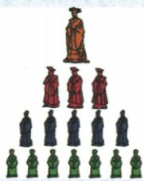
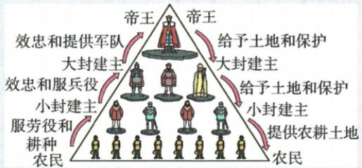

## 讲解

### 是什么

西欧封君与封臣关系以土地封赐为纽带，封臣效忠军役金钱，封君保护其荣誉人身财产。等级严格又有双向约定，称呼按具体关系：某人对上为臣，对下可为君，直接关系不能无条件越级转移。

### 怎么来的

土地提供收益与生活资源，授地者由此换取受封者支持和军事服务，受封者也因提供服务要求保护，双向权义把土地、力量和秩序联系起来。继续分封形成多层，在每层有自己的双方，所以不能把全部下层都按现代直接任命官员理解。身份相对关系而定，不是永久一种称号；权义有契约意义，但地位不平等，也不同现代平等合同。农民耕地与劳役维持生产，同贵族封赐军役在图中不同箭头，不能因图放在一起就把所有农民升为封臣。原直接主从概括帮助认识关系边界，仍不能抹去国王所有其他政治影响。

### 什么时候能用

看授地保护与效忠军役两向关系判封君封臣，看农耕劳役判生产关系。读等级要指定谁对谁，比较中外先定纽带权义社会形态。

## 例题

**完整原问：据图回答西欧封建等级制度特点。三点完整原答。**1.土地封赐为纽带形成封君封臣关系，封君保护，封臣效忠并随作战。2.国王大封建主小封建主层层分封，成金字塔等级。3.不同等级贵族依次互为主从，封君只管自己封臣、不直接管封臣的封臣，原概括“我的附庸的附庸，不是我的附庸”。

**完整原权义表。**封臣须忠诚、需要时无偿服兵役供金钱等；封君不任意侵荣誉人身财产，遇外攻须保护。11世纪土地封赐封建制度西欧已普遍，等级严格、权义交织有契约意义。

**原图箭头核读及完整解析。**国王→大封建主、大→小为给予土地和保护，反向为效忠提供军队或服务，不能读成全是单向命令。小封建主→农民为提供农耕土地，反向为劳役和耕种，图虽同在金字塔，农民的生产负担不自动等同贵族间封赐军役契约。小封建主对上是封臣，对下有自己的封君地位，说明名称相对具体关系。原“不直接管附庸的附庸”用来说明直接关系范围，不推出国王在任何渠道都毫无影响，也不能把原教学模式当每国家每时期完全不变。

### 九上第三单元东西制度两图及庄园材料两问完整解析

**原新考法综合探究，原无数字总题号，覆盖记第3题。**李老师开展“对比东西方文明”探究，完成任务。

**任务一，原问(1)：结合所学，分别写出图一图二对应制度名称，分析两制度异同。**

**完整原答(1)。**图一分封制，图二封君封臣制。不同点：联系纽带不同，前者以血缘关系、后者以土地封赐为纽带；前者所有被分封者对周天子负责，后者封君封臣依次互为主从。相同点：都通过分封土地实现；促进等级制；一定程度巩固统治秩序；规定分封者与受封者权利义务。

**完整解析(1)。**图一人物分层授封联系西周原制度，图二贵族间“给予土地和保护”“效忠和提供军队”对应封君封臣相对关系。比较先固定同一维度：纽带对纽带，负责关系对负责关系。西周主要血缘纽带不等只有同姓能受封，原七上还给功臣等；所有被分封者负有对天子义务是原制度概括，不等后世任何时期天子都有效控制所有地方。西欧每对双方一方授地保护、另一方效忠军役，依次互为主从，不能让最上国王自动成为所有下层人物的直接封君。图底农民获耕地、服劳役耕种与贵族封臣军役不同。再比较实现途径、等级、统治作用、权义四同点，不能只说“都是分封”便漏三项。原“一定程度”保局限，土地层级秩序并非保证永远统一。

**任务二原材料。**东汉豪强大族庄园“有煮盐、冶铁、酿造、纺织等作坊，能满足田庄基本生活要求”；西欧庄园“有住房、冶铁等作坊，奶酪、火腿、鞋帽、衣服等自己制作”。

**原问(2)：根据材料，谈谈东汉与西欧庄园共同点。原答(2)：经济上自给自足。**

**完整解析(2)。**两材料都给内部生产生活用品，东汉明确满足基本生活、西欧列食物衣用品自己制作，把不同物品列表归纳成共同经济方式：主要内部生产满足内部需要。自给自足不等产出物品一模一样，也不等绝无任何外部交换。材料只支持经济共同点，不能由有作坊便推人身身份、土地法律、法庭权利和政权结构全部一样；制度任务与经济任务须分别回答。

## 易错

权义双向不等双方社会地位完全平等；不是每条箭头都分封，附庸范围不等国王毫无政治权威。

### 来源定位

- WF7-Q01：full.md（历史扫描分册251-300），L638–L677，封君封臣原等级图原问与三点原答完整；5dc2c8da-0729-4435-bf9a-d7b79d1838b6_origin.pdf，实际PDF第10页。
- WF7-S03：full.md（历史扫描分册251-300），L694–L696，封君封臣土地权义等级契约及11世纪普遍；5dc2c8da-0729-4435-bf9a-d7b79d1838b6_origin.pdf，实际PDF第10页。
- WF-U03：full.md（历史扫描分册251-300），L1008–L1053，东西制度两图及庄园经济材料两问完整原答；5dc2c8da-0729-4435-bf9a-d7b79d1838b6_origin.pdf，实际PDF第15页。
