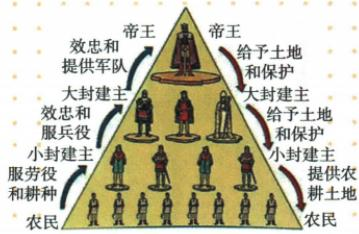

## 讲解

### 判据

原图问制度特点，先识帝王大小贵族层次，再读上下箭头的土地保护与效忠军役，最下农民劳役不要当同一契约。

### 流程

1. 国王到大封建主到小封建主读分封层次，连接金字塔等级。

2. 向下授土地保护、向上忠诚军役金钱相配，写土地纽带及双向义务。

3. 指定小封建主对大是臣、对自己下层贵族可为君，不固定每人只能一身份。

4. 原直接主从范围说明附庸的附庸不是自己的附庸，不直接等现代一串中央任命。

5. 农民取农耕地和服劳役是生产关系，区别贵族间封赐，不由图最下面有农民就称其都是封臣。

## 例题

**完整原问：据图回答西欧封建等级制度特点。三点完整原答。**1.土地封赐为纽带形成封君封臣关系，封君保护，封臣效忠并随作战。2.国王大封建主小封建主层层分封，成金字塔等级。3.不同等级贵族依次互为主从，封君只管自己封臣、不直接管封臣的封臣，原概括“我的附庸的附庸，不是我的附庸”。

**完整原权义表。**封臣须忠诚、需要时无偿服兵役供金钱等；封君不任意侵荣誉人身财产，遇外攻须保护。11世纪土地封赐封建制度西欧已普遍，等级严格、权义交织有契约意义。

**原图箭头核读及完整解析。**国王→大封建主、大→小为给予土地和保护，反向为效忠提供军队或服务，不能读成全是单向命令。小封建主→农民为提供农耕土地，反向为劳役和耕种，图虽同在金字塔，农民的生产负担不自动等同贵族间封赐军役契约。小封建主对上是封臣，对下有自己的封君地位，说明名称相对具体关系。原“不直接管附庸的附庸”用来说明直接关系范围，不推出国王在任何渠道都毫无影响，也不能把原教学模式当每国家每时期完全不变。

## 易错

自动流程把人物动作串单线错误弃用；图的层级不够，需结合每向箭头标签及原三点答案。

### 来源定位

- WF7-Q01：full.md（历史扫描分册251-300），L638–L677，封君封臣原等级图原问与三点原答完整；5dc2c8da-0729-4435-bf9a-d7b79d1838b6_origin.pdf，实际PDF第10页。
- WF7-S03：full.md（历史扫描分册251-300），L694–L696，封君封臣土地权义等级契约及11世纪普遍；5dc2c8da-0729-4435-bf9a-d7b79d1838b6_origin.pdf，实际PDF第10页。
