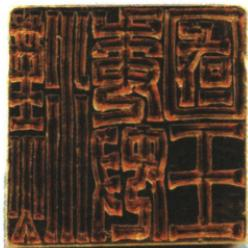

## 讲解

### 判据

题问原印图信息，先识图注和器物，再用原文献确定年代人物授印行为，说明交流；不可单从照片猜具体年及全国管辖。

### 流程

1. 原图注倭王印确认器物，福冈馆藏印文汉委奴国王支持识别，模糊图不能强读不存在的日期。

2. 原后汉书记载建武中元二年57、倭奴国奉贡刘秀赐印绶，确定事件和人物。

3. 实物印与文献授印相对应，解释二种证据互证具体往来事实，保原答真实性与已有往来。

4. 原答密切为总体概括，单器物不统计频次或证明东汉直接治理所有日本。

5. 原1—2世纪多国与5世纪大和基本统一分开，57受印者不改后世统一天皇。

## 例题

**原图、原问：图片反映了什么历史信息？**

**完整原答。**《后汉书·东夷列传》记载光武帝建武中元二年（57年），倭奴国奉贡朝贺，光武帝刘秀赐印绶；后来出土的倭王印也证明这段历史真实性。原书结论为东汉时期中日已有密切往来。

**完整解析。**先用图注识印，再把印文、授印对象与记载的赠授行为相对照，实物和文献从不同载体提供同一交流事件的证据。原图是器物印面照片，不是《后汉书》原页；文献给57年和刘秀，不能声称单从模糊照片就读出公元年。福冈市博物馆藏品说明及市府年表也将“汉委奴国王”印联系57年，支持本题识别。这个具体事件可证明当时已有往来，原“密切”是原答的总体概括；单枚印不足统计每年交流次数，不能证明所有人民同样接触，或把一地国王接受印绶等同中国直接行政管理全部日本。原1—2世纪多小国、大和5世纪基本统一，不能把57年受印对象误写成已统一全国的5世纪大和天皇。

## 易错

器物图是实物载体，文字引文是文献；年代来自引文与核查不假装照片写数字；接受印绶不等全日本直接行政归东汉。

### 来源定位

- WA11-Q01：full.md（历史扫描分册251-300），L1187–L1201，倭王印原图历史信息原问及完整文献答案；5dc2c8da-0729-4435-bf9a-d7b79d1838b6_origin.pdf，实际PDF第17页。
- WA11-S01：full.md（历史扫描分册251-300），L1135–L1161，小国大和基本统一部民原图与地位易混；5dc2c8da-0729-4435-bf9a-d7b79d1838b6_origin.pdf，实际PDF第17；地位L1183–1185同页页。
