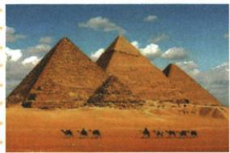

## 错法

原说古埃及文明没有延续，就断今天没有任何埃及文化遗产或当地人口全部灭绝。容易把文明体系变化、外来政治占领与每个人每件文物命运当同一个结论。

## 正解

保原文明历史概括，同时分政治统治、文字文化传统及遗迹人群不同对象；吞并改变独立统治，后期文字形式变化，古代文化不能当从未变过，但遗迹和后世影响也不能说全部不存在。原金字塔照片可说明建筑留存，不能因此反推法老制度今天仍原样持续；任何一边用一件文物代全部文明状态都越界。

## 例题

**原兴衰完整表与相关链接，未配独立例题。**约公元前3500起尼罗下游出现若干小国；前3100左右初步统一；图特摩斯三世时成为强大军事帝国，原版图北到叙利亚小亚细亚交界和幼发拉底上游，南到尼罗第四瀑布；几度分裂、受入侵，前525波斯吞并，后来亚历山大和罗马先后占领。地理为非洲东北角，尼罗贯南北；原称尼罗为世界最长河流，本课赠礼判断依据在农业及实践，不由河长排名直接推出文明形成。

**文化材料及原易混。**天文学数学医学成就突出，太阳历为天文成就，象形文字为最早文字之一。原说古埃及是最古老文明之一“但没有延续下去”。此句作为原书文明历史概括保留，不能扩大为当地人口全部消失、所有文化遗产不再存在；原题金字塔照片本身已说明遗迹留存。文字传统在后期变化而非永远同一体系，参见[大英博物馆象形文字解读时间线](https://www.britishmuseum.org/exhibitions/hieroglyphs-unlocking-ancient-egypt/egyptian-hieroglyphs-decipherment-timeline)所述希腊语科普特语书写逐渐替代早期形式。正文不另断所有文化因素完全中断，也不把525政治吞并当一切遗产在该年消失。

**原金字塔知识材料。**角锥体侧面形似汉字金，中文因形得名；古埃及法老陵墓，不是普通住宅或日常宫殿。原意义为文明象征、社会经济较高水平和古埃及人智慧结晶。

**原图问：为什么说金字塔是法老权力象征？完整原答。**没有现代化机械的古代，建造须大量人力物力，没有强大权力作后盾不可能完成，因此象征法老权力。

**完整推理。**工程规模需获取材料、运输、组织分工并保障人员工作，法老集中权力有条件动员和支配资源，陵墓又服务王室，工程与统治权联系。规划施工说明劳动者技术与集体智慧，动员资源说明王权，两个解释角度可同时成立，不能只赞国王个人技巧或只写壮观。原题没给劳动者人数、耗时和身份，不能自编数值或将全体建造者一律称奴隶。照片和原图注可识别建筑与用途，具体动员机制由原问及所学解释，不是照片直接给统计。

### 来源定位

- WA1-S04：full.md（历史扫描分册201-250），L2578–L2584，文明未延续原易混及图特摩斯版图相关链接；5cc603b4-3c7a-4bc5-b935-8c05069de690_origin.pdf，实际PDF第47页。
- WA1-Q01：full.md（历史扫描分册201-250），L2586–L2600，金字塔权力象征原图问及完整原答；5cc603b4-3c7a-4bc5-b935-8c05069de690_origin.pdf，实际PDF第47页。
