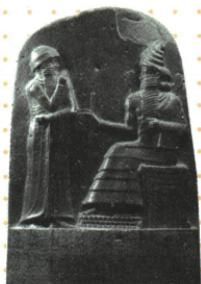

## 错法

原说法制传统源远流长，就把《汉谟拉比法典》解释为古巴比伦所有人享相同权利。容易将法律有文字可读、历史上有意义和现代平等制度合成一个评价。

## 正解

先问法典怎样规定身份：两类自由民与奴隶地位严格不同，说明并非人人同权。再问它维护谁：原重难表说明维护奴隶主统治。最后保历史价值：成文材料留存社会信息，早期法律规范说明法制传统古老。贡献与局限可以同时成立，不能因其不平等抹去文化史价值，也不能因其有价值抹去奴役等级。

## 例题

**完整原法典知识表，未配独立条文计算或判案题。**地位为“迄今已知世界上第一部较为完整的成文法典”。内容广泛，可了解古巴比伦社会。原列三方面：拥有公民权的自由民、无公民权的自由民、奴隶三个严格等级；战俘为奴隶主要来源，家庭奴隶制为一大特征；租赁、雇佣、交换、借贷等规定反映商品经济比较活跃。意义为宝贵文化遗产，表明法制传统源远流长。

**完整原重难表。**制定原因：中央集权专制国家的国王权威既需要武力维护，也需要法律使其合法化；奴隶制国家需要确定阶级阶层地位，规范约束社会行为与秩序。原定实质为维护奴隶主阶级统治的工具。

**完整推理。**有不同等级的规定，可看出权利身份有差别；战俘来源和家庭奴隶制说明奴役存在于战争和家庭关系中，不能说全部奴隶仅一种来源；多类交易规则说明社会有这些经济活动及相应秩序需求。由规定归纳社会特点是用法律作史料，不是把每条规定当所有地方每天必然发生的事实。法律使权力与等级秩序获得书面确认，对统治有维护作用；其历史价值在保存早期成文法律与社会信息，不必先认定它实行现代平等才有价值。

**历史称谓边界。**[卢浮宫的石碑解说](https://www.louvre.fr/zh-hans/hanmolabifadian)说明它是法律裁决汇编，与现代意义的法典不同。沿用原书《汉谟拉比法典》称呼；“第一部较为完整”不能省略“迄今已知”和“较为完整”，也不能改成此前世界没有任何法律。

**完整原问。**浮雕呈现司掌公正与法律的太阳神沙马什向国王汉谟拉比授予权杖的情景，该情景表达什么思想？

**原答案：君权神授。完整解析。**先读原图注的身份与动作：授予者为神，接受者为国王，物件象征权力。因此图把国王统治权的来源表现为神的授予，以宗教权威支持王权。不能只凭站坐位置答国王比神强，也不能只看石柱有法律文字就答社会人人平等。“表达思想”问当时如何说明权力正当性，不是在证明神明实际完成过授予。原图加原图注共同提供判据；[卢浮宫解说](https://www.louvre.fr/zh-hans/hanmolabifadian)亦解释沙马什交给国王权力象征。

### 九上第一单元原题3完整原答与解析

**单元原题3，原书标注2024甘肃兰州中考，未另核真题身份。**《汉谟拉比法典》规定：“倘理发师未告知奴隶之主人而剃去非其奴隶之奴隶标识者，则此理发师应断指；倘自由民购买奴婢，未满月而该奴即患癫痫，则买者得将其退还卖者而收回其所付之银。”这说明该法典维护的是（）。

A.理发师的利益；B.奴隶的利益；C.外邦人的利益；D.奴隶主的利益。

**原答案D，完整原解。**古巴比伦是奴隶制国家，法典实质是奴隶主阶级维护统治的工具，严格维护奴隶主利益。

**逐项解析。**A不选，第一条是对未经主人允许去除标识的理发师施以惩罚，保护重点不是理发师。B不选，奴隶被主人控制并可被购买退还，条款没有给予奴隶自由选择或不被交易的权利；不能因提到奴隶疾病就当保障奴隶自主利益。C不选，题干未给外邦人身份或其权利规定，不补隐藏对象。D正确，第一条维护主人控制奴隶的标识，第二条使购买者可退还患病奴隶取回银，保护交易中购买者的财产利益。购买者原称自由民，但在这项买奴关系中处于奴隶占有者角色，不能只抓自由民一词而忽略其行为。两条不同角度共同说明保护奴隶主控制和财产；本题阐释古代制度，绝不将原残酷惩罚当今日应照做的规范。

### 来源定位

- WA2-S03：full.md（历史扫描分册201-250），L2692–L2698，法典地位内容价值意义与神授原问答；5cc603b4-3c7a-4bc5-b935-8c05069de690_origin.pdf，实际PDF第49页。
- WA2-S04：full.md（历史扫描分册201-250），L2704–L2706，法典制定原因与实质原表；5cc603b4-3c7a-4bc5-b935-8c05069de690_origin.pdf，实际PDF第49页。
- WA2-Q02：full.md（历史扫描分册201-250），L2654–L2664，法典石柱原图与跨页君权神授原问原答；5cc603b4-3c7a-4bc5-b935-8c05069de690_origin.pdf，实际PDF第48；设问答案在49页L2696–2698页。
- WA-U03：full.md（历史扫描分册251-300），L8–L18，奴隶标识与买奴退还第3题四项原答完整原解；5dc2c8da-0729-4435-bf9a-d7b79d1838b6_origin.pdf，实际PDF第1；原答L50–52同页页。
