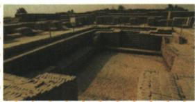

## 讲解

### 是什么

古代印度在本课是南亚次大陆的地域称呼，早期文明位于印度河流域，代表遗址哈拉帕和摩亨佐·达罗。雅利安人后来进入并建国家，孔雀王朝除最南端外基本统一；遗址形成、后来的国家与统一范围不能混成一次事件。

### 怎么来的

历史地域包含今天多个国家，名称相同不保证各时期边界相同，认识遗址归属应依据河流位置和历史材料。早期城市遗存说明居民有建筑、生产及组织生活，不应将后来的进入者直接当这些早期遗址创造者。国家形成和区域统一分别回答有没有政权以及多个政权是否整合，原许多小国不等已经统一。孔雀强盛时期使较大范围纳入同一统治，但原明确最南端例外，所以基本统一是一种范围限定，不得删掉基本。遗址分期来自考古研究，照片的建筑形态本身不能推出一套精确年代。

### 什么时候能用

原遗址图问答古代印度河流域文明；地理概念保古代与现代范围，统一保最南端例外；原遗址年代保原并注明分期资料差异，不将简表用作全部遗址精确起止。

## 例题

**原知识表及易混完整。**古代印度地理指今南亚次大陆，包括今天印度、巴基斯坦、孟加拉国等国，不能按今天一个国家疆界理解。文明最早出现印度河流域；原列哈拉帕、摩亨佐·达罗遗址“约前23世纪至前18世纪”。前1500年左右雅利安人进入，定居从事农业并建许多小国家；原旁注他们不是早期居民，前述遗址文明不是其创造。孔雀王朝鼎盛，除半岛最南端外基本统一，农业工商业繁荣，不等整个印度全部统一。

**原问：上图的发现，可以证明哪一文明的繁荣？原答案：古代印度河流域文明。完整解析。**遗址名称为摩亨佐·达罗，本课将它归印度河早期城市文明，建筑等遗存为认识文明提供实物证据。不能只见“印度”二字按现代印度国境断归属，也不能将早期遗址归后来雅利安人创造。照片与图注支持识别遗址和文明，不直接给出全部具体年代或所有古城的人口规模。

**原年代与核查区别。**保留原书前23至前18世纪概括；[联合国教科文组织哈拉帕申报说明](https://whc.unesco.org/en/tentativelists/1878/)将其成熟阶段列约前2600至前1900年，[摩亨佐·达罗世界遗产说明](https://whc.unesco.org/en/list/138/)指出建成于公元前第三千纪。这些资料说明原书日期不能当所有遗址全部使用阶段的一致精确起止，遗址发展分期需另外确定。本原图题只问文明，不用冲突年代强定答案。

## 易错

雅利安进入不是印度河文明从零开始；孔雀基本统一不是覆盖最南端，文明的地域称呼不是今天单一国家身份。

### 来源定位

- WA3-S01：full.md（历史扫描分册201-250），L2724–L2741，印度地理发源遗址雅利安国家孔雀与成就原表及地域易混；5cc603b4-3c7a-4bc5-b935-8c05069de690_origin.pdf，实际PDF第49页。
- WA3-Q01：full.md（历史扫描分册201-250），L2743–L2757，摩亨佐达罗遗址原图问与原答；5cc603b4-3c7a-4bc5-b935-8c05069de690_origin.pdf，实际PDF第49页。
