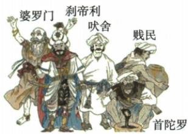

## 讲解

### 判据

材料涉及祭祀、军政、生产或服务义务时，用四等级表定位；遇农业重叠、国王地位和等级外群体，要增加身份义务判据。

### 流程

1. 祭祀接婆罗门第一；军政国王武士接刹帝利第二，不能将最高政治统治者直接改第一。

2. 吠舍生产经商与首陀罗农业手工业有部分交叉，继续查为谁服务、身份和原制度位置。

3. 世袭、职业禁止和通婚限制共同说明森严，不只列四职业名称。

4. 原四等级外受歧视群体保在外，不补成表内某等级。

5. 神化与祭司特权接制度维持原因，认识其排斥性，不用当时贵贱称呼评价人的本来价值。

## 例题

**原制度表、易混与相关链接，未配课内独立制度题。**

|等级|名称|原职责|
|---|---|---|
|第一|婆罗门|掌管祭祀，如僧侣|
|第二|刹帝利|军事与行政，如国王、武士|
|第三|吠舍|农业、畜牧业、商业|
|第四|首陀罗|原称主要由被征服居民构成，从事农业、畜牧、捕鱼和手工业，为前三等级服务|

**原其余规定。**四等级之外还有被称“不可接触者”的贱民，受到歧视凌辱。等级世代相袭，贵贱分明，低等级不能从事高等级职业，不同等级不得通婚。原易混指出国王不是最高等级，属于第二刹帝利；相关链接将规定职责、神化制度与维护婆罗门特殊地位相连。

**完整解释。**职业安排只是表的一部分，世袭、贵贱、职业和通婚限制一起固定身份，不能理解为可自由转换的一般职业分工。吠舍和首陀罗都有农业畜牧活动，但权利地位与服务义务不同，不能只按种田就判等级。祭祀权威在制度中被神圣化，为婆罗门地位提供观念支持；军事行政是国王掌握的实际职权，社会等级排序不等每一种实际力量大小。原有四等级之外群体，不将他们补进第三或第四，原使用的歧视性称呼用于说明当时制度，不作为对人的合理评价。

### 九上第一单元原题4完整原答与解析

**单元原题4，原书标注2023山东济宁中考改编，未另核真题身份。**某古代国家建立严格社会等级制度，如下图，该古代国家是（）。

A.古代埃及；B.古巴比伦；C.古代印度；D.古代中国。

**原答案C，完整原解。**雅利安进入印度后逐渐建立种姓制度：第一婆罗门，第二刹帝利，第三吠舍，第四首陀罗，四等级外还有被称不可接触者的贱民。

**逐项解析。**C正确，图里的婆罗门、刹帝利、吠舍、首陀罗专名与本课种姓表直接对应，等级外贱民亦相符。A不选，埃及法老统治和社会分层并不等于本图种姓名称，不能只凭古国都存在等级选择。B不选，古巴比伦本课是有公民权自由民、无公民权自由民和奴隶，名称与划分不同。D不选，中国古代也有身份等级，但题图特定种姓名未指中国。判断依据是图中具体制度标签，不是仅凭“严格等级”四字。原图将贱民文字置旁边，结合原表知其在四等级外，不把图的人物高低位置自行变成第五等级。

## 易错

职业相同不是等级相同；祭司与国王不同权威、规定与现实个案需保范围。

### 来源定位

- WA3-S02：full.md（历史扫描分册201-250），L2759–L2765，祭司与国王地位原易混及种姓神化目的；5cc603b4-3c7a-4bc5-b935-8c05069de690_origin.pdf，实际PDF第50页。
- WA3-S04：full.md（历史扫描分册201-250），L2788–L2802，种姓制度起源四等级职责与世袭限制及雅利安旁注；5cc603b4-3c7a-4bc5-b935-8c05069de690_origin.pdf，实际PDF第50页。
- WA-U04：full.md（历史扫描分册251-300），L20–L56，种姓原图题第4题四项原答完整原解；5dc2c8da-0729-4435-bf9a-d7b79d1838b6_origin.pdf，实际PDF第1页。
