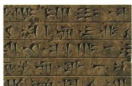

## 讲解

### 判据

文字图问区域，先用楔形文字与苏美尔创造者定位；成就表中的月相闰月和60进制分别属于历法、数学，不能按古代成就都互换。

### 流程

1. 图注楔形文字接苏美尔人，再接古代两河流域，原问区域不只答一位国王。

2. 月亮盈亏接定月，置闰接协调季节年，354只按原普通年概括。

3. 60进制接进位规则，不当文字形式或历法年长。

4. 文字、历法和数学可服务记录与时间数量需求，各有机制；三项表述没有直接给现代制度全部起源，不扩大。

## 例题

**原问：上图所示是古代哪一区域的文明成就？原答案：古代两河流域。**

**完整解析。**图注给“楔形文字”，本课成就表给“苏美尔人发明”，将文字类型与创造者所处两河地区相连，所以答区域为古代两河流域，不答尼罗河或印度河。仅说古巴比伦会把范围缩小：苏美尔成就属于更长的两河文明史。图像识别需要结合字形与图注，原图未要求读出泥板全部文字，不猜其具体内容。

**原易写字。**“楔”读xiē，勿写“偰”。原记忆以楔子上粗下锐的小木橛联系木字旁。该记忆帮助书写，不证明文字必须刻在木头上。文字记录活动的形成联系：[大都会艺术博物馆文字起源解说](https://www.metmuseum.org/de/essays/the-origins-of-writing)说明早期泥板记录与经济管理需要有关；这是补充讲解，原图本身未给出某次交易详情。

**原成就表，未配独立历法例题。**苏美尔人根据月亮盈亏制定“阴历，一年354天”，又设闰月调整阴历、阳历天数差距。

**完整解释。**月亮明暗形状周期变化提供定月依据；以这种月组成普通年，其总天数与季节年不同，若每年都不调整，农事季节与固定月份会逐渐错开。加闰月是把月的节奏与季节年协调，所以不是给每年固定加一天，也不是所有年总天数永远354。原书简称“阴历”保留；包含置闰协调季节的制度具有阴阳合历特点，不把简称扩大为从不管太阳年。

**核查范围。**[皇家格林尼治博物馆历法说明第7–8页](https://www.rmg.co.uk/sites/default/files/Calendars-from-around-the-world.pdf)区分月相定月和置闰协调年长；[Steele的晚期巴比伦乌鲁克历法研究第3页](https://www.cambridge.org/core/services/aop-cambridge-core/content/view/569C136C716A6CB00C475517C0860884/S1743921311012774a.pdf/astronomy_and_culture_in_late_babylonian_uruk.pdf)提供普通年十二月及置闰月的证据。后者研究晚期制度，不能把晚期精确置闰周期直接当原表所述苏美尔时期全部规则。

**原成就表，未配独立计数题。**两河流域人发明计数法中的60进制。

**完整解释。**进制规定同一级达到多少单位就向高一级进位：60进制按六十单位进一位理解，和十进制按十单位进一位不同。这说明计数组织有规则，不是仅能写到数字60，也不是任何看见60的数字都属于这套古代记数法。原表没有古代数符完整形状、零占位规则或为什么最初选60的说明，不能以本条的基本含义代替全部古代计算操作，也不能编造其起源原因。

## 易错

问区域答区域，问类别给规则与用途；不从木字旁推楔形文字必须写木板。

### 来源定位

- WA2-Q01：full.md（历史扫描分册201-250），L2633–L2652，楔形文字原图问与原答案及易写字；5cc603b4-3c7a-4bc5-b935-8c05069de690_origin.pdf，实际PDF第48页。
- WA2-S01：full.md（历史扫描分册201-250），L2666–L2676，两河地理小国初步统一与文明成就表；5cc603b4-3c7a-4bc5-b935-8c05069de690_origin.pdf，实际PDF第48页。
