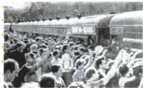

## 错法

见失败或未根治就删全部措施，反向又因卫星成功断农业民生一定没有问题，忽略结构和部门。

## 正解

部分管理激励改革确有动作，但基础高度集中和部门利益可能仍在，故未根治；尖端科技是特定成就，不能替全部民生指标。用图注农业配赫、重工军备配勃，按阶段任务和结果具体评价。

## 例题

# 知识点 ② 苏联的发展与改革 ★★☆

# 1.赫鲁晓夫改革

(1) 时间: 20 世纪五六十年代。

(2) 内容

| 政治 | 批判斯大林个人崇拜 |
|---|---|
| 经济 | 发动垦荒运动;发展饲料生产,广种玉米;取消农产品的义务交售制,改行收购制;改革工业管理体制;等等 |

(3) 结果: 没有从根本上解决苏联模式高度集中的经济体制弊端, 并且存在严重偏差。

# 2.勃列日涅夫改革

(1) 时间: 20 世纪六七十年代。

# 1 易混易错

1. 赫鲁晓夫改革的重心是经济改革,尤其是农业方面。  
2. 勃列日涅夫改革的重心也是经济改革,但偏向重工业领域。  
3. 戈尔巴乔夫改革的重心先是经济改革, 后又转向政治体制改革。

(2) 内容

| 项目 | 经济 | 军事 |
|---|---|---|
| 表现 | 推行“新政策”,要求加速科技进步、完善经济管理体制和加强经济刺激 | 将科技进步的重心放在军事上 |
| 结果 | 没有从根本上突破高度集中的计划经济体制 | 国民经济呈现畸形发展状态 |

苏联城市青年出发参加垦荒

图中现象的出现与哪一改革有关？

赫鲁晓夫改革。

**原问完整解析。**照片图注城市青年出发垦荒，与赫鲁晓夫发动垦荒、发展饲料和玉米等农业重点相符，原答赫鲁晓夫。不是仅凭年轻人或车站猜人物，须读图注接措施。原照片未给产量、地点和确切拍摄年，不补造。

赫鲁晓夫政治批个人崇拜，经济重农业并改交售和工业管理；勃列日涅夫经济刺激管理科技但偏重工业军备。改革触及部分管理激励，却未根本突破高度集中，军事资源重使部门不协调。不能把“改革未根治”理解从来没采取措施，也不能因提出经济刺激就说已建立完整社会主义市场经济。玉米需要自然生产条件，原严重偏差不能简化所有地区种任何作物都必同结果。

# 知识点 ① 社会主义力量的壮大 ★☆☆

1. 社会主义力量壮大：二战后，东欧、亚洲和拉丁美洲等地出现了一些社会主义国家。

# 2.经济互助委员会

(1) 成立: 1949 年, 苏联同保加利亚、匈牙利、波兰、罗马尼亚、捷克斯洛伐克等国家建立了经济互助委员会, 简称“经互会”。  
(2) 影响: 苏联通过经互会帮助东欧国家克服了战后经济困难, 但也利用经互会将各成员国的经济纳入苏联计划经济的轨道。

# 3.《中苏友好同盟互助条约》

(1) 缔结时间: 1950 年。  
(2) 影响: 加强了社会主义阵营的力量。新中国掀起了学习苏联的热潮。

# 相关链接 苏联改革的背景

1. 苏联经济发展不协调。  
2. 苏联模式的弊端, 严重阻碍了苏联的发展。  
3.1947年，苏联成立了“共产党和工人党情报局”。苏联通过情报局控制东欧各国，要求东欧各国的社会制度、政权性质与苏联统一，并按苏联模式对这些国家进行全方位的内部改造。

# 相关链接 二战后苏联取得的重大成就

1.1957年,苏联成功发射世界上第一颗人造地球卫星。  
2.1961年,苏联宇航员加加林乘坐苏联第一艘载人宇宙飞船“东方一号”进入太空,后安全返回地面。

**知识解释，原没有独立经互会题。**二战后更多地区出现社会主义国家，1949经互会以经济协调帮助重建也使成员纳苏联计划轨道，合作支持与主导约束并存；1947情报局偏政治制度影响，不同机构日期功能不能换。1950中苏条约增强阵营与学习苏联，是此时期交流，不等中国所有政策永远不变或照搬全一样。1957卫星、1961加加林载人飞行展示技术成果，不能凭尖端部门成就就断农业轻工业和全部民生均同水平。阵营力量壮大与后来改革弊端不是彼此取消的两种描述。

### 来源定位

- WV18-S02：full.md（历史扫描分册301-345），L2238–L2267，赫鲁晓夫改革措施结果及照片；bd22a802-356b-4b67-b51c-daf820cc3300_origin.pdf，实际PDF第33页。
- WV18-S03：full.md（历史扫描分册301-345），L2274–L2288，勃列日涅夫经济军事改革结果和重点辨析；bd22a802-356b-4b67-b51c-daf820cc3300_origin.pdf，实际PDF第34页。
- WV18-S07：full.md（历史扫描分册301-345），L2269–L2272，1957卫星1961加加林成就；bd22a802-356b-4b67-b51c-daf820cc3300_origin.pdf，实际PDF第34页。
