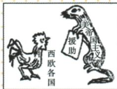

## 讲解

### 是什么

1947年3月杜鲁门主义标志冷战开始，马歇尔计划为援助西欧恢复经济稳定资本主义的经济手段，也扩大美国影响。

### 怎么来的

政治宣示把世界分成对立营垒，为干预与盟友动员提供理由；经济援助将资源与恢复能力相连，能缓经济困难和制度不稳，也让援助者通过关系增强影响。两种手段相配但并非同一个文件，马歇尔计划是政治方向在经济方面的大规模运用。漫画借黄鼠狼向鸡送援助讽刺不单纯善意，判断要读形象标签与动物关系，不能只看送礼。控制意图与真实恢复效应可同时存在，历史评价不能用一方完全抹另一方。作者讽刺是史料立场，需要和具体政策共同读，不能凭画面断每个受援国家完全丧失所有决定权或每个居民都持同态度。

### 什么时候能用

用于漫画实质、政策目的与政治经济措施比较。恢复经济是手段，稳定资本主义与战略影响是目的层，不拿其他后来效果替题证据。

## 例题

# 5.美国的冷战措施

| 项目 | 杜鲁门主义 | 马歇尔计划 |
|---|---|---|
| 时间 | 1947年3月 | 1947年 |
| 内容 | 把世界分为“自由国家”和“极权政体”两个对立的营垒,宣称美国将领导和帮助所有选择“自由制度”、抵抗极权统治的力量 | 企图通过援助西欧恢复经济,稳定资本主义制度 |
| 影响 | 杜鲁门主义的出台,标志着美、苏战时同盟关系正式破裂,冷战开始1 | 是杜鲁门主义的一次大规模运用,也是美国实施冷战政策的又一重要步骤 |

漫画《黄鼠狼给鸡拜年》

图片意在说明马歇尔计划的实质是什么？

控制西欧各资本主义国家。

**原答解析。**图中鸡代表西欧国家，黄鼠狼标美帝国主义，礼物写援助；“拜年”与捕食关系相反，讽刺援助中控制意图。原答控制西欧资本主义国家，从援助经济依赖到扩大政治影响理解，不能只说赠礼很善意，也不能说西欧没有得到任何恢复帮助。漫画是作者对目的的批评，不是援助统计，更不凭形象断所有西欧民众同意被控制。

杜鲁门主义为政治宣示和冷战开始标志，马歇尔计划通过资金物资恢复经济、稳定资本主义并增强美国影响，是经济手段。同年不等两者一文件；国家帮助与自身战略目标可以同时存在，不用实际恢复结果否认控制意图，也不用意图否认全部经济效果。

### 九下第五单元原题2完整解析

2.(2024青海西宁中考)1947年,马歇尔提出“美国应该尽其所能帮助世界恢复正常经济状态,并使‘自由制度’得以存续”,就此美国提出了帮助欧洲恢复战争创伤的计划。材料说明该计划的目的是()

A. 加速资本原始积累

B. 推动和平局面形成

C.加快欧洲走向联合

D. 稳定资本主义制度

**完整原解与原答：**

2. 解题思路 马歇尔计划是美国冷战经济方面的主要措施, 其企图通过援助西欧恢复经济, 稳定资本主义制度。

答案 D

**逐项。**A资本原始积累是前期历史概念，原1947援欧不是该阶段基本任务。B不选，恢复有助稳定但材料直接目的“自由制度存续”，不泛化为纯和平动机。C不选，西欧联合有本身条件与后续过程，不是题明目的。D正确，恢复经济保资本主义，接援助资源到社会稳定的机制；同时第16课漫画说明美国控制扩大影响，不用此题目的抹另一面。

## 易错

漫画不是现场援助照片与数值，援助非全善意或完全无效的二选一。

### 来源定位

- WV16-S02：full.md（历史扫描分册301-345），L1959–L1961，杜鲁门主义马歇尔计划原比较表；bd22a802-356b-4b67-b51c-daf820cc3300_origin.pdf，实际PDF第29页。
- WV16-Q01：full.md（历史扫描分册301-345），L1979–L1993，黄鼠狼援助西欧漫画原问原答；bd22a802-356b-4b67-b51c-daf820cc3300_origin.pdf，实际PDF第29页。
- WV-U02：full.md（历史扫描分册301-345），L2450–L2528，马歇尔自由制度目的D原详解；bd22a802-356b-4b67-b51c-daf820cc3300_origin.pdf，实际PDF第37页。
