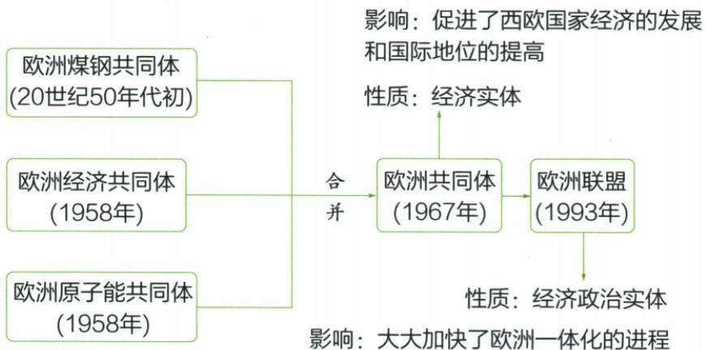
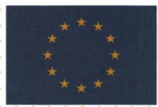

## 讲解

### 是什么

西欧凭工业基础科技政策及美国援助恢复，因战后弱化经济联系和美苏压力联合；1967欧共体到1993欧盟，合作范围扩展，十二星象征团结。

### 怎么来的

战争损坏生产和国际地位，但原有工业基础保技术劳动力组织能力，先进科技提高效率，政策和援助把资源投入恢复；恢复成绩反过来增强国家间经济联系。各国单独面对美苏压力和大市场竞争能力有限，共同规则与资源合作能减少壁垒扩大市场，解释联合自强，不是美国援助唯一造成联合。原图三机构汇线表示1967共同执行机构关系，不能照自动图将合并放欧盟后；1993扩大经济政治合作，实体性质变化不等成员变成一个国家。旗帜的圆和固定十二星传合作理想，不能据星数反推某年国家数；共同格式护照和共同货币体现便利合作，也不取消所有成员国差异或国籍。

### 什么时候能用

用于恢复原因表现、联合时序和符号题。教材简述与具体机构含义区分，2002大多数不改所有，恢复条件不可与表现交换。

## 例题

# 知识点① 欧洲的联合★★★

# 1.战后西欧经济的恢复和发展

| 原因 | 1内因:原有的工业基础较好;采用了最先进的科技成果;制定了恰当的经济发展政策2外因:马歇尔计划的援助 |
|---|---|
| 表现 | 120世纪50年代初,各国的工业生产已经基本恢复到甚至超过了战前水平220世纪50—70年代,西欧经济持续繁荣 |

# 2.欧洲走向联合

(1) 原因: 欧洲国家遭受战争创伤, 经济实力和国际地位下降; 随着经济的发展, 西欧国家之间的联系日益密切; 美苏争霸, 威胁欧洲国家的安全。

(2) 过程

**原图结构恢复：**50年代初煤钢共同体、1958经济共同体、1958原子能共同体，三条并列线在1967汇向欧洲共同体，1993指欧洲联盟。欧共体为经济实体，作用为经济发展和国际地位；欧盟为经济政治实体，加快一体化。原自动图把1993写第二个欧共体，又将“合并”置欧盟后，均与原图不符，不能照抄。

**解释与范围。**原工业基础、技术政策提供内部生产能力，马歇尔援助补资源；1950年代初恢复到战前、50–70年代繁荣属于表现，不是原因。战争损地位、美苏压力以及经济联系密切促联合，用共同市场规则和合作增强实力，不是几国变一个国家。原“合并”为教材简述，欧盟官方史说明1967主要统一三个共同体执行机构，不等所有条约法律主体一日完全消失；1993欧盟扩大经济政治合作范围。[欧盟1960年代史](https://european-union.europa.eu/principles-countries-history/history-eu/1960-69_en)。

欧盟旗帜

欧盟旗帜中间由十二个金星组成一个不可见的圆,代表着欧洲各国人民之间的团结与合作。

# 相关链接

欧盟成立后,欧洲一体化进程加快,
成员国公民拥有统一的欧洲护照;
2002年,欧盟的大多数成员国开始
使用统一的货币——欧元。

**原说明的边界。**蓝底十二金星围圆代表团结合作，不代表必须十二成员；欧盟官方符号资料明确星数与成员数无关。“统一欧洲护照”应理解各国护照采用共同格式，不等各国国籍被一个国籍取代。原2002“大多数”限定当时欧盟范围，不能改说所有成员或任何年份都用欧元；使用同货币体现一体化，未用者也不能因此自动判不是欧盟成员。[欧盟旗帜说明](https://european-union.europa.eu/principles-countries-history/symbols/european-flag_en)、[欧盟护照共同格式决议](https://eur-lex.europa.eu/legal-content/EN/TXT/PDF/?uri=OJ%3AC%3A2004%3A245%3AFULL)。

## 易错

经济政治实体不是统一国家，十二不随成员变；护照共同格式不同共同国籍。

### 来源定位

- WV17-S01：full.md（历史扫描分册301-345），L2056–L2094，西欧恢复与联合原表原图；bd22a802-356b-4b67-b51c-daf820cc3300_origin.pdf，实际PDF第31页。
- WV17-S04：full.md（历史扫描分册301-345），L2114–L2126，欧盟护照欧元旗帜十二星原说明；bd22a802-356b-4b67-b51c-daf820cc3300_origin.pdf，实际PDF第31页。
