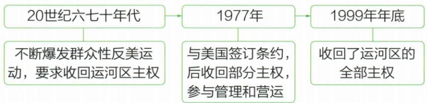
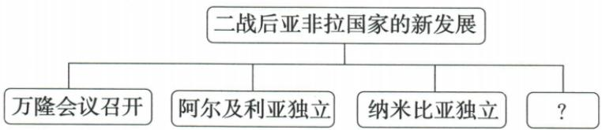

## 讲解

### 判据

看到古巴独裁被推翻和巴拿马运河主权，先定外控对象，分别读手段和阶段结果，不统一套摆脱直接殖民。

### 流程

1. 古巴受政治经济控制，1959武装推独裁再走社会主义；任务不是巴拿马运河管理。

2. 巴拿马经济战略运河被美国控制，六七十年代群众要求主权，1977条约后部分管理，1999年底全部。

3. 群众诉求推动谈判、条约需实施，签约与移交范围分，未全部完成不能提前写成功终点。

4. 两国同维写目标手段过程结果，共同外控不推出所有拉美走社会主义或都武装。

5. 亚非本课摆脱直接殖民，拉美案例维护已有主权，教材分类不等所有地区永无殖民统治。

## 例题

# 知识点 ③ 拉美人民维护国家主权的斗争① ★★☆

# 1.古巴走上社会主义道路

| 背景 | 古巴在政治和经济上长期被美国控制 |
|---|---|
| 过程 | 在卡斯特罗等人的领导下,经过数年的武装斗争,在1959年推翻了美国支持的独裁政权;挫败美国支持的雇佣军入侵 |
| 结果 | 走上了社会主义发展道路 |

# 2.巴拿马收回运河区的全部主权

(1) 背景: 巴拿马运河具有重要的经济和战略地位; 运河开通后, 运河区一直由美国控制。

(2) 过程

**原图逐格转写：**20世纪六七十年代群众性反美运动要求运河区主权；1977签约，后收回部分主权、参加管理营运；1999年底收回全部主权。原图为“签约后逐步”过程，不是1977已全部完成，管理参与也不自动等全部主权。

**完整解释。**古巴政治经济受美国控制，1959推翻美国支持的独裁政权，随后挫败雇佣军入侵并走社会主义道路，革命胜利与道路形成分过程，不把同一“独立”词套所有国家。巴拿马运河经济战略重要，外国控制限制其决定管理空间，群众行动推动协商条约，条约安排再经历实施移交，最终全主权。古巴武装斗争与巴拿马群众、条约、移交手段不同；一个走社会主义不等所有拉美国家同道路。

# ① 易混易错

亚非国家争取独立是为了摆脱殖民统治；拉美国家是为了摆脱美国的控制，而不是摆脱殖民统治。

**原易错限定。**本课亚非突出摆脱直接殖民统治，古巴巴拿马突出摆脱美国控制维护既有国家主权。是这些案例的任务区别，不断言所有拉美地区历史上永无殖民地、所有外国影响都已消失；原没有全球每地区资料，不擅补全称。

### 九下第五单元原题5完整解析

5.(2024 山东枣庄中考)知识结构化的实现,来自可视化的知识结构,即通常所说的思维导图。历史社团开展了“思维导图·寻找历史”活动。下图“?”处最恰当的史事是()

A.墨西哥的卡德纳斯改革

B.埃及的华夫脱运动

C.印度的非暴力不合作运动

D.巴拿马收回运河区全部主权

**完整原解与原答：**

5. 解题思路 二战后为了捍卫国家主权, 发展民族经济, 从万隆会议开始, 发展中国家作为一支新兴独立的政治力量登上了国际舞台。1962年, 阿尔及利亚独立; 1990年, 纳米比亚独立; 1999年年底, 巴拿马收回了运河区的全部主权。墨西哥的卡德纳斯改革、埃及的华夫脱运动、印度的非暴力不合作运动都发生在一战后。

答案 D

**逐项。**题中心二战后亚非拉，已列万隆、阿尔及利亚、纳米比亚，待项需同阶段且维护独立主权。A卡德纳斯1934、B华夫脱一战后、C甘地非暴力不合作主要本书一战后阶段均不合此二战后专题；不因不合就说他们非民族民主运动。D巴拿马1999年底收回运河区全部主权合，正确；1977条约还不是全部移交。原有年份均保书中说明，图没有更多国家地区不自画。

## 易错

部分主权参与管理不同全部，原图自动结构按原格核，不编经济读数。

### 来源定位

- WV19-S03：full.md（历史扫描分册301-345），L2392–L2417，古巴社会主义与巴拿马原图三阶段；bd22a802-356b-4b67-b51c-daf820cc3300_origin.pdf，实际PDF第36页。
- WV19-S04：full.md（历史扫描分册301-345），L2375–L2377，亚非拉摆脱殖民统治与美国控制原易错；bd22a802-356b-4b67-b51c-daf820cc3300_origin.pdf，实际PDF第36页。
- WV-U05：full.md（历史扫描分册301-345），L2496–L2540，思维图问号四项D原详解；bd22a802-356b-4b67-b51c-daf820cc3300_origin.pdf，实际PDF第37页。
