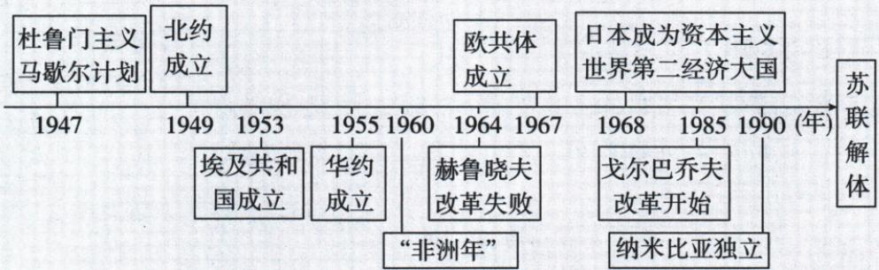

## 讲解

### 判据

时间轴同时含两极、西欧日本、社会主义改革和亚非拉发展时，主题需覆盖整个共同二战后阶段，不能只挑一支。

### 流程

1. 日期逐格配动作，1947起到1991解体为本轴范围，右末苏联未明码用原解1991核，不误1990。

2. 两极对峙是国际格局支，西欧日本为资本主义经济支，苏联改革为社会主义支，独立为亚非拉支。

3. 问共同主题时看所有事件是否纳入，单支名称虽与部分有关仍漏其他。

4. 原四选项A全球化B亚非拉D资本主义均过窄，C战后世界变化全涵盖。

5. 包含同阶段非所有事件直接互为因果，日期邻近与上下框位置不代因果；原1964失败概括不抹先措施。

## 例题

新考法 ▶ 大单元教学（2024 贵州黔西南中考改编）构建时间轴是学习历史的重要方式，小明同学运用构建时间轴的方式梳理了某一时期的重大史事。据此判断他学习的主题是 （）

A. 经济全球化的趋势

B.亚非拉国家的新发展

C. 二战后的世界变化

D.战后资本主义新变化

解题思路 时间轴开始于杜鲁门主义、马歇尔计划,结束于苏联解体,结合所学可知,二战后,美苏双方互相敌对,进而发展为两大集团的全面冷战对峙,两极格局形成,1991年苏联解体,两极格局随之结束,因此题干反映的是二战后的世界变化。选择C项。

答案 C

**原图节点配对核验。**1947主义计划、1949北约、1953埃及共和国、1955华约、1960非洲年、1964赫改革失败、1967欧共体、1968日本资本主义第二、1985戈改革、1990纳米比亚；苏联解体位图右端未独立标出1991数码，原解析明确1991，不能因挨1990就改其解体年。原1964“改革失败”为赫时期收束概括，不说此年前全无局部作用。

**逐项。**A只经济全球化不能覆盖冷战、改革与独立；B只亚非拉漏美苏西欧日本；C二战后世界变化覆盖所有事件国家阶段，正确；D只资本主义变化漏苏联改革解体、民族独立。选主题找全体事件共同范围，不能因图第一格冷战就把其余全读为冷战直接产生，也不能以一个熟悉项代整轴。

## 易错

主题大小依材料全体，不以首格或某一熟悉项排全部；时间轴OCR遗漏日期不可凭位置猜。

### 来源定位

- WV-U07：full.md（历史扫描分册301-345），L2554–L2586，二战后综合轴四项C原详解；bd22a802-356b-4b67-b51c-daf820cc3300_origin.pdf，实际PDF第38页。
