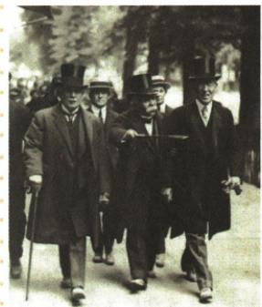

## 错法

见凡尔赛条约就把会议所有场所同名，见美国不批准就说总统未倡议国联或从未签署，见初排斥便断永不入会；都是把不同动作或阶段合并。

## 正解

保原会议地点短表并标官方纠正：会议巴黎开幕、凡尔赛为签署地。总统推动和国会批准不同主体环节，美国签署后未获批准又未入会不同中国代表拒签；初建排斥也不等国联长期成员绝不变。

## 例题

# 知识点①《凡尔赛条约》★★☆

# 1.巴黎和会

| 时间 | 1919年1—6月 |
|---|---|
| 地点 | 巴黎近郊的凡尔赛宫 |
| 目的 | 讨论对德和约及战后安排 |
| 操纵者 | 英国首相劳合·乔治、法国总理克里孟梭和美国总统威尔逊 |
| 实质 | 战胜的帝国主义国家重新分割世界的分赃会议 |
| 结果 | 协约国与德国签订《凡尔赛条约》 |

# 2.《凡尔赛条约》的主要内容

| 领土 | 重划德国疆界,阿尔萨斯—洛林归还法国,萨尔煤矿归法国开采 |
|---|---|
| 军事 | 莱茵河西岸的德国领土由协约国占领15年,莱茵河东岸50千米内,德国不得设防;禁止德国实行义务兵役制,不许德国拥有空军,限制德国陆军的人数 |
| 政治 | 德国承认奥地利、波兰等国独立 |
| 赔款 | 由协约国设立赔偿委员会,决定德国战争赔款的总数 |
| 殖民地 | 德国的全部海外殖民地由英、法、日等国瓜分 |

# 3.巴黎和会及《凡尔赛条约》的影响

(1)巴黎和会暂时调整了战胜国在欧洲的关系。  
(2)协约国还分别与其他战败国签订了一系列和约,这些和约与《凡尔赛条约》一起构成了凡尔赛体系。  
(3)没有从根本上解决帝国主义国家之间的矛盾,为第二次世界大战埋下了隐患。

4. 国际联盟：巴黎和会决定建立国际联盟，但战败国和苏维埃俄国被排斥在外。美国因为夺取世界领导权的野心未能实现，既不批准《凡尔赛条约》，也不加入国际联盟。

巴黎和会三巨头

巴黎和会三巨头由劳合·乔治（前排居左）、克里孟梭（前排居中）、威尔逊（前排居右）组成，三巨头实际主导了巴黎和会的进程。

# 相关链接

在巴黎和会上,列强无视中国代表提出收回德国在中国山东的一切权益的正当要求,将德国在中国山东的权益全部转给日本。消息传到国内,引发了五四运动。最终,中国代表拒绝在条约上签字。

**原表解释。**限制军队设防降低德国军事能力，赔款与煤矿开采改变经济资源，重划疆界和承认国家影响政治空间，殖民地重新分配满足胜国海外利益。五类作用不同，原未列军人数与赔款总额不自行补数；50千米是莱茵东岸限制区域，15年是原占领概括，不乱换单位和对象。

**原地点与纠正依据。**原把巴黎和会地点写凡尔赛宫，保原表供对照；法国外交档案记会议1919年1月18日在巴黎外交部开幕，凡尔赛宫是6月28日对德条约签署地。应分会议与签约场所，不能将整个会议都放凡尔赛宫。原1919年1—6月是本书议和对德安排阶段，不扩大所有相关和约均6月完成。

山东安排反映中国虽为战胜国仍主权受损，消息引五四，最终代表拒签；消息争议与最终签署是过程，五四在5月不是6月签完后才发生。三巨头原图只对前排左中右，不按自动“四人”描述改变三位主导者。

# 相关链接 国际联盟

| 成立 | 1920年1月,国际联盟正式成立,总部设在瑞士的日内瓦 |
|---|---|
| 宗旨 | 促进国际合作,保证国际的和平与安全 |
| 主要机构 | 会员国全体代表大会、国联行政院和常设秘书处 |
| 实质 | 实际上是英、法操纵下维护凡尔赛体系的工具 |
| 解散 | 联合国成立后,国际联盟于1946年宣告解散 |

4. 国际联盟：巴黎和会决定建立国际联盟，但战败国和苏维埃俄国被排斥在外。美国因为夺取世界领导权的野心未能实现，既不批准《凡尔赛条约》，也不加入国际联盟。

**组织宗旨与现实作用分开。**国际合作和平安全是宗旨，英法主导维护凡尔赛是本书对实际权力关系的评价，两者不在同一层次；有宗旨不保证每次都能制止侵略。1920年1月正式成立与1919决定建立不同节点，1946解散与1945联合国成立不同动作。

原战败国苏俄被排斥指初建环境，不能推国联一生永不接纳原战败国，联合国日内瓦档案记德国1926入会。原美国因领导权愿望未实现的简述保留，同时美国国务院外交史显示威尔逊推动国联、国会反对条约承担的国际义务和国内党争，使条约未获批准；不能说全体美国政治人物都反对国联或拒签和不批准同动作。美国参与议和签署而国内未批准条约、没加入国联，须区分。

### 来源定位

- WT10-S01：full.md（历史扫描分册301-345），L893–L901，巴黎和会概况及条约五类内容；bd22a802-356b-4b67-b51c-daf820cc3300_origin.pdf，实际PDF第12页。
- WT10-S05：full.md（历史扫描分册301-345），L931–L938，国联成立机构宗旨实质解散表；bd22a802-356b-4b67-b51c-daf820cc3300_origin.pdf，实际PDF第13页。
- WT10-S02：full.md（历史扫描分册301-345），L903–L909，和会影响国联中国山东链接；bd22a802-356b-4b67-b51c-daf820cc3300_origin.pdf，实际PDF第13页。
