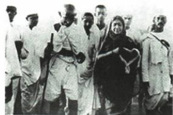

## 讲解

### 是什么

民族运动争对外独立，民主运动争对内自由，非暴力不合作是斗争方式。战后高涨由本地经济组织、列强暂放松、战争削弱觉醒、十月示范四条件配合。

### 怎么来的

目标回答要改变何关系，手段回答怎样行动，不在同一分类轴，因此一场运动可以既有民族民主目标又用某种方式。民族经济社会力量给组织需求，列强战争分散注意暂缓控制给空间，战后实力削弱和意识觉醒加强动力，十月给国际示范；条件必须经本地群众与组织转行动。印度拒配合、埃及代表团反英、墨西哥政府改革为不同路径，不因同属亚非拉便说同一领导手段成果。高涨形容动员和反抗发展，不能直接替全部取得完全独立或殖民体系终结；民族民主可相连而不是必然彼此排斥。

### 什么时候能用

用于高涨四因与三地共同主题，原合法概括保原并说明不服从边界，不把三个运动皆军事革命。

## 例题

# 常考设问 亚非拉民族民主运动高涨的原因

1. 民族资本主义经济得到发展，资产阶级实力壮大。  
2. 一战过程中, 英法等殖民国家暂时放松了侵略, 为殖民地半殖民地经济、政治的发展创造了条件。  
3. 一战削弱了帝国主义的殖民力量, 进一步促进了殖民地半殖民地国家的民族觉醒。  
4.俄国十月革命的鼓舞。

**四原答完整依据。**本地民族经济发展给资金社会力量，资产阶级壮大给组织和政治诉求；列强忙战争、原暂放松侵略使本地经济政治活动获得空间，控制并非完全撤离；战争消耗列强实力、民族觉醒使战后反抗动力增强；十月革命提供新制度与解放斗争示范鼓舞。前两点侧内部基础与战争期空间，第三战争后力量和意识，第四国际示范，不能都写一战使独立。

四条件须与本地具体组织群众结合，外部弱化或俄国示范不会自动代各国行动。印度非暴力群众、埃及代表团群众、墨西哥执政改革路径不同，时期主题可共而成果限度各异，不把运动高涨等同殖民体系此时全面崩溃。

② 易混易错 民族运动、民主运动与非暴力不合作运动的区别

1. 民族运动: 对外反对殖民主义、帝国主义, 实现民族独立。  
2. 民主运动: 对内反对专制独裁, 建立民主政治, 实现民主自由。  
3. 非暴力不合作运动: 采取和平与合法的手段取得印度的自治独立。

① 易混易错 对比印度民族大起义和印度非暴力不合作运动

| 项目 | 印度民族大起义 | 印度非暴力不合作运动 |
|---|---|---|
| 时间 | 19世纪中期 | 一战后 |
| 领导者 | 章西女王 | 甘地 |
| 斗争主力 | 印度土兵 | 群众 |
| 反抗手段 | 暴力形式 | 非暴力形式 |

**原定义与比较解释。**民族运动按对外争独立，民主运动按对内反专制争自由；非暴力不合作按具体斗争手段分类，三者不在完全同一轴，民族民主诉求可相联。原合法说法如本课盐法记录需限，非暴力不等一切符合殖民法。章西民族大起义19世纪中期、本地士兵和武装，甘地一战后群众和非暴力，虽同反英殖民而时间领袖手段不同，章西为原代表领导者之一，不扩大她独自领导全国每处起义。

### 九下第三单元原题3完整解析

3.(2024 新疆中考改编)民族解放运动是世界历史中的重要内容之一。以下是某班同学开展项目学习的部分环节,据此回答问题。

【拟定主题】小华准备根据搜集到的有关印度的非暴力不合作运动、墨西哥的卡德纳斯改革、埃及的华夫脱运动的资料,制作一期板报。

(1)这期板报最恰当的主题应是\_\_\_\_（填序号）

①西方列强的殖民扩张

②紧张的国际局势

③亚非拉民族民主运动

④殖民体系的崩溃

【观看纪录片】下图为纪录片《圣雄甘地》中“甘地和他的追随者”的画面。

(2)甘地领导的群众运动被称作什么？该纪录片解说词会如何叙述此运动的作用？

**原完整答案：**

3. 答案 (1)③。

(2) 运动: 非暴力不合作运动。
作用: 动员了广大群众, 打击了英国的殖民统治, 增强了印度人民的民族自尊心和自信心。
(意思相近即可)

**(1)推理及四主题辨析。**印度亚洲、埃及非洲、墨西哥拉丁美洲，分别拒殖民、争独立与实施民主民族经济改革，共同亚非拉民族民主运动，③最合。①列强扩张是被反抗的对象，不是三行动自身主题；②紧张局势过宽未抓共同目标；④殖民体系崩溃把运动与全面终结成果混合，埃及有条件独立、印度此时未完全独立，墨西哥又是改革，不能全套。

**(2)完整推理。**题明甘地及追随者，原其领导非暴力不合作。抵殖民机构商品税与盐法，把普通群众连接成压力，故动员广大群众；减少经济行政配合，故打击英国殖民；集体争权增强自尊自信，故民族精神作用。三原作用各有机制，非暴力不等无反抗、谈判不等独立全实现，也不将纪录片画面当未经核实的真实新闻照片日期。题中纪录片身份按原，未另核影视版本，不凭模糊人物动作编精确情节。

## 易错

条件不等自动结果，目标不等手段，国有或中央集权不能单独定全制度。

### 来源定位

- WT12-Q01：full.md（历史扫描分册301-345），L1162–L1167，亚非拉运动高涨四原因原答；bd22a802-356b-4b67-b51c-daf820cc3300_origin.pdf，实际PDF第17页。
- WT12-S05：full.md（历史扫描分册301-345），L1156–L1160，民族民主手段原三定义，合法概括边界；bd22a802-356b-4b67-b51c-daf820cc3300_origin.pdf，实际PDF第17页。
- WT12-S04：full.md（历史扫描分册301-345），L1086–L1088，19世纪印度与一战后非暴力四维比较；bd22a802-356b-4b67-b51c-daf820cc3300_origin.pdf，实际PDF第16页。
- WT-U03：full.md（历史扫描分册301-345），L1183–L1225，亚非拉主题甘地纪录片两小问四主题原答；bd22a802-356b-4b67-b51c-daf820cc3300_origin.pdf，实际PDF第18页。
