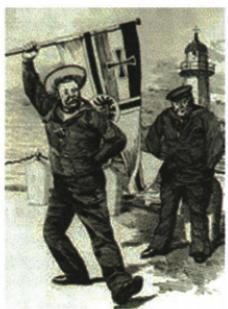

## 讲解

### 判据

原地盘诉求先认既有分配与德国挑战，再说明经济实力和政治占有不平衡；问导火索或爆发则切换事件节点，不把根因照抄给所有问。

### 流程

1. 图注德国向英挑战，原言“别的国家分割”与“我们也要求”直接呈新旧利益矛盾，不凭自动抬杆描述猜。

2. 实力发展与原地盘分配不一致，使列强重分要求和争夺扩大，接长期政治经济不平衡。

3. 结盟扩军把冲突升级风险增强，非不平衡孤立自动充分原因。

4. 若题问触发答1914.6.28事件，若问战争爆发答奥匈对塞宣战，不能刺杀日期替宣战。

5. 地盘为殖民政治诉求，日光非天气；人物一句话支持利益判断，不等仅一人造成大战。

## 例题

德国向英国发起挑战(漫画) 德国外交大臣皮洛夫曾说:“让别的国家分割大陆和海洋,而我们德国满足于蓝色天空的时代已经过去,我们也要求在日光下的地盘。”这体现了第一次世界大战爆发的根本原因是帝国主义国家间经济、政治发展不平衡。

**原材料解读，不另造漫画问。**“别的国家分割大陆和海洋”表示既有殖民分配，“我们也要求…地盘”表示德国不满并要求扩张；把后来经济实力与既有政治殖民地位不同连起来，说明发展不平衡引争夺。漫画不是原自动“抬杆”字面识别，必须接图注和言论；“日光”不是自然环境改善诉求，不说只因个人好战或一次刺杀即可解释全部根源。

# 知识点 ② 第一次世界大战 ★★★

# 1.原因

(1)根本原因:各主要资本主义国家政治、经济发展不平衡。  
(2) 导火索: 萨拉热窝事件 (1914 年 6 月 28 日)。

2. 爆发：1914年，奥匈帝国向塞尔维亚宣战。第一次世界大战爆发。

# 3.战争进程及结果

| 战场、战线 | 第一次世界大战爆发后,战争主要在欧洲战场上进行,形成了东线、西线和南线三条战线。后来,战争逐渐扩大到非洲、亚洲等地 |
|---|---|
| 重要战役 | 1916年的凡尔登战役,该战役有“绞肉机”“地狱”“屠场”之称 |
| 战争发展 | 1917年美国参加协约国一方作战,大大增强了协约国的力量。俄国爆发十月革命,不久,退出第一次世界大战 |
| 战争结果 | 1918年11月,德国投降,第一次世界大战以同盟国的失败而结束 |

4. 性质：是人类历史上一次规模空前的战争，是西方列强为重新瓜分世界、争夺世界霸权而发动的一场帝国主义战争。  
5. 影响：给人类带来了巨大灾难，参战各国损失惨重。大大削弱了欧洲的力量，从根本上动摇了欧洲的优势地位。削弱了帝国主义的殖民力量，进一步促进了殖民地半殖民地国家的民族觉醒。

**过程与整体性质说明。**长期政治经济不平衡使利益争夺持续，集团扩军增加冲突升级条件；1914年6月28日萨拉热窝事件为引爆既有矛盾的导火索，奥匈对塞宣战才是战争爆发节点，不能把刺杀当天直接换成宣战。1916凡尔登长期惨烈消耗被称绞肉机等，称号说明惨烈而不是技术名称。1917美国参战增强协约，俄国革命后不久退出，两个同年方向相反；1918年11月同盟国失败结束战争，不能单因一个战役便断全部结束。

原性质从主要列强重新瓜分和霸权目的判断为帝国主义战争，非因所有参加者每项行为都同性质；受侵略小国的具体抵抗不能拿整体概括抹去。欧洲战争损失消耗实力、殖民控制被削弱，为当地民族觉醒创造条件，但未说一战结束时所有殖民地即独立或欧洲毫无影响力。科技军事用途扩大杀伤，与生产用途改善生活可并存，评价需看用途与制度目的。

## 易错

根源导火索正式爆发是三层；图注言论比模糊外形自动识别有直接证据。

### 来源定位

- WT08-M01：full.md（历史扫描分册301-345），L750–L760，德国向英国挑战漫画与皮洛夫材料原解；bd22a802-356b-4b67-b51c-daf820cc3300_origin.pdf，实际PDF第10页。
- WT08-S02：full.md（历史扫描分册301-345），L784–L795，根本原因导火索爆发与进程表；bd22a802-356b-4b67-b51c-daf820cc3300_origin.pdf，实际PDF第10页。
