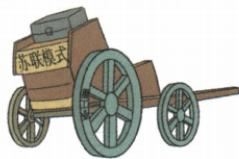

## 讲解

### 判据

原模式教训表不是口号清单；先找问题，再解释哪条办法回应，图不含数值则不算百分比。

### 流程

1. 指令固化阻适应，接生产关系随生产能力和任务调整，不能永远一个方法。

2. 大小轮象征重轻农比例不适，接三业适当协调可持续，非平均三份。

3. 集体化损害积极性，接政策顾农民实际利益，不以组织名称代产量。

4. 排市场缺反馈，接计划市场均有效工具，方法多少不直接决定制度性质。

5. 保原特定条件快速建设和战争支撑，问题教训不抹历史成就，也不借成就否问题。

## 例题

# 知识点 ③ 苏联模式 ★☆☆

1. 背景：工业化和农业集体化的实现，使苏联的社会经济生活和社会阶级结构发生了根本性变化。

2. 形成：1936 年, 苏联公布了新宪法, 规定苏联是一个工农社会主义国家。新宪法标志着苏联模式的形成。

# 3.评价

| 积极 | 在特定的历史条件下促进了苏联经济社会快速发展,也为苏联军民夺取反法西斯战争胜利发挥了重要作用 |
|---|---|
| 消极 | 没有尊重经济规律,随着时间推移,苏联模式的弊端日益暴露,成为经济社会发展的严重体制障碍 |

苏联模式

此车一面轮子大,一面轮子小,表明苏联模式没有尊重经济规律,片面发展重工业。

# 相关链接 苏联模式的表现

苏联模式在经济方面表现为建立单一生产资料公有制,实行自上而下的指令性计划经济体制。在政治方面,苏联模式表现为权力高度集中。

# 重难点 2 认识苏联模式

| 探索途径 | 社会主义工业化、农业集体化 |
|---|---|
| 主要特点 | 实行单一的公有制、实行高度集中的政治经济体制、实行排斥市场的指令性计划经济,主要以行政手段管理经济 |
| 教训 | 1制定政策时一定要坚持生产关系适应生产力发展的原则2坚持可持续发展战略,农业、轻工业和重工业按适当比例平衡发展3制定农业政策必须考虑农民的利益4计划和市场都是发展、调控经济的有效手段 |

**原图与评价完整解析。**一侧大轮一侧小轮表现部门比例失衡，接片面重工与轻工农业受限，不当真正历史车辆事故或按轮径虚算工业占比。单一公有、经济指令计划、政治权力集中是所有制、经济调配、政治权力三层，不能只用一个词替全部模式。

集中资源可在特定条件迅速建设并支持反法西斯战争，但固定排市场反馈、忽略部门协调和农民利益会造成长期障碍。四教训分别政策须适应生产能力、三部门按适当比例协调可持续、农业政策顾农民、计划市场都是手段。协调不是每部门永远各占三分之一，计划市场作用也不直接决定社会主义或资本主义性质。1936新宪法是模式形成标志，不是全部弊端到那年才突然出现，或每一措施都那日首创。

# 2. 苏联的农业集体化

| 背景 | 1927年年底至1928年年初,苏联发生了严重的粮食收购危机,斯大林决心用行政手段加快农业集体化进程 |
|---|---|
| 开始 | 20世纪30年代初 |
| 内容 | 开展消灭富农运动。政府从多方面支持集体农庄的建设,加快组建拖拉机站,为集体农庄提供机械服务,监督集体农庄执行国家的生产计划 |
| 结果 | 农民的利益受到严重损害,致使苏联农业生产长期停滞 |

**原表解释，无独立集体化例题。**粮食收购危机影响城市与工业供给，政府以行政手段集中农户生产和交售，拖拉机站供机械又监督计划，技术服务与行政管理作用不同。大规模组织可集中设备，但强制过程损害农民利益积极性，原长期停滞说明组织规模或机械增加本身不保证产量。

原30年代初为大规模推进阶段概括，不等此前完全没有集体组织，也不把收购危机1927年底—1928初写成开始已全完成。政府措施、农民利益、生产结果每层要对应，不因名为集体社会主义就断实际只有正面，也不因损害全盘否定机械服务本身用途。

## 易错

图是象征非统计，四教训各有不同问题依据不能全重复尊重规律。

### 来源定位

- WT11-S06：full.md（历史扫描分册301-345），L1074–L1076，认识模式途径特点四教训表；bd22a802-356b-4b67-b51c-daf820cc3300_origin.pdf，实际PDF第16页。
- WT11-S03：full.md（历史扫描分册301-345），L1010–L1012，农业集体化背景时间内容结果；bd22a802-356b-4b67-b51c-daf820cc3300_origin.pdf，实际PDF第15页。
- WT11-M01：full.md（历史扫描分册301-345），L1028–L1061，大小轮苏联模式原图解及发展图；bd22a802-356b-4b67-b51c-daf820cc3300_origin.pdf，实际PDF第15页。
