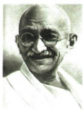

## 讲解

### 判据

见甘地和抵制拒税盐法，先定非暴力方式和反英目标，再按动员效果与限制结果评价；方式非武装不代表无行动，也不全合法。

### 流程

1. 1920–1922机构学校商品税抵制、手纺分别削行政经济配合并扩群众参与。

2. 焚警局超非暴力而停止说明原则限制，不把群众动员成果删掉。

3. 1930起减田赋放政治犯废盐法，谈判妥协不同完全独立，两个阶段别互换。

4. 作用动员打击尊严信心各接行动，原软弱妥协评价保其教材语境不推整个民族天性。

5. 原合法概括与打破盐法史料分开，非暴力是手段、不等遵从全部殖民法。

## 例题

# 知识点 1 印度的非暴力不合作运动 1 ★★☆

1. 背景：一战后，印度人民与英国殖民者的矛盾激化。

2. 领导者：甘地。

3.两次非暴力不合作运动

| 项目 | 第一次 | 第二次 |
|---|---|---|
| 时间 | 1920—1922年 | 1930年开始 |
| 内容 | 抵制在殖民政府和法院中工作;拒绝在英国学校读书;鼓励发展手工纺织业,抵制英国商品;拒绝纳税;等等 | 发起“文明不服从运动”,提出了降低田赋、释放政治犯、废除食盐专卖法等要求 |
| 结果 | 农民焚烧警察局,甘地认为这超出了运动的范围,决定停止运动 | 印度总督与甘地谈判,双方妥协 |

4. 影响：甘地发动的非暴力不合作运动，动员了广大群众，打击了英国的殖民统治，增强了印度人民的民族自尊心和自信心。

甘地

甘地领导了非暴力不合作运动。非暴力不合作运动将运动局限于非暴力范围内，影响了运动的进一步发展，反映了印度资产阶级的软弱性与妥协性。

**原知识与图解完整说明，没有独立肖像问。**抵制任职学校商品纳税减少对殖民机构经济的配合，手纺支持本地经营；1930盐法要求触及生活负担与殖民专卖，扩大动员。因此不用武装也能施压力、增强群众尊严信心。1920–1922运动因焚警局越非暴力范围而停止，1930起阶段通过谈判妥协；原局限评价不抹群众动员，也不把1930谈判等同印度此时已独立。

原“文明不服从”保称谓，指非暴力的不服从而非完全照殖民法律办事。原另一链接“和平与合法”过度概括：英国1930年4月7日议会原记录明确提甘地打破食盐法，说明非暴力与殖民当局判合法是不同标准。保原句并纠正不能将全部行动称合法；拒不执行被认为不正义的法可成为其抗议手段，不展开当代法律建议。[英国议会当时记录](https://api.parliament.uk/historic-hansard/commons/1930/apr/07/civil-disobedience-campaign)。

## 易错

手段效果与结果分别判断，非暴力不等不合作仅口头赞成殖民统治。

### 来源定位

- WT12-S01：full.md（历史扫描分册301-345），L1097–L1107，印度两次不合作原表原因影响；bd22a802-356b-4b67-b51c-daf820cc3300_origin.pdf，实际PDF第16页。
- WT12-M01：full.md（历史扫描分册301-345），L1090–L1095，甘地原肖像与局限原解；bd22a802-356b-4b67-b51c-daf820cc3300_origin.pdf，实际PDF第16页。
- WT12-S05：full.md（历史扫描分册301-345），L1156–L1160，民族民主手段原三定义，合法概括边界；bd22a802-356b-4b67-b51c-daf820cc3300_origin.pdf，实际PDF第17页。
