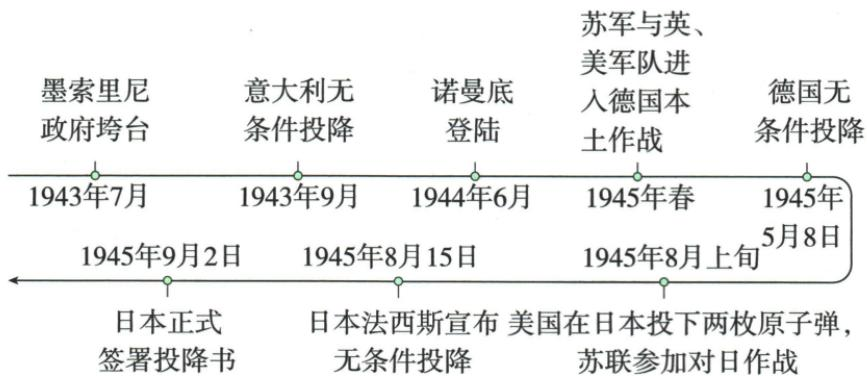

## 讲解

### 是什么

雅尔塔1945年2月、波茨坦1945年7月协调胜利并安排战后。会议、宣言、承诺、投降行动要按主体日期区分，德国投降和日本正式签书不是同一终点。

### 怎么来的

盟军已经扭转战局，但击败敌军、占领管理和战后秩序仍需协调，因此首脑会议同时包含军事与政治安排。分区占领针对战后德国，成立联合国面向战后合作，对日参战承诺针对亚洲仍在继续的战争；不能因一项涉及未来就把全部内容当战争结束后才讨论。波茨坦公告以中美英名义提出对日要求，与参会美英苏三国首脑不是同一名单；开罗宣言提出领土归还目标，重申它也不等所有地方立即实际接收。意大利政府垮台、国家投降、德国守军投降与全国投降、日方宣布与签书各有对象范围。按动作区分，才能保留每个日期的作用而不将二战结束误放在欧洲胜利一日。

### 什么时候能用

用于会议表比较和结束排序。原等字保留占领国范围；时间轴漏识日期以原图核对，不靠自动文字猜。

## 例题

**两会议原合并表恢复：**

|项目|雅尔塔|波茨坦|
|---|---|---|
|目的|协调盟军，取得最后胜利|同一目的|
|时间|1945年2月|1945年7月|
|参会国|美英苏三国首脑|美英苏三国首脑|
|主要内容|彻底消灭德国法西斯；战后美英苏等分区占领德国；战后成立联合国；苏联承诺欧洲战事结束后三个月内对日作战|重申雅尔塔精神；以中美英名义发表敦促日本投降的波茨坦公告，重申开罗宣言条件必须实施|

**原表解释。**相同参会国家不等每次都是同一个人；“美英苏等”不是仅三国占领。会议参加国与公告署名国属于不同对象，中国出现在公告名义中不能据此说中国参加波茨坦三国首脑会议。承诺、公告与实际作战投降是不同动作，既协调战胜敌国，也讨论战后安排，不能只保一层。

**对照原图恢复日期与事件：**

|日期|原图对应事件|
|---|---|
|1943年7月|墨索里尼政府垮台|
|1943年9月|意大利无条件投降|
|1944年6月|诺曼底登陆|
|1945年春|苏军与英美军进入德国本土|
|1945年5月8日|德国无条件投降；此日期在原图上，OCR文字漏掉|
|1945年8月上旬|美国投下两枚原子弹、苏联参加对日作战|
|1945年8月15日|日本宣布无条件投降|
|1945年9月2日|日本正式签署投降书，二战结束|

政府垮台和国家投降不同，德国欧洲战争结束不等日本战争也同时结束，宣布与签书不能合成一日。原图“8月上旬”含两类行动，本书没有在此细分日数，保持概括，不凭OCR排列猜先后。

# 相关链接

1943年11月，中、美、英三国的首脑在开罗会晤，并于12月初发表《开罗宣言》。宣言明确规定：日本所窃取的中国领土，例如东北地区、台湾及其附属岛屿、澎湖群岛等，归还中国。

**会议、宣言、执行分开。**原1943年11月开罗中美英会晤、12月初宣言，提出归还日本窃取中国领土。1945波茨坦重申其条件不是1943已完成一切归还；开罗中美英与雅尔塔、波茨坦首脑美英苏不可交换。东北、台湾及其附属岛屿、澎湖按原完整保留，不把宣言的目标当同日全部实际接收。

## 易错

同参会国不保证同一首脑；公告署名不是现场参会名单，宣布不等签书。

### 来源定位

- WU15-S05：full.md（历史扫描分册301-345），L1658–L1716，两会议原表结束时间轴与开罗宣言；bd22a802-356b-4b67-b51c-daf820cc3300_origin.pdf，实际PDF第24–25页。
