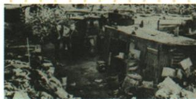

## 讲解

### 判据

危机题先分制度矛盾、购买力投机触发和破产失业表现；过剩的分母是支付能力，照片用图注而非自动垃圾场猜原因。

### 流程

1. 原繁荣产能利润股价都涨而工资缓，说明表面增长与购买力风险并存。

2. 社会生产联系与私人占有为根层，收入差投机虚荣为此次直接因素，股崩等为表现。

3. 价格资产信用融资和生产就业收入消费连锁，解释范围时间破坏，非只列名词。

4. 过剩相对有效需求，饥饿而买不起与商品卖不动可共，不答人人需求全满足。

5. 原棚户图问答1929–1933，失业住房困难为作用机制，图无地点人数不编。

## 例题

# 1 易混易错

此次资本主义经济危机的实质是生产相对过剩,即相对于人们的购买能力,社会生产能力过剩。

# 1.繁荣中隐藏着危机

| 20世纪20年代的空前繁荣 | 隐藏的危机 |
|---|---|
| 新兴产业迅猛发展,生产力不断提高,企业利润大幅增加 | 工人的工资增长缓慢,购买力严重不足,生产过剩 |
| 大量资金进入股票市场,股票价格狂涨 | 资本家兴风作浪,普通民众把有限的积蓄用来购买股票,出现了全国性的股票投机活动 |

**经济大危机原合并表：**

|项目|原内容|
|---|---|
|根本原因|生产社会化与生产资料资本主义私人占有矛盾|
|直接原因|贫富差距过大限制实际消费增长、全国股票投机、虚假繁荣|
|时间|1929—1933年|
|表现|股市崩盘银行倒闭企业破产工人失业农产品过剩|
|特点|时间长范围广破坏特别大|
|影响|生产力破坏，经济危机引政治社会危机，各国寻不同应对道路|

**完整机制说明。**生产越来越依赖许多企业行业互相供货和社会消费，但企业各按私人利润投资，财富分配又使普通人购买力追不上产出，生产与有支付能力的需求失配。相对过剩是相对购买能力，不是人人吃饱穿暖无需求；穷人仍需要却付不起，商品也可能卖不动。股价投机虚高不同企业实际盈利持续同速，价格崩跌损财产信心，银行信用困难使融资收缩，企业停破产又增失业、收入减少，再压购买力，危机可相互传导。这里因果链按学科规范补讲，原表列环节而非逐字原详解。

经济大危机时期美国穷人居住的棚户区——“胡佛村”

这一场景是什么原因造成的？
1929—1933年爆发的经济大危机

**原图问完整解析。**图注经济危机棚户区，原答1929–1933经济大危机。企业破产失业收入减少，住房与生活困难使贫民聚居，图作为社会后果的形象资料；原没有人口数和具体城市，不由外观编地点数量，也不把胡佛村名称判只有一村或建筑垃圾自然灾害。

## 易错

原因表现后果不同层，不以名叫胡佛村当唯一个人造成一切经济矛盾。

### 来源定位

- WU13-S02：full.md（历史扫描分册301-345），L1375–L1381，繁荣危机根本直接原因表现特点合并表；bd22a802-356b-4b67-b51c-daf820cc3300_origin.pdf，实际PDF第20页。
- WU13-S01：full.md（历史扫描分册301-345），L1324–L1326，相对过剩与繁荣隐患原表；bd22a802-356b-4b67-b51c-daf820cc3300_origin.pdf，实际PDF第20页。
- WU13-Q01：full.md（历史扫描分册301-345），L1328–L1341，胡佛村原图原问危机年代原答；bd22a802-356b-4b67-b51c-daf820cc3300_origin.pdf，实际PDF第20页。
