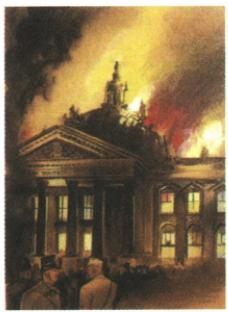

## 讲解

### 判据

原图题问打谁，答案依据原统治措施而非画面猜纵火者；先定共产党，再解释取消保障和打反对派巩独裁。

### 流程

1. 原国会绘画图注和问题对应纳粹上台后政治迫害，原答德国共产党。

2. 借火指控共产党、逮捕进步者解工会限思想，削反对组织为独裁服务。

3. 绘画只能呈题材，不能证明现场责任；原蓄意策划保原题标争议，纪念馆起火责任未明。

4. 利用已能核实不同策划定论，存疑不抹纳粹迫害责任，也不承认其指控受害者即真实。

5. 1933上台与1935起扩军节点分，别把所有措施放火灾一日。

## 例题

国会纵火案(绘画)

希特勒上台后，蓄意策划的“国会纵火案”主要打击的是谁？

德国共产党。

**原答与确定的政治利用。**原答德国共产党；火灾被纳粹用来指控共产党、取消自由保障、逮捕政治反对者，因而破坏组织并推进独裁，题问打击对象的答案成立。绘画是后述艺术呈现，不能当现场照片或凭火焰样子证明具体策划者。

**原说法与核查区分。**原题写“蓄意策划”，保原题；美国大屠杀纪念馆历史说明称起火责任仍不明确，明确的是纳粹利用火灾打击共产党和其他反对力量。不能把策划者疑点讲成已证实定论，也不因疑点删其政治迫害责任。[纪念馆国会火灾资料](https://encyclopedia.ushmm.org/content/en/article/the-reichstag-fire)。

# 1.德国法西斯政权建立

(1)背景

①经济大危机沉重打击了德国,广大中下层民众困苦不堪,对政府的不满加剧。
②以希特勒为首的纳粹党徒乘机大肆活动,进行针对性的蛊惑宣传,利用民众对《凡尔赛条约》的不满,煽动复仇情绪。

(2)标志:1933年,希特勒出任德国总理,建立了法西斯专政,第二次世界大战的欧洲战争策源地形成。

(3) 统治措施

①利用“国会纵火案”，逮捕和迫害大批共产党人和进步人士，并解散工会。  
②焚烧了大量的进步书籍,加强思想控制。  
③残酷迫害犹太人,许多犹太人被迫流亡国外。

**德国扩军侵占原时间轴按图转写：**

|原年|原行动|
|---|---|
|1935|义务兵役制、庞大军队|
|1936|进驻莱茵非军事区|
|1938|吞并奥地利|
|1939|原称吞并捷克斯洛伐克|

**完整说明。**危机损中下层生活，纳粹以复仇宣传将不满转支持，1933上台后打击政治组织工会、控制思想、迫害犹太人，限制独立力量并扩侵略能力。宣传有利用条件但不等所有民众都认同、所有德国人自同一思想。

违条扩军与侵占是逐步突破战后限制，1935/36/38/39不可交换。原1939“吞并捷克斯洛伐克”保简述作对该国领土侵占概括，不扩大为其所有地区同日全以同一种形式纳德；本书未细列区划，不补虚构地图。

## 易错

题问对象不是起火者，两个证据问题分开；共产党被诬指不能等同已证纵火。

### 来源定位

- WU14-Q01：full.md（历史扫描分册301-345），L1472–L1486，纵火绘画原问打击共产党原答，策划论待区分；bd22a802-356b-4b67-b51c-daf820cc3300_origin.pdf，实际PDF第22页。
- WU14-S02：full.md（历史扫描分册301-345），L1508–L1538，德国背景建政迫害措施与扩军时轴；bd22a802-356b-4b67-b51c-daf820cc3300_origin.pdf，实际PDF第22页。
