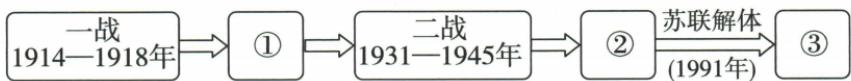

## 错法

1991解体就填多极已完全建立，原美国企图又当全世界已由美国唯一控制，经济增长就认所有领域权力同等。

## 正解

两极结束是旧结构失中心，多力量增长是趋势；单极为政策目标非全实现。经济资源能支持政治影响却需合作制度转化，各维度有差异，不自造最终几极和完成年。

## 例题

# 重难点 1 两次世界大战后世界政治格局的演变

| 时期 | 格局或趋势 | 背景 |
|---|---|---|
| 一战后 | 凡尔赛—华盛顿体系 | 战胜国为重新瓜分世界先后召开了巴黎和会、华盛顿会议等 |
| 二战后 | 两极格局 | 二战后初期,美国成为资本主义世界的头号强国,苏联是唯一能与美国抗衡的国家 |
| 20世纪90年代以来 | 世界多极化趋势 | 苏联解体后,美国成为唯一的超级大国,企图建立一个以美国为主导的“单极世界”;世界经济力量的多极化必然导致世界政治格局多极化趋势 |

**三阶段原表逐步解释。**一战后战胜国协商利益条约形成凡尔赛华盛顿；二战后两强相对阵营与军事集团形成两极；1991一力量中心瓦解后其他力量成长，出现多极化方向。会议条约、两强集团、多个力量增长是不同形成机制，不能只列三个名字。原“经济多极必然导致政治多极化趋势”说明经济力量分散提供政治影响条件，不是有一个经济数据就能确定政治格局完成日期，也不说所有国家影响相等。

# 知识点 ② 世界多极化① 趋势的发展 ★☆☆

# 1.背景

(1)苏联解体后,美国企图建立一个以美国为主导的“单极世界”。  
(2)欧盟、日本、中国和俄罗斯等国家联盟或国家在国际和地区事务中发挥着重要作用,推动世界朝着多极化方向发展。

# 2.表现

| 欧盟 | 欧盟成立后,欧洲实力进一步增强、地位进一步提高,在国际事务中发挥日益重要的作用 |
|---|---|
| 日本 | 积极谋求政治大国地位 |
| 中国 | 中国通过改革开放,经济快速发展,国家综合实力显著增强。经过和平发展不断壮大的中国对世界格局产生重大影响 |
| 俄罗斯 | 力求在国际舞台上扮演更重要的角色 |
| 广大发展中国家 | 总体实力在不断增强,国际影响不断扩大,成为推动世界多极化趋势发展的一支不可忽视的力量 |

# ① 易混易错 世界多极化

世界多极化是当今国际形势的一个发展趋势,目前并未最终形成。

# 相关链接 20世纪世界政治格局的三次变动

1. 第一次世界大战后: 从巴黎和会到华盛顿会议, 列强建立起凡尔赛—华盛顿体系, 确立了战后世界新秩序。  
2. 第二次世界大战后: 1947 年, 杜鲁门主义出台, 成为美苏冷战开始的标志; 随后, 北约、华约建立, 两极格局形成。  
3.1991年至今:苏联解体,两极格局结束。世界朝多极化方向发展。

**原表现解析。**美国企图单极是目标，不等全球实际已全由一国决定；欧盟联盟与日本中国俄罗斯国家、发展中国家群体各形成影响，不能把联盟写成一个国家或所有力量同等。经济发展提供科技资源与对外交往能力，是政治影响的基础之一，转成影响还需政策合作和具体议题，不是GDP增长一数就立刻成为固定一极。

本书“目前未最终形成”表达多极化为方向，不能改成1991已建固定均等多极格局，也不在原书学习条目里凭空列所谓最终几极。日本谋求政治大国是诉求，中国和平发展作用、俄罗斯角色、发展中国家总力分别保，不将诉求当所有目标已实现。

### 九下第六单元原题1完整解析

1.(2024 山东东营中考)以下图示呈现了 20 世纪以来世界格局的演变过程。按①②③顺序排列,对应正确的是()

A.凡尔赛—华盛顿体系 $\rightarrow$ 两极格局 $\rightarrow$ 多极化趋势  
B.凡尔赛—华盛顿体系→多极化趋势→两极格局  
C.两极格局→凡尔赛—华盛顿体系→多极化趋势   
D. 多极化趋势→凡尔赛—华盛顿体系→两极格局

**完整原解与原答：**

1. 解题思路 一战后, 形成凡尔赛—华盛顿体系; 二战后, 美苏双方互相敌对, 进而发展为两大集团的全面冷战对峙, 两极格局形成; 1991 年年底苏联解体, 两极格局瓦解, 世界朝着多极化方向发展。

答案A

**看到阶段→想到形成机制→按序判断。**一战后的条约安排对应凡尔赛—华盛顿体系；二战后美苏两强与集团对峙对应两极格局；1991苏联解体使两极结构终止，多个力量发展对应多极化趋势。三个空不是同一种机制连续换名，分别有条约、集团与力量发展的依据。

**逐项。**A三阶段都合，正确。B把第二空与第三空对调，两极在1991以前，多极化趋势在旧结构终止后发展。C把一战后的体系与二战后的两极倒置。D把多极化放在一战后第一阶段，且末尾两极与1991结束不合，三个位置都不能成立。

**原图时间范围说明。**原图确印“二战1931—1945年”，保留而不改图：1931九一八为中国遭受日本侵略的早期阶段；本书第15课以1939年德国侵波兰及英法宣战说第二次世界大战全面爆发，二者采用的事件范围不同，不能把1931当1939印错，也不能把这道格局题当确定全球各战场同年开战的依据。第三空必须保留“趋势”，不改成1991固定均等多极格局已完成。

### 来源定位

- WW21-S05：full.md（历史扫描分册301-345），L2857–L2859，三阶段政治格局背景原表；bd22a802-356b-4b67-b51c-daf820cc3300_origin.pdf，实际PDF第43页。
- WW21-S02：full.md（历史扫描分册301-345），L2811–L2838，多极趋势限定五类力量表现及三变动；bd22a802-356b-4b67-b51c-daf820cc3300_origin.pdf，实际PDF第42页。
- WW-U01：full.md（历史扫描分册301-345），L2975–L3001，世界格局原图1931–1945与四项A完整原解；bd22a802-356b-4b67-b51c-daf820cc3300_origin.pdf，实际PDF第44页。
