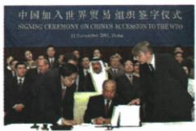

## 讲解

### 是什么

世界贸易组织1995年1月1日成立于多边贸易规则基础，宗旨开放公平等促贸易发展，协定谈判争端解决为主要职能，机会需能力条件。

### 怎么来的

跨国贸易若各方规则不同不透明，容易产生壁垒和争端，共同协定与谈判可协调条件，争端程序提供处理分歧的途径，因此降低关税减少障碍能增加贸易机会。原则是制度目标与约束，不说明所有现实行为都已公平，职能也非保证所有分歧从无发生。中国加入后市场进入更便利，同时承诺与竞争要求企业和制度调整，技术质量管理影响能否把机会变收益，所以有助现代化不等每家必盈利。加入的签署与正式生效为法律程序不同动作，原图可识仪式，但日期要依据清楚记录，不能凭小字识别串猜。联合国安全政治与世贸经济贸易共同影响和平发展，书中两支柱为角色概括，不能推只有两组织或相同权限。

### 什么时候能用

用于标志与中国原问、联合国世贸同维比较。关税普降非所有为零，宗旨非收入绝对保证。

## 例题

世界贸易组织标志

# 加入世界贸易组织对中国有什么影响？

加入世界贸易组织,有助于中国商品进入国际市场,对推动经济体制改革和现代化建设产生了深刻影响。

# 2.世界贸易组织

(1)前身:关税与贸易总协定。  
(2) 成立: 1995 年 1 月 1 日正式成立, 总部设在日内瓦。  
(3) 宗旨: 以非歧视性、开放、公平等为原则, 促进全球贸易和经济发展, 保证就业、收入与需求的增长, 提高人类的生活水平。

(4) 主要职能: 制定和规范多边贸易协定、组织贸易谈判、解决贸易争端等。

(5)作用

①成员的关税水平普遍降低,贸易壁垒进一步减少,促进了全球贸易和世界经济的发展。  
②已经成为具有重大影响力的国际组织,它与联合国成为支撑、协调世界经济和政治的两大支柱,推动着世界的和平与发展。

**完整原问解析。**规则降低部分进入市场障碍，商品有更多国际销售机会；遵守承诺与竞争推动体制管理调整、现代化，但有助不等每家企业自动获利，产品技术价格和管理仍影响结果。原宗旨是努力促进就业收入生活，并非组织保证每国每人收入一定增长。

1995年1月1日世贸成立、日内瓦总部，前身关贸总协定不同当年从无规则到有规则。多边协定、谈判、争端解决提供共同规则，不能所有关税壁垒已零，非歧视与开放公平是规则原则而非现实全部贸易完全无分歧。与联合国是书中协调政治经济“两大支柱”概括，不说世界只有这两个组织；联合国主要和平安全不同世贸贸易职能。

# 重难点 2 中国如何应对经济全球化

根据右图并结合所学，思考当今中国如何应对经济全球化。

# 回答：

1. 顺应经济全球化的潮流,积极推进经济全球化。  
2. 制定防范风险的有效政策，趋利避害。  
3. 引进国外的投资和技术, 学习先进的经济管理经验。  
4.加快产业结构升级和制度创新,大力提高本国产品的科技含量和管理水平。

中国代表签署中国加入
世界贸易组织议定书

**四原答完整解释。**参与全球化获取市场技术资源；制定风险政策防外部波动传导；引投资技术管理提高吸收能力；产业升级制度创新提高产品科技与管理，避免只依低水平竞争。积极参与与风险防范互相配合，不是开放就放弃规则，不是有风险就全面拒绝交流。

**图像读数边界。**原图是中国签入世议定书，自动描述写“2011, India”不可信；世贸原新闻记录签署为2001年11月11日多哈，中国正式成为成员是12月11日，签署与生效分步。本题只据仪式识入世与应对，不能读模糊英文臆造日期地点。[世贸中国签署原记录](https://www.wto.org/english/thewto_E/minist_e/min01_e/min01_11nov_e.htm)。

## 易错

前身关贸不同正式组织，2001签署与成员生效相差月不当2011印度。

### 来源定位

- WW20-S04：full.md（历史扫描分册301-345），L2740–L2751，世贸前身成立宗旨职能作用跨页；bd22a802-356b-4b67-b51c-daf820cc3300_origin.pdf，实际PDF第40–41页。
- WW20-Q02：full.md（历史扫描分册301-345），L2690–L2701，世贸标志与中国入世作用原问；bd22a802-356b-4b67-b51c-daf820cc3300_origin.pdf，实际PDF第40页。
- WW20-Q03：full.md（历史扫描分册301-345），L2767–L2789，中国签议定书原图及全球化四应对原答；bd22a802-356b-4b67-b51c-daf820cc3300_origin.pdf，实际PDF第41页。
