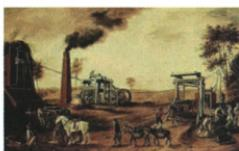
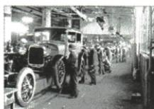

## 讲解

### 是什么

科技增强生产和处理问题的能力，其影响取决于用途与治理。原书同时列出四类积极作用、四类消极影响，并给国家和个人层面的启示。

### 怎么来的

新的动力、生产和信息技术让人们完成过去难以完成的活动，或用更少时间和投入完成任务，所以能够提高生产效率、生活质量并改变活动方式。技术提供的能力也可被用于战争和非法行为；生产规模增长若伴随污染与资源过度消耗，还会伤害生态。因此积极作用说明发展潜力，消极作用说明使用条件和治理责任，不能简单把四项好处与四项风险相抵就得出固定净结果。“科学技术是第一生产力”强调科技对生产发展的推动，不意味着资金、人才、制度、合理使用等条件从此不需要。原书国家启示把物质基础、科教和创新体系联系起来，个人启示把学习、实践和创新能力联系起来，正是在补这些条件。评价一项技术要明确作用对象和因果过程，不用“科技进步”一句替代效率、生活、战争、生态等不同维度。

### 什么时候能用

用于社会影响与启示题；原八项影响和三启示均保留，不能因题目问积极方面就把风险写成该题唯一结论，也不能从风险推出拒绝科技。

## 例题

# 常考设问 如何认识科技发明对社会生活的影响

# 1. 积极

(1)提高了人们的生活质量,丰富了人们的物质文化生活。  
(2) 改变了人们的生活方式和思维方式。  
(3)提高了人们的工作效率。  
(4) 加强了人与人之间的联系。

# 2. 消极

(1)战争问题:加剧了战争的残酷性。  
(2) 环境问题: 环境污染与其他生态问题。  
(3) 高科技犯罪: 网络“黑客”等。  
(4) 其他问题: 科技伦理问题等。

# 常考设问 第三次科技革命带给我们的启示

1. 科学技术是第一生产力, 对人类社会发展起着巨大的推动作用。  
2.作为国家,应坚持以经济建设为中心,为科技的发展奠定物质基础;发展科教事业;重视人才培养,建立知识创新体系。  
3.作为个人,应努力学习,积极参与社会实践,注重对创新意识和创新能力的培养。

**原三启示和八项影响逐层解释。**提高生活质量关乎物质文化条件；改变生活与思维方式关乎活动方法；工作效率关乎在同样时间或投入中完成更多任务；人与人联系关乎交流范围与速度。这四点可以相互关联，但答题时不能四遍重复“方便”。

消极方面也应按对象区分：武器能力被用于战争可扩大破坏；生产消费中的污染和过度消耗会损伤生态；技术被用于非法侵入等会形成高科技犯罪；新技术的使用还涉及责任和伦理。不能由“有积极作用”推出不需治理，也不能由风险推出应取消科技发展。

原启示第一点说明科技能提高生产能力；国家层面把经济物质基础、科教、人才和创新体系接起来，技术发展需要资源、知识与组织条件；个人层面把学习、实践和创新意识能力接起来，掌握知识还要在实践中尝试应用。“第一生产力”不等一项发明能自动解决分配、制度和一切社会问题。

### 九下第六单元原题2完整解析

2.(2022 福建中考)下图分别呈现了三次工业革命的有关内容。据此可知,其共同的影响是()

19世纪早期使用蒸汽机的英国煤矿

20 世纪初福特汽车公司的生产流水线

孩子们通过互联网学习知识

A. 改变了社会生活的方式  
B. 推动采矿和冶金业发展  
C. 加剧资本主义国家矛盾  
D.确立资本主义世界市场

**完整原解与原答：**

2. 解题思路 第一次工业革命期间,蒸汽机成为主要的动力来源,改变了人们的生产生活方式;第二次工业革命期间汽车逐渐普及,拓展了人们的活动空间,也改变了人们的生活方式;第三次科技革命中互联网的普及,改变了传统的线下学习的方式。

答案A

**三图共同证据。**煤矿蒸汽机改变劳动与动力方式；流水线与汽车生产涉及生产活动、交通和活动空间；网络学习改变获得知识的方式。抽取共同层次是社会生产生活方式的变化，不能只用第一图的采矿行业概括全部。

**逐项。**A正确，三图分别展示生产、交通及学习变化，都可归入生活方式改变。B仅与部分工业活动有关，孩子网络学习不证明采矿冶金，不能涵盖共同影响。C材料没有国家间矛盾的证据，技术发展与竞争可能有关也不等本三图直接证明。D资本主义世界市场的形成有阶段过程，三次革命不各自都重新“确立”同一世界市场，网络学习图也不能单独证明这一结论。

题目问共同影响，原答案讲积极变化，不据此推科技没有战争、污染、犯罪和伦理风险；正面题的答案范围与完整评价范围不同。

## 易错

战争破坏、环境污染、犯罪和伦理各有对象，不把消极影响缩成一句“有弊端”。

### 来源定位

- WW22-Q01：full.md（历史扫描分册301-345），L2906–L2910，第三次科技革命国家个人三启示原答；bd22a802-356b-4b67-b51c-daf820cc3300_origin.pdf，实际PDF第43页。
- WW22-Q03：full.md（历史扫描分册301-345），L2927–L2941，科技发明积极四项与消极四项原答；bd22a802-356b-4b67-b51c-daf820cc3300_origin.pdf，实际PDF第43页。
- WW-U02：full.md（历史扫描分册301-345），L3003–L3037，三次工业革命煤矿流水线网络三图共同影响A及原详解；bd22a802-356b-4b67-b51c-daf820cc3300_origin.pdf，实际PDF第45页。
