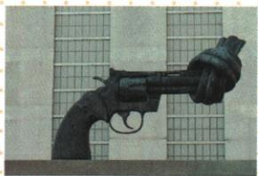

## 讲解

### 判据

原图武器枪管被打结，先解释功能反差反战争愿望，再接和平安全宗旨；机构看职责，中国看会员和代表区别。

### 流程

1. 图中打结是枪管，普通可杀伤武器被阻功能，读制战争禁止杀戮呼和平三寓意。

2. 艺术愿望连1945国际安全组织宗旨，非证明联合国建立后处处无战。

3. 联大全体会员、安理会主要安全责任、秘书行政三职分，主要选列不当仅三。

4. 派人员为依据决议可行动，实际和平需落实合作，不能职能就保证成功。

5. 中国1945创始与1971代表恢复不同对象，不改1971才国家入会；UN纽约WTO日内瓦分总部。

## 例题

# 知识点 ① 联合国 ★☆☆

# 1.建立过程

| 决定建立 | 第二次世界大战中,世界反法西斯国家提出建立战后国际安全组织的主张 |
|---|---|
| 正式建立 | 1945年10月,联合国正式成立,总部设在美国纽约 |

2.首要宗旨：维持国际和平及安全。

3.地位：是人类构建世界和平的成果,也是影响最大的国际组织。

# 4.主要机构

(1)联合国大会,简称“联大”,由全体会员国组成,每年举行一届大会。  
(2)联合国安全理事会,简称“安理会”,担负着维护国际和平与安全的主要责任。  
(3)联合国秘书处,是联合国的行政秘书事务机构。

5.职能：根据安理会或联大的决议，联合国可以向冲突地区派出军事人员，以恢复或维持和平。

6.作用：在维护国际和平与安全方面发挥了积极作用。

联合国总部门前的

著名雕塑《打结的手枪》

# 该雕塑有什么寓意？

《打结的手枪》寓意制止战争、禁止杀戮、呼唤和平。

**原图问完整解析。**手枪为杀伤武器，枪管打结使射击功能受阻，形象表达制止战争、禁止杀戮、呼唤和平，原三寓意全保；自动描述误说握把打结，与原图枪管不符，不能照抄。雕塑是和平愿望象征，不证明联合国已消一切战争。

联合国1945年10月正式成立，纽约总部；战时提出与正式建立不同阶段。原列联大全体会员、安理会和平安全主要责任、秘书处行政事务，是主要机构选列，不说联合国只有三机构。决议派人员维护恢复和平是可采取行动，实际效果受授权合作和局势条件影响，“积极作用”不是永远成功或保证各地无冲突。

# 相关链接 中国与联合国的关系

1. 中国是联合国创始会员国之一和5个安理会常任理事国之一。  
2.由于美国等国家的阻挠,直至1971年10月,在第26届联合国大会上,中华人民共和国才恢复了在联合国的合法席位。  
3.中国在联合国发挥了重要作用,积极参加联合国的维和行动。

**完整区别。**中国是创始会员国和五常之一，1971年10月第26届联大恢复的是中华人民共和国代表中国的合法席位，不是中国当年才成为联合国新会员。国家会员身份与代表权不同，维和参与是履行国际合作的一面，也不能据此说每项国际争端都已解决。

## 易错

雕塑不提供战争人数，原三寓意必须全接但不由愿望推实现。

### 来源定位

- WW20-Q01：full.md（历史扫描分册301-345），L2664–L2680，打结手枪原图问寓意；bd22a802-356b-4b67-b51c-daf820cc3300_origin.pdf，实际PDF第40页。
- WW20-S01：full.md（历史扫描分册301-345），L2703–L2721，联合国建立宗旨机构职能作用；bd22a802-356b-4b67-b51c-daf820cc3300_origin.pdf，实际PDF第40页。
- WW20-S02：full.md（历史扫描分册301-345），L2684–L2688，中国创始会员1971合法席位维和；bd22a802-356b-4b67-b51c-daf820cc3300_origin.pdf，实际PDF第40页。
