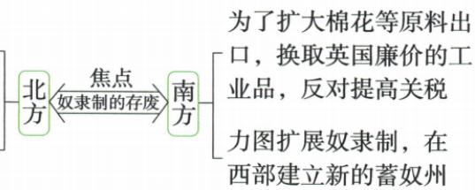

## 讲解

### 是什么

19世纪中期北方发展资本主义工商业，南方种植园大量用奴隶。关税、原料市场及西部新州制度的利益分歧加剧，焦点是奴隶制存废；1860林肯当选为导火线，1861南方挑战。

### 怎么来的

工商业经营者希望本国商品销售与产业成长，提高进口关税可减外国工业品竞争；南方种植园重原料出口换廉价外国工业品，提高关税损其交换利益。西部新地采用自由或奴隶劳动，又改变两种经济发展空间和政治力量，所以分歧不仅是不同农作物。劳动制度关系到人的身份与生产组织，奴隶制的扩展与自由雇佣方向冲突，成为经济制度矛盾的焦点。总统当选激化已存在矛盾是具体触发，不是林肯个人创造全部根本问题。

### 什么时候能用

用于矛盾表现、根因与导火线区分。原北方主张为阵营概括，不扩大每个人立场；原工业第四等排名属19世纪中期语境，不能作今天数据。

## 例题

# 知识点 ① 南北矛盾的加剧 ★★★

# 1.背景

(1)领土扩张:美国独立后,经济发展,领土扩张。到19世纪中期,美国已经成为东临大西洋、西濒太平洋的大国。工业生产居世界第四位。  
(2)两种经济制度:北方完成了工业革命,发展资本主义工商业;南方以种植园经济为主,大量使用黑奴劳动。

# 2.表现

为发展本国工业，要求提高关税，抵制外国商品输入

主张废除奴隶制，在西部建立自由州，发展资本主义工商业

**原图文字补齐：**北方为发展本国工业要求提高关税抵制外国商品输入，主张废除奴隶制、在西部建自由州发展工商业；南方为棉花等原料出口、换英国廉价工业品，反对提高关税，力图扩奴隶制、在西部建新的蓄奴州；焦点为奴隶制存废。

**原材料解释。**关税使外国工业品进口成本上升，北方本国产业较易竞争，而南方交换原料与进口工业品的成本利益相反；西部新州采用何种劳动制度又影响两种经营的发展空间。因此经济类型差异发展为政策与土地制度冲突，不是两个地区天生不相容。原北方废奴主张是总体阵营对比，不能理解每位北方人从始至终都有完全相同立场；根本矛盾、总统当选导火线和南方挑起战争三个层次不能混写。

**原爆发表逐格转写。**1861年4月爆发；根本原因为北方资本主义制度与南方种植园奴隶制矛盾；导火线为1860林肯当选总统、主张限制奴隶制发展。初期南方准备久、北方屡失利，人民不满示威要求转局。

**原转折表逐格转写：**

|项目|宅地法|解放黑人奴隶宣言|
|---|---|---|
|原背景与时间|初期北方失利，1862年|同左|
|内容|鼓励农民到西部耕种|从1863元旦起南方叛乱地区奴隶永远自由，可自由人身份加入北军|
|原共同作用|动员农民尤其黑人，扭北方被动|同左|

原结果1865南方投降、北方胜利、避免分裂。**解释：**土地和解放措施把战争同群众切身利益连接，增加北方支持和力量，不能只列文件名便跳到必胜；北方综合实力仍是条件，初期失利又说明经济优势不是每场战役立即胜利。

**文件的时间与范围补充。**原1862为初步宣言发表阶段，1863年1月1日为正式宣言生效节点。美国国家档案馆原件及说明确认它针对指定叛乱地区，未立即废全国所有地区奴隶制，实际自由又与联邦军事推进相联。全国废奴的宪法保障还包括1865第十三修正案。因此“1862文件—1863生效范围—战争及后来全国废奴”不能压成发表当天全国人人获全同政治权利。

### 九下第一单元原题7与完整解析

7.(2024 河北中考节选)阅读材料,完成下列要求。

材料二 美国历任总统中,很少有人处理过林肯所面对的危机。他刚当选,南部一些州纷纷退出联邦,国家就像“房子一样裂开”;他还未就任,叛乱分子组织的“美利坚联众国”即已推举了自己的正、副总统。他在第一次就职演说中仍寄希望于南部各州回心转意,一再表示他的政府无意于干涉南部的特殊制度,也不会首先发动攻击。他同时严正地警告说,他决不会对分裂联邦的行为坐视不管。但他期望的“联邦大团结的合唱”,却并未因他这番苦口婆心的规劝而响起,而是经过整整4年血战后方才重新“响彻云霄”。

——摘编自常冬为《美国档案》

材料三 美国内战前,农业产值在工农业总产值中占63%,1900年工业产值超过农业产值,达到61%。内战后持续半个世纪保持4%的平均年经济增长率,到19世纪末,美国已成为世界第一经济强国与世界制造业巨头。

——摘编自钱满素、张瑞华《美国通史》

(2) 据材料二, 指出林肯政府遭遇的危机。并概括林肯政府是如何应对这一危机的。

(3) 综合材料二、三和上述问题, 谈谈你从美国的发展中得出的认识。

**完整原答（保留节选原号）：**

7. 答案 (2) 危机: 国家分裂, 南方部分州独立。做法: 领导美国内战并取得胜利。

(3)认识:国家统一是国家发展和强大的前提。

**(2)完整推理。**“退出联邦”“裂开”“另推总统”说明南方分离和国家分裂危机，不是再次受英国殖民。原答“部分州独立”指宣布脱离联邦，不把其写成后来获得普遍承认的独立国家。林肯初尝规劝而无效，整整4年血战后重归团结，结合本课说明领导内战、北方胜利维护统一；材料初演说无意干涉特殊制度是当时立场，不能倒读为后来解放宣言从未发布或各阶段目标毫无变化。

**(3)完整推理。**材料二统一恢复，材料三后来工业地位和增长，支持原认识“国家统一是发展和强大的前提”：统一稳定政治与市场联系，为制度和经济发展提供条件。但前提不是充分保证，仍需废奴、生产技术经营等实际因素，不能只凭统一后增长就断增长全部由统一唯一造成。原数字农业63%、1900工业61%分别是不同部门份额，不能直接相减说农业只降2个百分点；平均年4%是原半世纪平均概括，不代表每年恰好4%。原未给逐年数据或全部统计口径，不自补精确曲线。

本书为节选，只提供材料二、三和(2)(3)，不补造材料一或(1)。

## 易错

北方主高关税、南方反高关税不能交换；内战不同英殖民下独立战争。

### 来源定位

- WE03-S01：full.md（历史扫描分册251-300），L3044–L3089，领土两经济及南北关税西部奴隶制原图；5dc2c8da-0729-4435-bf9a-d7b79d1838b6_origin.pdf，实际PDF第47页。
- WE03-S02：full.md（历史扫描分册251-300），L3102–L3104，1860导火线1861爆发与初期北方失利；5dc2c8da-0729-4435-bf9a-d7b79d1838b6_origin.pdf，实际PDF第48页。
- WE-U07：full.md（历史扫描分册301-345），L87–L105，美分裂两材料(2)(3)两原答；bd22a802-356b-4b67-b51c-daf820cc3300_origin.pdf，实际PDF第2页。
