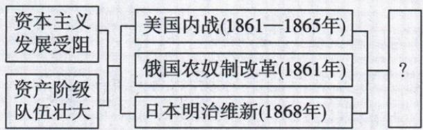

## 讲解

### 判据

原图同受资本主义发展阻碍、资产阶级队伍壮大的背景，三行为解除不同社会制度障碍，先说明各自产生何种变化，再概括共同方向。

### 流程

1. 对原左右括号，左两背景共同接三事、右括号接问号，不用自动图漏边。

2. 美内战维护统一废奴，俄解除农奴身份，日多方面改制，路径分别为战争与改革。

3. 各促资本主义关系发展，概括制度扩展；同年代只是辅助，关键为社会作用。

4. 另三项分别世界市场、殖民控制、工人力量，不是本图共同直接证据，不凭相关主题替答。

5. 原三次改革措辞保原解并纠正为两改革一内战，保1861—1865/1861/1868动作精度。

## 例题

新考法 ▶ 大单元教学（2024 四川自贡中考）构建思维导图是学习历史的方法之一，下图是某同学在学习世界历史某一单元后制作的思维导图，结合所学可知，图中“?”处应填写（）

A.资本主义世界市场初步形成

B.世界殖民体系的形成

C. 无产阶级独立登上历史舞台

D.资本主义制度的扩展

解题思路 美国内战清除了资本主义发展的最大障碍,为以后经济的迅速发展创造了条件;1861年农奴制改革推动俄国走上了发展资本主义的道路;日本明治维新使日本迅速走上了发展资本主义的道路。由此可见,19世纪60年代的三次改革促进了资本主义制度的扩展。

答案 D

**原图读取与逐项。**图左资本主义发展受阻、资产阶级队伍壮大共同汇合三事件，再括到“？”；不是自动图所画仅美国一项受阻。D正确，美国内战为资本主义进一步发展扫障碍、俄日改革走资本主义道路，共同为制度扩展。A世界市场联系是不同经济空间主题，图未以跨国贸易网络为直接证据。B殖民体系形成须看殖民控制地域与列强统治，三事件共同核心不是殖民体系建立。C工人作为独立政治力量是工运主题，不是这里三场资产制度变动。

**原解析勘误。**原称“19世纪60年代的三次改革”保留原句，但美国内战是战争，另两场为改革；应概括为三次制度变动、两改革加一内战，不把路径全改相同。共同方向不等完全同机制，原1861—1865、1861、1868各保对应事件。

### 九下第一单元原题8与完整解析

新考法 ▶ 大单元教学（2024 四川自贡中考）构建思维导图是学习历史的方法之一，下图是某同学在学习世界历史某一单元后制作的思维导图，结合所学可知，图中“?”处应填写（）

A.资本主义世界市场初步形成

B.世界殖民体系的形成

C. 无产阶级独立登上历史舞台

D.资本主义制度的扩展

解题思路 美国内战清除了资本主义发展的最大障碍,为以后经济的迅速发展创造了条件;1861年农奴制改革推动俄国走上了发展资本主义的道路;日本明治维新使日本迅速走上了发展资本主义的道路。由此可见,19世纪60年代的三次改革促进了资本主义制度的扩展。

答案 D

**原图读取与逐项。**图左资本主义发展受阻、资产阶级队伍壮大共同汇合三事件，再括到“？”；不是自动图所画仅美国一项受阻。D正确，美国内战为资本主义进一步发展扫障碍、俄日改革走资本主义道路，共同为制度扩展。A世界市场联系是不同经济空间主题，图未以跨国贸易网络为直接证据。B殖民体系形成须看殖民控制地域与列强统治，三事件共同核心不是殖民体系建立。C工人作为独立政治力量是工运主题，不是这里三场资产制度变动。

**原解析勘误。**原称“19世纪60年代的三次改革”保留原句，但美国内战是战争，另两场为改革；应概括为三次制度变动、两改革加一内战，不把路径全改相同。共同方向不等完全同机制，原1861—1865、1861、1868各保对应事件。

## 易错

不能把“资本主义”开头的几个主题都当同义词，图所给何证据才决定归类。

### 来源定位

- WE-U08：full.md（历史扫描分册301-345），L107–L136，大单元三事件原图四项原解D；bd22a802-356b-4b67-b51c-daf820cc3300_origin.pdf，实际PDF第2页。
