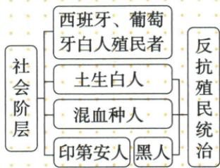

## 讲解

### 判据

阶层图展示统治等级与被统治者，先读标签及右侧括号实际范围，再解释不同阶层为何有共同反抗要求，不能看自动图所有箭头就说全部殖民者也反殖民。

### 流程

1. 自上而下读原四层，土生白人不同欧洲殖民统治者，原社会身份不能仅靠肤色归一。

2. 对右侧反抗括号的下部被统治层，不把顶部统治者算入同一联合。

3. 用政治等级和利益受损解释共同反殖民需求，而非说每种人天然性格相同。

4. 保不同诉求，联合反抗不等全部财富权利主张一致。

5. 图是知识材料，原未给独立图题，不编新题充覆盖。

## 例题

**原图：拉美殖民统治时期社会阶层。**

自上而下为西班牙葡萄牙白人殖民者、土生白人、混血种人、印第安人黑人。原图右侧“反抗殖民统治”括号对下部被统治阶层，不能按自动识别图把所有阶层包括顶部殖民统治者都连成共同反殖民者。

**解释与范围。**图表现殖民身份等级和社会矛盾，不是自然决定人的价值高低；“土生白人”与欧洲来的殖民者来源及社会地位不同，不能只看肤色就认为利益身份全同。各被统治阶层可能有共同反殖民要求，同时具体财产和权利诉求不同，因此联合反抗不等全都主张平均财富或每人行动完全一致。该图是材料不是独立原题，未据图编选择题。

## 易错

图的层次是历史统治结构，不是人的道德价值排序；自动箭头已错不引用。

### 来源定位

- WE01-S03：full.md（历史扫描分册251-300），L2922–L2944，原社会阶层图反殖民括号实际位置；5dc2c8da-0729-4435-bf9a-d7b79d1838b6_origin.pdf，实际PDF第45页。
