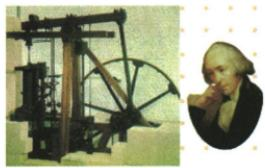

## 讲解

### 判据

看到瓦特与蒸汽机原图，先定贡献为改进，再按投入使用、广泛推广、工厂动力和生产影响展开，图的外观不能替代文字证据。

### 流程

1. 识人物和蒸汽机，已有早期排水装置证明不是瓦特从零发明。

2. 18世纪中期系列改进，1785投入使用，19世纪30年代主要动力，分三个动作阶段。

3. 有效动力支持机器集中生产与规模扩张，因而生产力提高，革命向纵深发展。

4. 说减少水力择址限制，同时保留燃料水交通等实际条件。

5. 按原问写一段连贯说明，不能仅写“蒸汽时代”而缺人物、时间和依据。

## 例题

请为图片撰写一段文字说明，感受工业革命的风采。

18世纪中期，瓦特对蒸汽机作了一系列改进，于1785年投入使用；到19世纪30年代，蒸汽机成为主要的动力来源；蒸汽机的广泛应用是生产领域的一次意义重大的飞跃，它极大地提高了生产力，使工业革命得以更快地向纵深发展。

(1) 蒸汽机的改进和应用

| 背景 | 早期的蒸汽机用于抽干矿井中的积水,很不完善 |
|---|---|
| 改进 | 18世纪中期,瓦特对蒸汽机作了一系列改进1 |
| 应用 | 1785年,瓦特改进的蒸汽机投入使用,后来应用到更多的生产部门。到19世纪30年代,蒸汽机成为主要的动力来源 |
| 意义 | 蒸汽机的广泛应用是生产领域的一次意义重大的飞跃,它极大地提高了生产力,使工业革命得以更快地向纵深发展 |

(2) 现代工厂制度的确立

| 前提 | 瓦特蒸汽机提供了更有效便捷的动力,工厂设置地点摆脱自然条件限制,规模也变得更大 |
|---|---|
| 确立 | 进入19世纪,传统的手工工场逐渐被大工厂替代2,现代工厂制度最终确立 |

**原问原答的完整解释。**先写图中人物瓦特和蒸汽机，再写18世纪中期系列改进、1785投入使用、19世纪30年代主要动力及广泛应用的生产力作用。原表已有早期矿井排水蒸汽机，所以贡献是改进推广而非从无到有发明。动力可集中带动机器，扩大厂房规模，减少必须靠河流水力择址的限制，使生产更集中、效率提高；仍需煤、水、交通、劳动力，不能说工厂从此不受任何自然和区位条件限制。投入某一用途、推广为主要动力和制度确立分属不同阶段。

### 1785应用节点的用途边界

原书1785投入使用作为棉纺织与工厂推广的课堂节点保留。科学博物馆的瓦特档案记1776已有商业矿井泵机；所以不把1785写成历史上任何瓦特蒸汽装置第一次商业运行。改进、矿井排水和扩大工厂生产用途是不同层次，能并列说明。

## 易错

一张装置图不证所有内部结构，原提高生产力不是每人立即富裕。

### 来源定位

- WI20-Q01：full.md（历史扫描分册251-300），L2592–L2614，瓦特蒸汽原图说明原问完整原答；5dc2c8da-0729-4435-bf9a-d7b79d1838b6_origin.pdf，实际PDF第40页。
- WI20-S03：full.md（历史扫描分册251-300），L2630–L2638，蒸汽改进应用与现代工厂；5dc2c8da-0729-4435-bf9a-d7b79d1838b6_origin.pdf，实际PDF第40页。
