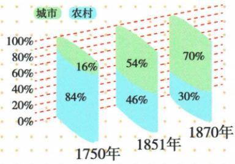
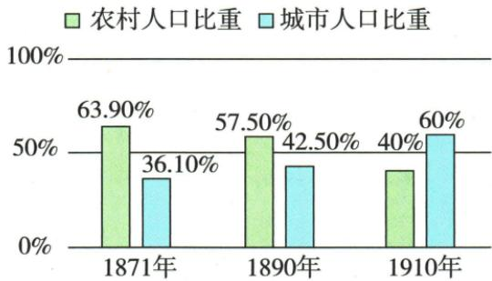

## 错法

直接抄识别表把1750城市写84%、1870城市写30%，便得出工业化越发展城市越衰退；又把农村占比缩小断农村人数必减。前错配色类别，后错把各年不同总量当同一分母。

## 正解

原城市为16%、54%、70%，比例持续上升。每年城市农村合100%只说明该年构成；比较人数还需各年总人口。程度看占比，速度看相应时段年均变化，不能总增幅互比；原图跨两轮，别把城市化推迟至第二轮开始。

## 例题

**原问：**英国城市人口与农村人口的比例变化说明了什么？

**原答：**工业化国家的城市化进程加快。

**对照原图例转录：**

|年份|城市人口比例|农村人口比例|
|---|---|---|
|1750年|16%|84%|
|1851年|54%|46%|
|1870年|70%|30%|

**完整解析。**先按绿色城市、蓝色农村配数，不能采用识别表的相反归类。城市占比由16%到54%再到70%，农村占比由84%到46%再到30%；这说明人口分布向城市转移，城市化程度提高。原答还说进程加快：前一段101年上升38个百分点，后一段19年上升16个百分点，后一段在较短时间取得较大的年均比例增幅，与原答一致；只比较38和16而不看时间，会误判速度。这里比较的是给定两时段的平均变化，不表示每一年速度都递增。

三组均以当年总人口为分母且各自合为100%，不能把1750年的16%与1870年的30%当同一总量下的两人数。图未给总人口，农村占比下降不能直接推出农村绝对人数减少；不能凭城乡比例判贫富差距、教育普及或每一年的迁移人数。1750至1870还跨两轮工业革命，不能说城市化到第二次工业革命才开始。

### 九下第二单元原题2及全部选项解析

2.(2024 四川南充中考)下图是德国 1871—1910 年农村人口与城市人口的比重变化情况。由此可知,当时德国()

A.贫富分化加剧

B.人口增长迅速

C.大众教育的普及

D.城市化进程加快

**原完整解析与原答：**

2. 解题思路 根据题干数据可知，1871—1910 年，德国农村人口比重不断下降，而城市人口比重不断上升，说明这一时期德国城市化进程加快。

答案D

**原图值：**1871农村63.90%、城市36.10%；1890农村57.50%、城市42.50%；1910农村40%、城市60%。先按绿色农村、浅蓝城市读，图例和上一课英国图配色不同，不能机械照抄颜色含义。城市比重持续升、农村降，说明人口分布向城市集中，原D正确。1871至1890的19年城市增6.40个百分点，1890至1910的20年增17.50点，后一段年均变化更快，但不是每年都按同一速度。

**逐项。**A不选，城乡分布不等收入财富分配，不能据这张图证明贫富差距。B不选，占比图没有总人口，无法推出总人口增长速度。C不选，图没有学校入学或文化水平数据，不能证明教育普及。D正确，直接对应城乡比重变化。未选不是断贫富、人口和教育在德国史上全未发生，而是本图不能证明。

### 来源定位

- WS06-Q01：full.md（历史扫描分册301-345），L305–L322，英国城乡原图问答，自动比例表反置；bd22a802-356b-4b67-b51c-daf820cc3300_origin.pdf，实际PDF第6页。
- WS-U02：full.md（历史扫描分册301-345），L449–L491，德国1871至1910城乡人口图四项原答D；bd22a802-356b-4b67-b51c-daf820cc3300_origin.pdf，实际PDF第8页。
