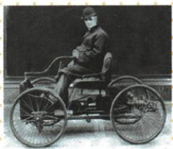

## 讲解

### 是什么

内燃机利用内部燃烧燃料提供动力，煤气汽油柴油机各有原代表。汽车飞机扩交通，石油需求推动相关工业；福特1913流水线改变汽车生产组织，不能同汽车首次制造混写。

### 怎么来的

新的交通不仅需车架，还需适宜发动机把燃料能量转行驶飞行动力；原一系列内燃机改进解决动力问题，使个人陆行和航空有新工具，扩大活动范围。制造和使用交通工具又需燃料材料零件与维修，推动新兴产业，特别石油开采化工，这是一条需求联系而非见同年代便硬连因果。流水线把装配分工成连续工序，提高批量效率与可供数量，支持更多中收入家庭开始使用，属于组织革新，不是1913才有汽车。发明、试飞、批量普及三个动作不能共用一个日期。

### 什么时候能用

用于原车图、发动机能源辨析及三个交通节点。能源是供能来源或形式，内燃机是装置；原飞机第一限定动力可控持续有人飞行，不排除以前滑翔飞行器。

## 例题

早期汽车

# 上图使用的是什么发动机？

内燃机。

# ② 易混易错

内燃机不是一种新能源,只是靠能源燃烧而运行的一种动力机。第二次工业革命中出现的新能源是石油、电力等。

# 3.内燃机和新的交通工具

| 内燃机 | ①1876年,德国人奥托制造出一台煤气内燃机1883年,德国工程师戴姆勒研制出汽油内燃机；③德国工程师狄塞尔发明了柴油内燃机 |
|---|---|
| 新的交通工具 | ①19世纪80年代,德国人本茨制造出一辆由内燃机驱动的汽车；②1903年12月,美国的莱特兄弟成功试飞第一架飞机；③1913年,美国的福特汽车公司使用流水线生产汽车,带来了汽车制造业的革命,汽车开始成为中等收入家庭的交通工具 |
| 内燃机发明的意义 | ①解决了交通运输工具的发动机问题,在交通运输领域内引发了一场变革；②带动了相关新兴工业的发展,为人们的生产和生活带来了极大的便利；③推动了石油开采业的发展,加速了石油化学工业的产生 |

**原图问原答完整解释。**原答内燃机，燃料在机内燃烧产生动力，机是转换能量的装置，燃料和电力是能源相关概念，不能把内燃机本身当新能源。图与原表本茨早期内燃机汽车对应，自动“电动车”描述已弃；不从照片外观猜出原未标型号或精确制造日。

内燃机让汽车飞机等交通有合适动力，扩大移动范围并带动生产维修材料等相关工业；石油燃料需求又推动开采和化工发展。19世纪80年代汽车、1903年12月试飞、1913流水线分发明试验与生产组织，流水线通过工序分工和连续装配提高批量效率，不是福特1913首次发明汽车。原第一架飞机按航空博物馆历史口径理解为成功的有人动力可控持续飞行，不说此前从无滑翔或任何飞行器；原家庭普及“开始”不是当年每个家庭已拥有。

## 易错

1876煤气1883汽油与未给狄塞尔年保精度；原1903.12、1913不可交换，自动电动车描述已弃。

### 来源定位

- WS05-S03：full.md（历史扫描分册301-345），L248–L250，三内燃机交通三成果三意义原表；bd22a802-356b-4b67-b51c-daf820cc3300_origin.pdf，实际PDF第4页。
- WS05-Q02：full.md（历史扫描分册301-345），L218–L236，早期汽车原图发动机问原答；bd22a802-356b-4b67-b51c-daf820cc3300_origin.pdf，实际PDF第4页。
