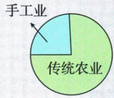
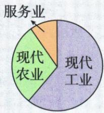
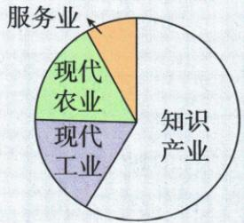

## 讲解

### 是什么

三个经济时代按主导生产方式和部门结构区分，传统农业、现代工业、知识经济各有突出成分；图中其他部门仍存在，时代名称不代表仅有一个行业。

### 怎么来的

生产力是生产物质财富的能力，技术工具、劳动技能与生产组织变化提高能力，也改变生产活动怎样展开及哪些部门更重要。农业为主时工业手工活动仍有，工业提高规模与分工时农业与服务仍存，知识技术产业突出时仍依赖农业工业物质生产。故主导结构转型不是把旧部门瞬间删除。科学家、思想和跨国联系可以推动技术与经营，但属于影响能力变化的具体条件，根本解释需接实际生产力改变，不能将某一人努力当所有时代统一充分原因。图示没有部门精确比例，不从大小估数，也不能把历史分期当所有国家在同年进入相同阶段。

### 什么时候能用

用于三经济时代原图根本原因与部门共存判断。原无百分数不编；主导概括不同各国完全同步。

## 例题

新考法 ▶ 核心素养·唯物史观（2024 山东青岛中考）学者何顺果认为，自文明产生以来，人类社会的发展经历了以下三个经济时代。这三个时代不断发展演变的根本原因是 （）

传统农业时代

现代工业时代

知识经济时代

A. 科学家的努力

B.先进思想的推动

C.生产力的发展

D.世界联系的加强

解题思路 从传统农业时代到现代工业时代,再到知识经济时代,这一系列经济时代的演变根本上是因为生产力的发展推动了社会经济结构的转型和升级。

答案 C

**原图读取。**第一图有传统农业和手工业，第二图有现代工业、现代农业与服务业，第三图有知识产业、现代工业、现代农业和服务业。原图示主导经济成分变化，没给数值标注，不用自动识别“100、50、20”等假精确量，也不按扇区视觉估算百分比作为原数据。

**逐项。**C正确，生产力是生产物质财富的能力，工具技术和劳动组织发展改变生产方式与部门结构，从农业占主导到工业再到知识技术产业突出，是经济时代演变的根本推动。A不选，科学家探索是影响生产力发展的因素，但单一主体努力不能涵盖全部经济结构演变条件。B不选，先进思想可推动实践却不是此经济转型根本的生产能力变化。D不选，世界联系能促进交流市场，但不直接替代生产力这个根本层次。其余三项不是完全无作用，题问“根本原因”需分作用层级。新主导部门出现也不等旧农业工业全部消失，第三图仍画其他部门。

## 易错

科学思想联系有作用，但原问根本层次；知识经济图仍有工业农业服务。

### 来源定位

- WS-U04：full.md（历史扫描分册301-345），L505–L658，三经济时代原三饼图四项原答C，自动数值不实；bd22a802-356b-4b67-b51c-daf820cc3300_origin.pdf，实际PDF第8页。
