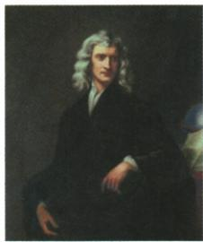

## 讲解

### 是什么

牛顿是英国科学家，主要成就包括万有引力定律、光学分析、微积分学。1687《自然哲学的数学原理》出版是系统物理研究的重要标志，原书称独立学科标志。

### 怎么来的

自然运动可用规律和数学方法联系起来，不只逐个记零散现象；牛顿著作用数学方式建立解释和论证系统，使研究者能用较统一的依据理解客观世界，因而原表强调探索向前迈进。理论、数学方法、著作载体是不同层次：万有引力是自然规律，微积分是数学研究成果，著作承载体系，不能把一本书当同类自然定律。原独立学科标志突出体系发展意义，并非否认古代及此前自然研究。人物肖像帮助辨认名字，答案还须接文字成就，照片外表本身不能证明理论。三大成就不要求学生在历史卡上学习高中力学公式，重点是贡献对象、载体与意义。

### 什么时候能用

用于牛顿图问、人物著作年份配对。1687限出版节点，主要成就取原两项或按明确三大要求答三项；不把达尔文生物理论移入。

## 例题

# 知识点① 近代科学★★☆

| 人物 | 身份 | 成就 | 影响 |
|---|---|---|---|
| 牛顿 | 英国科学家 | 万有引力定律、光学分析和微积分学是他的三大成就。1687年,《自然哲学的数学原理》的出版,标志着物理学成为一门独立的学科 | 使人类对客观世界的探索向前迈了一大步 |
| 达尔文 | 英国生物学家 | 1859年,达尔文的《物种起源》出版,在书中他提出了进化论的观点 | 打破了千百年来“上帝创造万物”的神创论,在生物科学领域掀起了一场伟大革命 |

**原知识表完整解释，表本身不计独立题。**牛顿三大成就属于引力、光学、数学研究；1687著作以数学描述和论证自然运动规律，使探索自然有系统解释工具。原“物理学成为一门独立学科”是对其体系意义的教材概括，不能理解此前没有任何物理研究、或光学微积分全在出版当年第一次出现。

达尔文1859《物种起源》用生物演变的科学解释挑战物种自始固定、全由神直接创造的说法，改变生物科学研究方向。进化论不是牛顿的物理理论，二人虽同英国而研究对象、著作和年份均不同。历史课说明理论对研究方式的影响，不把自然选择错误变成现实社会强者压迫弱者的正当理由，也不以“革命”一词误判成政权革命。

牛顿

图中人物是近代自然科学的奠基人之一，请写出他的主要成就。

万有引力定律；《自然哲学的数学原理》；等等。

**完整解析。**图注牛顿，原问主要成就，原答万有引力定律与《自然哲学的数学原理》等；原表还列光学分析、微积分学，均属于其主要成就。若按题所需简答可取原两项，若问三大成就则按原表三研究成果回答，著作和理论类别不同，不能把二者硬作三理论之一。1687对应著作出版，人物身份英国科学家，不能换达尔文1859《物种起源》或把他归电气发明家。图片只是辨认线索，主要成就还需原表文字依据，不能从衣服发色推理论内容。

## 易错

三大研究成就不同三本著作，独立学科标志不同此前完全没有物理研究。

### 来源定位

- WS07-S01：full.md（历史扫描分册301-345），L389–L391，牛顿达尔文身份成就影响原表；bd22a802-356b-4b67-b51c-daf820cc3300_origin.pdf，实际PDF第7页。
- WS07-Q01：full.md（历史扫描分册301-345），L411–L425，牛顿肖像原问两项原答；bd22a802-356b-4b67-b51c-daf820cc3300_origin.pdf，实际PDF第7页。
