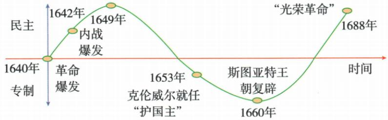
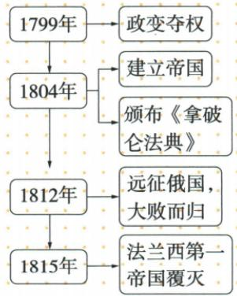

## 错法

见处死国王和共和国便说革命最后英国永无君主；见1660复辟或1688迎新王又说反专制全部失败，拿元首名称代实际权力。

## 正解

革命经历共和独裁复辟与妥协，最终仍有君主但法律议会逐渐限制专断。问成果看权力规则是否变化，而不是只数国王有无；阶段共和国也不证明实际从未独裁。

## 例题

**完整原原因过程意义表与曲线。**根本：斯图亚特封建专制严重阻英国资本主义。直接：查理一世继续君主专断，无视议会、解散议会，矛盾激化。

|原节点|发生什么|
|---|---|
|1640|议会重新召开，革命序幕|
|1642，曲线所示|内战爆发|
|1649|处死查理一世，随后宣布共和国|
|1653，曲线所示|克伦威尔任护国主、独揽大权|
|1660|查理二世为国王、君主制恢复，但权力已受限制|
|1688|议会废詹姆士二世，迎玛丽、威廉，原称光荣革命|

**原特点：**长期、曲折、艰巨、妥协。**原意义：**推翻封建君主专制，给资本主义开道路，对世界近代历史重要影响。

**完整解析。**处死国王建共和国表示对旧王权突破，但护国主独裁仍有权力集中；复辟恢复君主形式又不等所有限制全取消，最后以政变和保留君主形式的安排解决权力对立，显示反复与妥协。1640到1688跨48年，中间内战、共和国、独裁和复辟，能据具体阶段解释特点，不能只列四个词。意义针对专制被推翻、经营政治障碍减少，不能改成英国从此没有国王，或全体人立即拥有同样政治权利。曲线是制度过程示意，没有数值刻度，峰谷不代表精确民主得分，也不把曲线斜率算成改革速度。

**原君主立宪定义、特点和完整发展图。**保留王权形式的资产阶级代议政体，又称“议会君主制”；原特点为议会行国家最高权力、君主是国家权力象征。

|原阶段|原具体作用|
|---|---|
|1689《权利法案》|限制王权法律保障；逐渐形成|
|1701《王位继承法》|进一步限王权、保证资产阶级自由权利；巩固|
|18世纪内阁制逐步确立|英国代议制度建立；进一步完善|

**解析。**代议指通过代表组成的议会参与决定国家事务，君主立宪保留君主，同时让权力受法律和制度约束；所以国家仍有国王不等仍是旧式专断。法案先巩固限制、后来法律进一步规范、内阁发展完善，说明政体形成靠权力安排逐步改变。原“最高权力”“象征”是成熟政体的概括，不能倒放1689当天所有国王实际权力已完全消失。议会代表结构与选举范围也是历史发展的，不以“代议”两个字推出当时全体人口普选。原图没有完整内阁组成工作程序，不补编一份当时组织图；先掌握谁受约束、谁有决定权及怎样形成。

### 法国共和国与拿破仑称帝也须分形式和社会法律成果

**原帝国建立、兴亡图和对内对外措施。**1799年11月政变建新政府；1804公民投票改帝国、拿破仑称帝。

原对内改善财政，发展工商业农业，整理革命立法，主持民法典，原通称《拿破仑法典》1804颁布，为很多国家民法蓝本。对外屡败反法联盟，原称几乎横扫欧洲，废封建特权，同时压榨掠夺当地人。图示1812远征俄国大败，1815帝国覆灭。

**完整解析。**财政经济措施支撑国家经营，统一整理民法使革命后的法律成果有较系统规则，而不是只有政治口号；帝国称号变化不证明此前所有法律财产和反特权成果都取消。战争废特权有打击旧制度作用，压榨掠夺又伤当地人民，须分活动与对象，不能以一方积极作用抵消另一方侵害。原几乎不是全部欧洲，1812是重大败局而1815才原帝国终点，政变、称帝、法典与覆灭不是同动作。

**名称核查边界。**沿用本书通称，《民法典》1804颁布，法国司法部的历史资料记1807改称Code Napoléon。因此1804讲颁布，1807为名称变化，不因通称把颁布年改1807，亦不说最初正式标题已与后来全同。蓝本是参照影响，不是各国以后法律都一字不改，更不是今天所有条款仍适用于每国。

**英、美、法原七项目完整对比。**

|项目|英国|美国|法国|
|---|---|---|---|
|根本|封建专制阻资本主义|英国殖民统治阻资本主义|封建专制阻资本主义|
|开始|1640议会重开|1775来克星顿枪声|1789攻巴士底狱|
|主要人物|克伦威尔|华盛顿|罗伯斯庇尔|
|重要文件|权利法案|独立宣言|人权宣言|
|性质|资产革命|资产革命且民族解放|资产革命|
|政体|君主立宪|民主共和|民主共和|
|意义|资本主义道路，逐渐君主立宪|民族独立、资本主义道路|资产自由民主广传，世界性影响|

**解析。**同项比较才有意义：都为资本主义清障碍，但英法对内专制、美国对外殖民不同，故美国还具民族解放。人物列的是本表代表，不等每国革命全由一个人单独完成；三文件的限制王权、反殖民、反等级原则各有侧重，不能仅因同谈自由就交换名称日期。政体是原成果阶段概括，英国保君主，美国共和，法国1792共和以后又有帝国等变化，不能把一格“民主共和”当法国1789以后永远不变。共同性质不等过程主张和影响全同，世界性也不只法国任何他国绝无外部影响。

### 来源定位

- WC17-S03：full.md（历史扫描分册251-300），L2196–L2198，革命根本直接原因五阶段意义原表；5dc2c8da-0729-4435-bf9a-d7b79d1838b6_origin.pdf，实际PDF第32页。
- WC17-S05：full.md（历史扫描分册251-300），L2204–L2206，1640至1688民主专制原曲线及特点表；5dc2c8da-0729-4435-bf9a-d7b79d1838b6_origin.pdf，实际PDF第33页。
- WC17-S06：full.md（历史扫描分册251-300），L2208–L2210，君主立宪定义特点及1689到1701到18世纪三阶段原图；5dc2c8da-0729-4435-bf9a-d7b79d1838b6_origin.pdf，实际PDF第33页。
- WC19-S05：full.md（历史扫描分册251-300），L2320–L2353，1799政变1804称帝及1799至1815原时间图；5dc2c8da-0729-4435-bf9a-d7b79d1838b6_origin.pdf，实际PDF第35页。
- WC19-S06：full.md（历史扫描分册251-300），L2355–L2361，对内财政经济民法典及对外双作用1815终点；5dc2c8da-0729-4435-bf9a-d7b79d1838b6_origin.pdf，实际PDF第36页。
- WC19-S07：full.md（历史扫描分册251-300），L2385–L2387，英美法七项目完整原比较表；5dc2c8da-0729-4435-bf9a-d7b79d1838b6_origin.pdf，实际PDF第36页。
