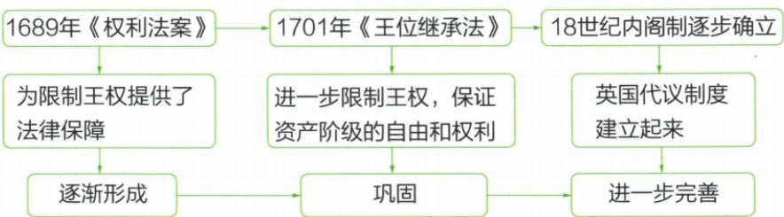

## 讲解

### 判据

遇国王不经议会不得某事，先认主语、受限动作和批准者，再说明怎样把个人专断变成规则下权力，不把禁止条件误删。

### 流程

1. 定期议会与议员讨论自由保障议事，不能把它说国王可无限不开会。

2. 停法征税需议会许可，限制国王擅自行为；法和税不因这条完全取消。

3. 请愿给提出要求渠道，不能推所有要求必获准。

4. 原王位宗教条款按历史情境，不能以法案名推出权利全平等或当今条文不变。

5. 作用为法律保障、议会权力日益超国王和逐渐形成政体，后续完善不放1689同一天。

## 例题

**1689年原《权利法案》表，目的限制国王，三项内容完整。**

1. 重申英国人“自古就有的权利”：议会定期召开，议员讨论国事和言论自由，征税权属议会，国民自由请愿等。
2. 国王不经议会许可，不能随意废法律、停止执行，也不得征捐税。
3. 原历史规定天主教徒不能为英国国王，国王也不能与天主教徒结婚。

**原结果：**议会权力日益超过国王，君主立宪制逐渐形成。

**逐项解析。**定期开会防国王长期排除议会，议员讨论自由保障议事，征税需议会许可则把国家收入决定权置于议会程序；请愿给提出要求的渠道。第二项使国王不能凭个人意志停法、收钱，重心是法律和议会约束，而非取消法律或一切税。第三项为当时王位宗教限制，说明原法案有具体历史边界，不能概括当时各宗教和全体人的权利完全平等，也不作为今天法律婚姻规定直接套用。法案是政治变革以后巩固限制的法律依据，议会超过国王、内阁发展仍有过程，不能把“逐渐”删成颁布当天现代体制各部分全部定型。

**原君主立宪定义、特点和完整发展图。**保留王权形式的资产阶级代议政体，又称“议会君主制”；原特点为议会行国家最高权力、君主是国家权力象征。

|原阶段|原具体作用|
|---|---|
|1689《权利法案》|限制王权法律保障；逐渐形成|
|1701《王位继承法》|进一步限王权、保证资产阶级自由权利；巩固|
|18世纪内阁制逐步确立|英国代议制度建立；进一步完善|

**解析。**代议指通过代表组成的议会参与决定国家事务，君主立宪保留君主，同时让权力受法律和制度约束；所以国家仍有国王不等仍是旧式专断。法案先巩固限制、后来法律进一步规范、内阁发展完善，说明政体形成靠权力安排逐步改变。原“最高权力”“象征”是成熟政体的概括，不能倒放1689当天所有国王实际权力已完全消失。议会代表结构与选举范围也是历史发展的，不以“代议”两个字推出当时全体人口普选。原图没有完整内阁组成工作程序，不补编一份当时组织图；先掌握谁受约束、谁有决定权及怎样形成。

## 易错

条款范围是议员议事或国民请愿，不泛化任何场所无限权利；批准与取消是不同判断。

### 来源定位

- WC17-S04：full.md（历史扫描分册251-300），L2200–L2202，1689权利法案目的完整三项内容与逐渐形成；5dc2c8da-0729-4435-bf9a-d7b79d1838b6_origin.pdf，实际PDF第32页。
- WC17-S06：full.md（历史扫描分册251-300），L2208–L2210，君主立宪定义特点及1689到1701到18世纪三阶段原图；5dc2c8da-0729-4435-bf9a-d7b79d1838b6_origin.pdf，实际PDF第33页。
