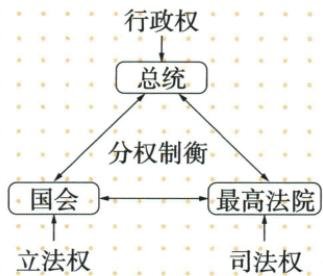

## 讲解

### 判据

原图有总统国会最高法院和行政立法司法，用职能配机构，再用程序联系解释制衡；联邦州关系为另一层。

### 流程

1. 读总统行政：执行政策法律；国会立法：制定法律；法院司法：依法裁判。

2. 分职避免一人包全部，不是三方完全无关系；按原宪法制度说明议案退回复议体现互制。

3. 三权横向分职，与联邦州纵向分享分开。

4. 中央比前强可协调国家，不等州权全部取消，地方分享非三州各领一种权。

5. 图是概括，没有法官选举方式全部信息，不能从总统议员选举推最高法院也全同种直选。

## 例题

**原1787宪法表与三权图。**独立后各州各行其是，中央软弱，1787华盛顿主持制宪。原四内容：按分权制衡设计联邦制共和国；行政立法司法三分，总统国会最高法院及相关机构各职互制；联邦地方分享权；总统议员选举。原定第一部资产阶级成文宪法；积极影响后来政治变革，局限允许奴隶制、妇女黑人印第安人与白男政治权不等。

**先说明权力含义。**行政是执行法律政策、处理国家事务；立法是制定法律；司法是按法律审理裁判。总统及行政机构、国会、最高法院及相关法院分别承担，不能把国家全部权力交一人。分权是分职，制衡是让权力按程序相互约束，不是三机构互不来往。按宪法原文补说明：总统可把议案退回，国会须按规定复议程序处理，说明立法与行政分开而又有联系；这属于制度讲解，不是新增原例题。

**两方向区别。**三权是联邦内不同机构之间的横向分职；联邦与州是不同层级的纵向权力安排，不是“总统一个州、国会一个州、法院一个州”。中央加强可处理共同事务、巩固国家；地方保有相应权力可发挥地方作用，既不同各州完全独立各行其是，也不等州一切权力被取消。原选举不等1787所有人口均享平等投票权，更不等总统国会议员最高法院法官全按同一种选法产生。

### 九上第六单元原题3及完整解析

3.(2023 湖北鄂州中考)1787 年美国宪法规定:“本宪法所制定的立法权,均属合众国国会,国会由一个参议院和一个众议院组成”“行政权力赋予美利坚合众国总统”“合众国的司法权属于一个最高法院以及由国会随时下令设立的低级法院”。宪法设计的美国政治体制的特点是 ( )

A.君主立宪

B.三权分立

C. 中央集权

D. 地方分权

**原完整详解与原答：**

3. 解题思路 美国依据分权制衡原则设计了一个联邦制共和国；行政、立法、司法三权分立，总统、国会与最高法院及其相关机构各司其职；相互制衡。

答案 B

**逐项与完整推理。**三段先分别把立法、行政、司法给国会、总统、法院，这是按权力职能横向分工，故B三权分立正确。A不选，没有君主以及君主受宪法限制的安排。C不选，中央集权问中央与地方权力关系，不是本材料列三职能的直接特点。D同样是中央地方纵向关系，不能把法院层级或国会两院误当地方分权。原解“联邦制共和国”是整体制度背景，材料直接展示的判据仍为三种职能及不同承担机关。最高法院及依法设立的其他法院共同属司法系统，不是全美国只有一所法院，也不说分权后机关毫无联系；制衡正是防某一机关独揽。

### 九上第六单元原题6及完整解析

6.(2023 山东滨州中考节选)制定和实施宪法,是人类文明进步的标志,是人类社会走向现代化的重要支撑。

材料一 1787年美国宪法是世界上第一部资产阶级成文宪法。宪法依据分权制衡原则设计了一个联邦制共和国：行政、立法、司法三权分立，总统、国会与最高法院及其相关机构各司其职，相互制衡。但是，1787年美国宪法也有很多不足之处，如允许奴隶制的存在，不承认妇女、黑人和印第安人具有和白人男子相等的政治权利。

——摘编自《义务教育教科书 世界历史 九年级 上册》

(1) 根据材料一, 分析美国政权结构的历史进步性。

**原完整答案：**

6. 答案（1）进步性：依据分权制衡原则设计了一个联邦制共和国，使权力相互制衡。

**完整推理。**题问“政权结构的历史进步性”，应先取“分权制衡”与三个机关各司其职，再说明权力相互制衡，使某一机关难以同时独揽全部职能，从制度上限制专断；联邦制共和国是其结构框架。不能只写“第一部”而不答结构怎样发挥作用。原材料同时承认奴隶制及妇女、黑人、印第安人政治权利不平等，评价需保留：结构有进步作用不等人人已获同等权利，局限存在也不等制衡机制毫无进步。原“第一部资产阶级成文宪法”带有性质限定，不能删成全世界此前从无任何成文宪法。

## 易错

自动图把立法行政对象连错，需原总统行政国会立法最高法院司法；图示并非只有三个人或完全没有机构联系。

### 来源定位

- WC18-S05：full.md（历史扫描分册251-300），L2275–L2277，1787宪法背景制定四内容地位与双评价；5dc2c8da-0729-4435-bf9a-d7b79d1838b6_origin.pdf，实际PDF第34页。
- WC18-S06：full.md（历史扫描分册251-300），L2248–L2264，三权分立总统国会最高法院原图；5dc2c8da-0729-4435-bf9a-d7b79d1838b6_origin.pdf，实际PDF第34页。
- WC18-S08：full.md（历史扫描分册251-300），L2290–L2295，宪法进步意义完整四点；5dc2c8da-0729-4435-bf9a-d7b79d1838b6_origin.pdf，实际PDF第34页。
- WC-U03：full.md（历史扫描分册251-300），L2425–L2467，美国宪法三权原条原题原解B；5dc2c8da-0729-4435-bf9a-d7b79d1838b6_origin.pdf，实际PDF第37页。
- WC-U06：full.md（历史扫描分册251-300），L2480–L2498，1787宪法进步局限材料与原(1)原答；5dc2c8da-0729-4435-bf9a-d7b79d1838b6_origin.pdf，实际PDF第38页。
