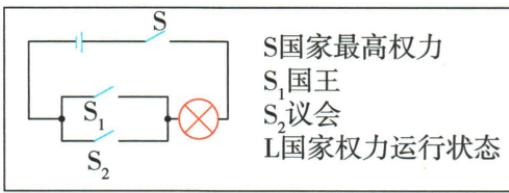

## 讲解

### 判据

原材料保留君主、议会权力增长、法律限制，判断政体靠谁能决定和谁受约束，不能凭国王二字认专制。

### 流程

1. 有国王只确定元首形式，继续查废法征税须许可及议会实际作用。

2. 议会法律约束说明王权有限，代议与君主形式共存。

3. 原三阶段1689保障、1701巩固、18世纪内阁完善逐一配作用。

4. 成熟制度象征主权表述不能倒放成1689所有实际王权瞬间清零。

5. 自由代议不是全体人口同权普选已完成，也不能因未达现代平等否认当时限制专制的变革。

## 例题

**原君主立宪定义、特点和完整发展图。**保留王权形式的资产阶级代议政体，又称“议会君主制”；原特点为议会行国家最高权力、君主是国家权力象征。

|原阶段|原具体作用|
|---|---|
|1689《权利法案》|限制王权法律保障；逐渐形成|
|1701《王位继承法》|进一步限王权、保证资产阶级自由权利；巩固|
|18世纪内阁制逐步确立|英国代议制度建立；进一步完善|

**解析。**代议指通过代表组成的议会参与决定国家事务，君主立宪保留君主，同时让权力受法律和制度约束；所以国家仍有国王不等仍是旧式专断。法案先巩固限制、后来法律进一步规范、内阁发展完善，说明政体形成靠权力安排逐步改变。原“最高权力”“象征”是成熟政体的概括，不能倒放1689当天所有国王实际权力已完全消失。议会代表结构与选举范围也是历史发展的，不以“代议”两个字推出当时全体人口普选。原图没有完整内阁组成工作程序，不补编一份当时组织图；先掌握谁受约束、谁有决定权及怎样形成。

**完整原原因过程意义表与曲线。**根本：斯图亚特封建专制严重阻英国资本主义。直接：查理一世继续君主专断，无视议会、解散议会，矛盾激化。

|原节点|发生什么|
|---|---|
|1640|议会重新召开，革命序幕|
|1642，曲线所示|内战爆发|
|1649|处死查理一世，随后宣布共和国|
|1653，曲线所示|克伦威尔任护国主、独揽大权|
|1660|查理二世为国王、君主制恢复，但权力已受限制|
|1688|议会废詹姆士二世，迎玛丽、威廉，原称光荣革命|

**原特点：**长期、曲折、艰巨、妥协。**原意义：**推翻封建君主专制，给资本主义开道路，对世界近代历史重要影响。

**完整解析。**处死国王建共和国表示对旧王权突破，但护国主独裁仍有权力集中；复辟恢复君主形式又不等所有限制全取消，最后以政变和保留君主形式的安排解决权力对立，显示反复与妥协。1640到1688跨48年，中间内战、共和国、独裁和复辟，能据具体阶段解释特点，不能只列四个词。意义针对专制被推翻、经营政治障碍减少，不能改成英国从此没有国王，或全体人立即拥有同样政治权利。曲线是制度过程示意，没有数值刻度，峰谷不代表精确民主得分，也不把曲线斜率算成改革速度。

### 九上第六单元原题1及完整解析

1.(2023 四川宜宾中考)小华同学巧用电路图表示 17 世纪后期某国家最高权力的转移（如图：打开S₁，闭合S、S₂，L灯亮；符号按实际原页转录）。其意指()

A. 美国

B.英国

C. 法国

D. 日本

**原完整解题思路与原答：**

1. 解题思路 图片描述了此国家中，议会拥有国家最高权力。根据材料“17世纪后期某国家最高权力的转移”和所学可知，1689年，英国通过《权利法案》，规定国王“统而不治”。此后，英国议会的权力日益超过国王，君主立宪制逐渐形成。

答案 B

**原图符号核验：**

$$
\text{打开 }S_1,\quad \text{闭合 }S,S_2,\quad L\text{ 灯亮}.
$$

S代表国家最高权力，S₁代表国王，S₂代表议会，L代表国家权力运行状态。先辨总开关与两条支路：总开关闭合，国王支路断开、议会支路闭合仍能运行，类比议会掌握最高权力。不是“国王被处死所以没有君主”的图。

**逐项判断。**A不选，美国独立战争和宪法在18世纪后期，不符合17世纪后期该英国制度转移。B正确，时间、议会限制王权及逐渐形成君主立宪三点配合。C不选，法国大革命在18世纪后期，且本图不能直接替代法国各阶段政体。D不选，日本不是本题17世纪后期英国式议会王权变动。日期只能缩小范围，仍需原图谁掌权的制度证据。

**原解析的措辞边界。**“规定国王‘统而不治’”保留为原书解析，但它把成熟君主立宪的概括压缩到了1689年法案。该法案具体限制国王停法、征税等行为，议会权力逐渐超过国王；不能把“统而不治”当法案逐字条文，也不能认为现代内阁全部机制在颁布当天完成。原OCR将闭合S误识为另一个S₁，实际图和原页支持上面的人工转录。

## 易错

形式不能代实际规则，开始形成不是已经完善；政变结束与法案颁布差一年。

### 来源定位

- WC17-S06：full.md（历史扫描分册251-300），L2208–L2210，君主立宪定义特点及1689到1701到18世纪三阶段原图；5dc2c8da-0729-4435-bf9a-d7b79d1838b6_origin.pdf，实际PDF第33页。
- WC17-S03：full.md（历史扫描分册251-300），L2196–L2198，革命根本直接原因五阶段意义原表；5dc2c8da-0729-4435-bf9a-d7b79d1838b6_origin.pdf，实际PDF第32页。
- WC17-S04：full.md（历史扫描分册251-300），L2200–L2202，1689权利法案目的完整三项内容与逐渐形成；5dc2c8da-0729-4435-bf9a-d7b79d1838b6_origin.pdf，实际PDF第32页。
- WC-U01：full.md（历史扫描分册251-300），L2393–L2459，电路原题与完整原解B，闭合符号据实际页纠正；5dc2c8da-0729-4435-bf9a-d7b79d1838b6_origin.pdf，实际PDF第37页。
