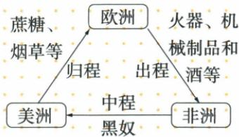
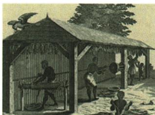

## 错法

沿自动图的箭头写美洲送奴隶到非洲，或只记三洲不记载物，随意把奴隶、糖烟草安排每段。原 OCR 图恰把中程方向反转。

## 正解

按原图出程欧洲到非洲货物，中程非洲到美洲被奴役者，归程美洲到欧洲糖烟草。每程方向和对象同时核验，能解释为何美洲园劳动与非洲人口损失相连；不能用错方向再推出非洲获得更多劳动者。

## 例题

**原三角贸易图。**

|航段|方向|原图运输对象|
|---|---|---|
|出程|欧洲→非洲|火器、机械制品和酒等|
|中程|非洲→美洲|被贩运的黑人奴隶|
|归程|美洲→欧洲|蔗糖、烟草等|

**解释。**欧洲奴隶贩子带货到非洲，在那里掳获、购买并强行运送人到美洲，将人卖给种植园主；再将殖民地糖、烟草等运回欧洲，串起三地获利环节。这里的人遭强迫并被当商品买卖，不是普通自愿移民。“三角”是三地三程的概括，不要求地图三个点边长相等，也不证明每条船每次一律走完整三段。原图显示中程箭头非洲到美洲，自动图反成美洲到非洲，须按原图纠正。货物与方向共同定位，不能只背三个洲名就把每段任意换。

**原问：观察图片，谈谈“三角贸易”的影响。**

**三点原答案。**

1. 欧洲：巨额利润转为资本，加速西欧殖民国家资本原始积累，推动资本主义经济。
2. 非洲：丧失大量精壮劳动力，极大制约经济社会发展，原称造成贫困落后。
3. 美洲：种植园主获得大量原称“廉价劳动力”，促进种植园经济发展。

**完整解析。**版画图注明确是奴隶加工烟草，不能沿自动描述当普通屋舍风景。它体现美洲种植园依赖强迫劳动；奴隶贩子和园主借买卖、强迫劳动获利，欧洲获得利润投入生产经营时转为资本，不能只因有钱就说任何钱都是资本。对非洲，劳动者强行流失并伴随暴力与社会破坏，生产发展和社会生活受损；对美洲，园主获得被强制劳动的人，使种植园产出与经营增加，但园主受益不等奴隶享受自由高工资或全美洲所有群体同等受益。

**原早期殖民三影响。**客观有助欧洲资本原始积累、世界市场逐渐形成；殖民地人民深重灾难；欧洲文化传入并有深远社会影响。文化变化未在本材料逐项评价，不一律改写为全部进步，更不能以资本积累抹掉奴役的侵害。版画支持劳动场景与本课联系，无法单图算全贸易利润、总运人数或证“每航次都同模式”。

### 来源定位

- WN16-S05：full.md（历史扫描分册251-300），L1854–L1871，三角贸易欧洲非洲美洲三程货物原图；5dc2c8da-0729-4435-bf9a-d7b79d1838b6_origin.pdf，实际PDF第27页。
- WN16-Q02：full.md（历史扫描分册251-300），L1883–L1904，观察奴隶加工烟草原版画问三角贸易影响与三地原答；5dc2c8da-0729-4435-bf9a-d7b79d1838b6_origin.pdf，实际PDF第28页。
