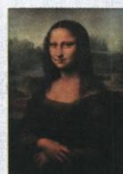

## 讲解

### 是什么

文艺复兴是意大利兴起、向西欧传播的新思想文化运动，核心人文主义：重人的个性、尊严价值与现世生活，反教会神权至上。借复兴希腊罗马文化的方式表达新阶层要求，方式继承古典而内容有创新，原性质为资产阶级运动。

### 怎么来的

新生产经营阶层成长，现实生活需要与教廷精神控制矛盾，形成新的表达要求。古典文化提供人物艺术思想资源，但使用古典不是将旧社会每项制度原样恢复；选择资源表达现世个性价值，说明继承和创新并存。性质须看产生的经济阶层基础及主张，不能靠名称“复兴”把它说成旧文化回归而无新要求。新价值视角扩大研究表达空间，促进文化繁荣并提供思想条件；条件不等资本主义国家法律制度当时已经全面实现。反神权至上不自动等所有人不信宗教，重人的生活也不等一切行为不需责任。

### 什么时候能用

问核心答人文主义并释价值；问性质据新阶层要求；问方式说借古典继承创新；问影响说思想文化基础而非政权已建。14中至17、15/16传播按原概括，不改各地同日开始。

## 例题

**原概况和易混，未另配独立性质题。**14世纪中叶至17世纪，意大利兴起，15、16世纪向西欧其他地区传播，核心人文主义。反教会“神权至上”、提倡以人为中心、个性与现世生活，采取复兴希腊罗马文化方式但有继承更有创新；原定资产阶级性质思想文化运动。解放思想、文化繁荣，给资本主义社会思想文化基础。

**解释。**新的经营阶层有现实生活发展需要，不满教廷对精神世界控制，重人的价值和现实生活与其要求相接。古典文学艺术提供可学习的表达资源，是方法和文化来源；新社会要求、反神权至上的主张则说明内容和性质，不能仅由“复兴”书名判只复原古代。思想解放使人们能在新的价值视角下研究表达，推动文化繁荣，为社会变化提供思想条件；思想条件不同于政治制度已建成。反对神权至上及腐化不等本原材料证明所有参加者拒绝一切信仰或各地宗教当时全部消失，提倡现世也不等任何自私行为都合理。

**原图与原问：该艺术作品核心思想是什么？**

**原答案：人文主义。完整解析。**先识原图注《蒙娜丽莎》，配达·芬奇与文艺复兴；原代表表说创作生动人物、艺术科学结合，体现人文精神。画面主体是人的具体形象，注意人物神态与人的价值，把图像观察和同课思想相接，再答人文主义。不能只因人物看起来微笑便断所有肖像都属于这场运动，时期作者和原图注仍是识别依据；也不能从一幅画直接读出全部群众政治权利已经平等或资本主义政权确立。原问只有思想一项，不将旁边别课的对数、时间或活动强行当题目条件。

### 九上第五单元原题3与完整解析

**单元原题3（原书标2023四川资阳中考，未另核身份）。**某学生课堂笔记“？”可填（）。

**原图按方向转写：**“？” ←承前— 文艺复兴运动 —启后→ 启蒙运动。

A.古代希腊罗马文化；B.古代埃及文明；C.封建时代阿拉伯文化；D.古代印度文明。

**原答A，完整原解。**运动以复兴古希腊罗马文化为方式，并非简单复兴，有继承更有创新。

**逐项。**A对，原“承前”问直接采用的古典资源，与运动复兴方式相配。B不选，埃及有文明成就，但不是本图所问直接古典复兴资源。C不选，阿拉伯学者保存传播知识有贡献，不能因这一媒介作用便把古希腊罗马文化的直接名称换成阿拉伯文化；不是说阿拉伯与后来文化发展绝无联系。D不选，印度也有文化成果，不对应本题复兴方式。图右启后为后来思想发展，不能把右边“启蒙”倒填左边。继承资源不等性质仅为古代原样复活。

### 九上第五单元原题4与完整解析

**单元原题4（原书标2024广东中考，未另核身份）。**16世纪意大利，第一人称日记日志增多，主要记家庭个人，唤醒自我意识，此现象（）。

A.推动启蒙运动高涨；B.受文艺复兴影响；C.瓦解封君封臣制度；D.保障平民政治地位。

**原答B，完整原解。**14中兴起，核心人文主义提个性现世生活，配个人自我意识；原解补17世纪英国早期启蒙、18世纪法国中心，与材料时间不符。

**逐项。**A不选，不能把后来的启蒙高涨当16世纪该现象直接背景；原时间先后与材料不配。B对，关注具体个人家庭、表达自我，和人文主义重人的个性现世生活相接。C不选，书写和思想关注未给封臣土地军事关系已经瓦解的证据，不用思想变化代完整制度结果。D不选，自我意识增长不是法律保障政治地位，材料没给权利制度。思想表达影响与政治权利实现必须分开，第一人称本身也不是任何年代都唯一文艺复兴特征，判断需16世纪意大利语境。

### 九上第五单元原题10与完整解析

**原跨美术新考法题（无总数字序号，覆盖记第10题；原书标2024内蒙古赤峰中考，未另核身份）。**文艺复兴时期作品，作者以好友佛罗伦萨银行家佐贡多妻子为原型，柔和细腻笔调描人物表情含蓄、自然、淳朴甜美、有生命活力。作品（）。

A.充分体现人文主义精神；B.批封建道德伦理；C.反时代风貌社会本质；D.表市民阶层丰富情感。

**原答A，完整原解。**肖像以现实人为主题，神态自然活力饱含人文；原对照莎士比亚作品反映时代、批封建伦理陋习，但丁神曲表达市民情感理想。

**逐项。**A对，现实人物、细腻神态和生命活力，接重人的价值美与情感，直接支持人文。B不选，原主要是人物描绘，没给具体批判何伦理的内容，不能把莎士比亚原特点套此图。C不选，原题没提供整个社会结构风貌描绘，不能一肖像即证社会本质；不是说绘画一概不能反映时代。D不选，原详解对应但丁市民情感理想，题中具体形象不直接代表整个市民阶层全部情感；不是说画中人没有情感。排除须看本图材料是否足以支持，不能以各选项术语熟悉就认任意作品都可替换。

## 易错

名称不是全部性质依据，反腐化和神权不是资料已证所有宗教灭绝；思想解放不能代现实所有人拥有相同权利。

### 来源定位

- WN14-S01：full.md（历史扫描分册251-300），L1672–L1680，经济政治背景与运动时间地点核心方式影响；5dc2c8da-0729-4435-bf9a-d7b79d1838b6_origin.pdf，实际PDF第24页。
- WN14-S02：full.md（历史扫描分册251-300），L1647–L1649，资产阶级性质与复兴方式区别原易混；5dc2c8da-0729-4435-bf9a-d7b79d1838b6_origin.pdf，实际PDF第24页。
- WN14-Q01：full.md（历史扫描分册251-300），L1686–L1691，蒙娜丽莎原图核心思想原问原答；5dc2c8da-0729-4435-bf9a-d7b79d1838b6_origin.pdf，实际PDF第25页。
- WN-U03：full.md（历史扫描分册251-300），L1948–L1961，承前启后图原题四项及原解析A；5dc2c8da-0729-4435-bf9a-d7b79d1838b6_origin.pdf，实际PDF第29页。
- WN-U03A：full.md（历史扫描分册251-300），L2013–L2015，继承创新原题3完整原解；5dc2c8da-0729-4435-bf9a-d7b79d1838b6_origin.pdf，实际PDF第29页。
- WN-U04：full.md（历史扫描分册251-300），L1963–L1973，16世纪日记自我意识原题四项；5dc2c8da-0729-4435-bf9a-d7b79d1838b6_origin.pdf，实际PDF第29页。
- WN-U04A：full.md（历史扫描分册251-300），L2017–L2019，原题4人文与启蒙时间完整原解B；5dc2c8da-0729-4435-bf9a-d7b79d1838b6_origin.pdf，实际PDF第29页。
- WN-U10：full.md（历史扫描分册251-300），L2055–L2066，跨美术原题四项蒙娜丽莎图完整原解A；5dc2c8da-0729-4435-bf9a-d7b79d1838b6_origin.pdf，实际PDF第30页。
