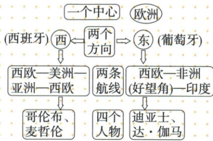

## 讲解

### 判据

看到四航海家或两方向原图，按支持国、方向、海洋、到达节点、成果主体逐栏判断，防把整体摘要线套到每个人。

### 流程

1. 欧洲中心下葡萄牙沿非洲向东方、西班牙向西，支持国不是自动等出生国。

2. 迪亚士到好望角；达·伽马续绕该角、横印度洋到印度，用终点区分。

3. 哥伦布1492起横大西洋，到古巴海地等，原自认印度与实际美洲分开。

4. 麦哲伦船队1519—1522三洋环行，主语保船队，本人首跨太平洋不等本人返欧洲。

5. 原图是两线四人分类，不是四人各走完整路线；“发现”是欧洲认识视角，不是发现此前无人之地。

## 例题

**原路线概括图与完整历程表（原材料，没有另造航海选择题）。**

|人物|支持国|原时间|航程及原成果|
|---|---|---|---|
|迪亚士|葡萄牙|1487—1488年|沿非洲西海岸南下到好望角，打开绕非洲南端通东方的航路|
|达·伽马|葡萄牙|1497—1498年|绕好望角、横印度洋到印度西海岸；原称带回胡椒肉桂等香料和黄金，获巨大利润|
|哥伦布|西班牙|1492年开始|横大西洋，“发现”古巴、海地；原概括“发现”美洲大陆，但他以为到印度，称当地人“印第安人”|
|麦哲伦|西班牙|1519—1522年|船队穿过大西洋、太平洋、印度洋回欧洲；本人首先横渡太平洋的欧洲航海创举，船队环球航行支持地圆说|

**逐项解释。**好望角是绕非洲南端的关键地点，迪亚士到这里不等已抵印度，达·伽马再横渡印度洋才到印度西岸。哥伦布向西先越大西洋，到加勒比海岛屿，他的“到印度”判断与实际地点分开；原表“美洲大陆”为新航路成果的概括，不能据此把1492年的古巴、海地改写成首次登陆大陆本土。麦哲伦船队依次跨三大洋完成环行，不能改为本人始终带队返欧洲：官方档案材料记他1521年去世，埃尔卡诺接续，1522年完成回航。

原图“一个中心”是欧洲，西侧西班牙与哥伦布、麦哲伦相配，东侧葡萄牙与迪亚士、达·伽马相配。两条线为不同探索的概括，不表示四个人各自都走完所列全部地点。哥伦布没有独自完成图上“西欧—美洲—亚洲—西欧”整条环球线；向东方的目标不等出发时一律向东。“发现”用引号表示欧洲航海者的认识和联系变化，当地原有居民，不能说美洲此前无人。支持国也不等航海家出生国籍，本表要求先认支持方。

## 易错

目标东方不等实际初始方向皆向东，到好望角不等到印度，船队完成不能写麦哲伦本人完成。

### 来源定位

- WN15-S04：full.md（历史扫描分册251-300），L1725–L1755，欧洲中心东西方向两线四人物原图；5dc2c8da-0729-4435-bf9a-d7b79d1838b6_origin.pdf，实际PDF第25页。
- WN15-S05：full.md（历史扫描分册251-300），L1788–L1790，四航海家支持国时间路线与成果原表；5dc2c8da-0729-4435-bf9a-d7b79d1838b6_origin.pdf，实际PDF第26页。
