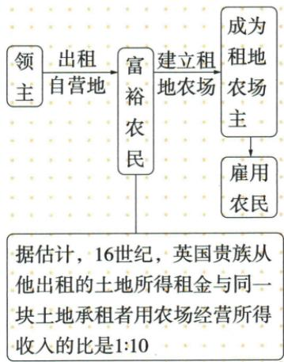

## 讲解

### 判据

材料对照小块自给与集中雇工面市场，先固定规模、劳动者和经营者关系、产品目的三个维度，不能只凭都有农民或地多判性质。

### 流程

1. 传统小块与新集中土地比较规模，说明组织较大经营条件。

2. 原庄园土地使用和劳役依附不同于农场主雇少地无地农民，劳动关系是性质关键。

3. 自给内部生活不同于农畜产品推市场，主要目的和商品化程度不同；保主要不写绝无交换。

4. 原土地租买等多方式，经营者与所有者可不同，不能要求新经营者全为土地原主。

5. 土地自由劳力和市场条件一起解释农场出现，不以规模一项代全部雇佣关系。

6. 原比租金经营收入先后与16世纪英国估计范围保，未给成本工资不擅自计算净利。

## 例题

**完整原农场表及原图，不另造计算题。**

耕地扩大、自由劳力增加、土地集中趋势，使庄园小块经营不适应新的生产。14世纪中叶后富裕农民承租购买领主地，或转租购买其他佃户地产，雇少地无地农民耕作，产品推市场；更多农畜产品进入市场，商人收购运港口或更远地区。

**原图数值。**原“据估计，16世纪英国贵族出租土地所得租金与同地承租者农场经营所得收入比”为 $1:10$。

**完整解释。**图中领主出租自营地给富农，富农成为农场主再雇农，土地所有或出租者、经营者、劳动者可以是三类角色，不能一律叫亲自种地的农民。可用地和自由劳力给组织大规模雇工以条件，市场销售让产品用于交换而非只供庄园内部。原比先租金后经营收入，不能倒写；经营收入未给成本和扣租方式，不能自动改成承租者净利润十倍或由此求每个农民工资。它是特定16世纪英国估计，不是所有国家所有农场恒定比例。土地可承租也可购买，原农场概念重经营和雇佣、市场目的，不以全部土地必须自有判断。

**完整原传统农业与租地农场表，非独立題。**

|维度|原传统农业|原租地农场|
|---|---|---|
|规模|小块土地规模小|领主或富农集中土地，较大|
|生产关系|农民农奴直接耕种|雇少地无地农民，资本主义生产关系特征|
|目的|自给自足自然经济|产品推市场，商品化高|

**解释。**两者都有土地农民，区别不在是否出现耕作，而在劳动者与经营者的关系和产品主要去向。庄园依附劳动联系原土地使用和劳役，农场经营者组织雇工面向市场。规模扩大支持组织变化，但规模单项不能证明雇佣关系；市场目的和雇佣材料须同时读。原传统自给是主要供给方式，不教绝无交换，新的商品化也不保证每一产品都外销。

### 九上第五单元原题8与完整解析

**单元原题8。**从14世纪开始英国由中世纪向近代逐步转变，阅读材料。

**完整原材料：**15—16世纪英国等西欧农村出现新经营，大地主租地给富农或农业家形成租地农场；农场主雇人商品化种植养殖，以雇佣劳动者代传统依附农民，使经营具资本主义性质。

**原问：**据材料分析租地农场与封建庄园土地经营区别。**完整原答：**形成租地农场，采用雇佣劳动、商品化生产，具有资本主义性质。

**完整推理。**先取土地组织：地主把地出租经营者形成租地农场，不把原租赁当劳动者全取得土地所有权。再取劳动关系：雇佣劳动替依附农民，区别工资雇用与身份劳役。再取产品目的：面市场商品化，对传统庄园主要自给自足。三变化相接才判资本主义经营性质，不能仅因土地面积大便判断。14起长期社会转变和15—16材料经营时段不同精度，不说全国同年全部农户摆脱依附；传统自给也不等绝对没有任何交换。

## 易错

所谓传统直接耕种也在生产，区别不是农民不劳动；雇工可以手工耕作，不由关系变化推出已经机器化。

### 来源定位

- WN13-S01：full.md（历史扫描分册251-300），L1484–L1500，农业出租自营到富农雇农原图与原1比10估计；5dc2c8da-0729-4435-bf9a-d7b79d1838b6_origin.pdf，实际PDF第22页。
- WN13-S02：full.md（历史扫描分册251-300），L1520–L1543，垦殖运动原表庄园劳役货币租与人身豁免原图；5dc2c8da-0729-4435-bf9a-d7b79d1838b6_origin.pdf，实际PDF第22页。
- WN13-S03：full.md（历史扫描分册251-300），L1545–L1552，租地农场背景经营者土地来源雇工市场完整表；5dc2c8da-0729-4435-bf9a-d7b79d1838b6_origin.pdf，实际PDF第22页。
- WN13-S08：full.md（历史扫描分册251-300），L1613–L1615，传统农业和农场规模生产关系目的完整表；5dc2c8da-0729-4435-bf9a-d7b79d1838b6_origin.pdf，实际PDF第23页。
- WN-U08：full.md（历史扫描分册251-300），L2035–L2045，租地农场与庄园区别完整材料问原答；5dc2c8da-0729-4435-bf9a-d7b79d1838b6_origin.pdf，实际PDF第30页。
