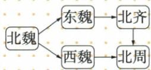

## 讲解

### 是什么

北朝主要政权的关系为北魏分裂成东魏、西魏，东魏被北齐取代，西魏被北周取代；577年北周灭北齐，北方再统一。分裂、取代和兼并分别是不同关系，不能用一条直线把全部政权写成依次传承。

### 怎么来的

北魏设六个军镇原为抵御北方柔然威胁。后期威胁减轻、军镇地位降低，军人的处境变化引发兵变，战争蔓延，政权最终分裂。军事组织原本服务防御，环境改变后若其利益与地位问题未得到治理，也会成为不稳定因素；不能把兵变解释为军镇从建立起就一定反朝廷。

分裂后东、西两条政权线分别更替。原书北周起初弱于北齐，采取政治、军事、经济、文化等措施并促进鲜卑汉人交融，增强实力，最终灭齐。由弱转强必须看改革与资源积累，不能把起初弱直接理解为永远弱。北方整合为隋统一全国提供基础，但577年南方仍有政权，故“北方再统一”不可扩成全国统一完成。

### 什么时候能用

用于北朝顺序图、六镇兵变、577事件和隋统一前提。原图右侧下行归并结合灭齐正文解释，不当作北齐改名北周；东魏西魏为并立支线，不是东魏灭亡后才出现西魏。

## 例题

**原资料（H19-S04、S09，非独立题）：**北魏分裂为东魏、西魏；东魏被北齐取代，西魏被北周取代；577年北周灭北齐，北方重归统一。

**完整分析补写：**横向两条线分别是东魏到北齐、西魏到北周；最右侧北齐向北周的归并线要结合577年正文，表示北周灭北齐后整合，不是北齐自行改名北周。439年北魏统一与577年北周再统一之间存在分裂，不能将“统一北方”当永远只有一次事件。

## 易错

- 诸朝排成北魏→东魏→西魏→北齐→北周：抹掉分支。
- 577统一北方当全国：空间对象变了。
- 北周初弱便否认以后胜齐：阶段变化。

### 来源定位

- H19-S04：full.md（历史扫描分册51-100），L1166–L1176，六镇兵变、北朝更替与577统一北方；a8d85606-ccac-4ba9-89c2-44c981a45642_origin.pdf，实际PDF第19页。
- H19-S09：full.md（历史扫描分册51-100），L1207–L1216，北朝更替原图、交融心理续表与特点影响；a8d85606-ccac-4ba9-89c2-44c981a45642_origin.pdf，实际PDF第20页。
