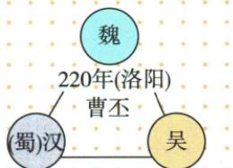

## 讲解

### 判据

出现曹刘孙故事、赤壁或三国建立图，先辨是在问势力形成背景、人物主要活动时期，还是正式建立者与纪年。看到“鼎立基础”不答三国已建；看到“魏建立者”不以曹操战功代替曹丕。

### 流程

1. 读取题目动词：形成基础、建立、称帝、发展分别是不同事件。
2. 按原图建立者、年份、都城逐项配对，魏曹丕220洛阳，蜀汉刘备221成都，吴孙权229建业。
3. 官渡200和赤壁208放在其前，为东汉末的形成背景；不要按小说人物归属替代历史分期。
4. 理解原图连线：没有箭头，不能读成政权传承或灭亡顺序。
5. 曹操不是魏建立者这一事实可纠正姓名混淆，但“没有建立某国”本身不能证明一个人的生活时期。原书将曹操归东汉末，教学依据应说明其主要政治军事活动及本课时间框架，不能教学生用错误推理判所有人物时代。

## 例题

**原资料（H16-S03、S06，非独立试题）：**魏：曹丕，220年，洛阳；汉（蜀汉）：刘备，221年，成都；吴：孙权，229年，建业。魏重视农业、兴修水利；蜀汉诸葛亮发展经济、改善民族关系，推进西南开发；吴开发江东，造船业、海外贸易发展。230年孙权派卫温率万人船队到达夷洲，加强大陆与台湾联系。

**完整分析补写：**图中三边连接三个政权，不表示魏传给吴或蜀汉先灭魏。建立时间分属三个年份，208年赤壁时不能说图中的三国都已正式建立。原表讲经济发展方向，不能推出每个地区同时同速发展；原书的船队人数按原说法保留，不由示意图推算。

**原辨析（H16-S01）：**官渡、赤壁在东汉末；魏国建立者为曹丕，而非曹操。以上分别核时期与建立者，不把两个判断之间的简单“因为”推广成普遍分期规则。

## 易错

- 小说《三国》人物直接等于三国正式时期人物：文学叙事覆盖背景时代。
- 非建立者就一定不生活在该时代：逻辑不成立。
- 图连线擅自加箭头，读成王朝相继：原图无该信息。

### 来源定位

- H16-S01：full.md（历史扫描分册51-100），L830–L836，官渡赤壁所属时期及曹操辨析；a8d85606-ccac-4ba9-89c2-44c981a45642_origin.pdf，实际PDF第14页。
- H16-S03：full.md（历史扫描分册51-100），L848–L869，三国建立原示意图；a8d85606-ccac-4ba9-89c2-44c981a45642_origin.pdf，实际PDF第14页。
- H16-S06：full.md（历史扫描分册51-100），L895–L907，三方发展与三国建立、经济发展表及局部统一；a8d85606-ccac-4ba9-89c2-44c981a45642_origin.pdf，实际PDF第15页。
