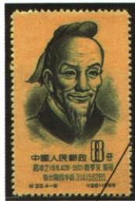

## 错法

原表说在3.1415926和3.1415927之间，抄成π同时等于两数。错在将界限关系换成等号，也把近似范围误当有限小数的完全精确值。

## 正解

两个数分别是下界上界，正确关系为大于前者、小于后者；本条公式已对照原页逐位核验。祖冲之成果说明区间精细，不说圆周率到第七位就终止，也不以两个界限相等为推导依据。

## 例题

**原设问（H20-S05）：**结合所学知识想一想，祖冲之为什么被列入《中国古代科学家（第一组）》邮票之中？

**原答案完整保留：**祖冲之博学多才，在数学、天文历法以及机械制造方面都有重大成就。他认真学习、刻苦钻研、反复实践的精神值得我们学习。

**完整解析补写：**先列三领域成就，再以严谨治学和实践说明纪念意义；数学可对应圆周率与《缀术》，历法对应观测推算与《大明历》，机械对应指南车、水碓磨、千里船。邮票为后世纪念材料，不是祖冲之本人肖像照，也不是从邮票肖像独立读出全部成就。识别文本中邮票日期及乱字不作科学纪年证据，具体图文以原图核对。

### 来源定位

- H20-S03：full.md（历史扫描分册51-100），L1261–L1263，祖冲之数学历法机械完整成就表；a8d85606-ccac-4ba9-89c2-44c981a45642_origin.pdf，实际PDF第21页。
- H20-S05：full.md（历史扫描分册51-100），L1269–L1285，祖冲之邮票原图原问原答；a8d85606-ccac-4ba9-89c2-44c981a45642_origin.pdf，实际PDF第21页。
