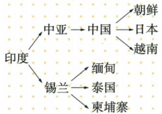

## 讲解

### 是什么

佛教是从外部传入中国的宗教，原书记两汉之际传入，东汉明帝时得到上层扶持，逐步传播；其主张众生平等，迎合贫苦民众求平安愿望，丰富中国文化并影响社会思想、文学、建筑雕刻绘画等。传入、扶持和广泛传播不是同一个瞬间。

### 怎么来的

跨地区交往使思想与信仰能够传播，民众生活愿望影响接受，上层扶持也影响传播条件，多个因素共同作用。原表“逐步”说明从进入到社会接受需要过程，不能推定所有地区当时立即全部信奉。主张中的众生平等是宗教思想，不能直接写成汉代现实社会已消除阶级差别或人人拥有现代同等政治权利。

传播还带来文本、观念和艺术表现的联系，进入本土后与既有文化相互作用，原书因此列多领域影响；不只是商品贸易，也不是所有中国文化都由一种宗教替换。后来的寺院、石窟等具体成就须在相应原章核查，本课表未给具体建筑图和年代，不拿外部图编原例。与道教比较，外来/本土和传播时期可区分，不能用二者同为宗教便合并来源。

### 什么时候能用

用于佛教传入时期、东汉明帝扶持、文化影响和与道教来源辨析。“两汉之际”为阶段称呼，原书无唯一精确传入日期，本条不造年份；传播作用有领域和过程限定。

## 例题

**原资料佛教行（H15-S05，非独立题）：**众生平等主张回应贫苦民众平安愿望；两汉之际传入，东汉明帝扶持、逐步传播；影响思想文学及建筑雕刻绘画，丰富文化。

**完整分析补写：**依次分接受条件、传播过程、文化效果。主张与现实社会制度不同，传入与普及不同，文化丰富也不等于原文化全部消失。

### 九上原传播图与早期佛教主张的完整补证

**原佛教知识表，未配课内独立教义题。**前6世纪产生；乔达摩·悉达多后来称释迦牟尼。早期反对婆罗门特权，提出众生平等，不拒低种姓入教；原同时概括宣扬“忍耐顺从”，得到国王和一些富人支持。

**完整解释。**世袭等级限制低种姓地位，接纳他们入教并反对婆罗门特权，为这些群体提供不同于等级排斥的宗教空间；原顺从主张也能被统治者和富人接受，所以不同群体支持可能来自不同关注。宗教接纳与精神主张不能直接推出国家废除种姓、现实权利已经完全平等，也不能将早期概括说成后来每个流派、每位信徒的全部教义。创始本名和后来称号指同一人，不是两个宗教创始者。

**原传播文字和图，非独立设问。**前3世纪后向外传播；原书记前1世纪经中亚至中国新疆，再入内地，后到朝鲜、日本、越南等；往南经锡兰至缅甸、泰国、柬埔寨等。原图为印度→中亚→中国，中国分别指向朝鲜、日本、越南；另为印度→锡兰，锡兰分别指向缅甸、泰国、柬埔寨。图是路线概括，箭头说明联系，不能据它断所有地区只有一条传播路径或各支同时传入。

**完整读图解释。**先找起点印度，再沿箭头分北线和南线，保中转位置；中国的三支并列，不把朝鲜→日本画成该原图的一条箭头。锡兰为南路中转，不把缅甸画成往锡兰的源头。原文字含新疆到内地的层次，图略写中国，读图与文字可互补；“公元前1世纪传入”和中国史“两汉之际”是不同精度的阶段表述，不另造唯一日月。传播带来宗教题材和造像表现，本课列云冈、龙门、莫高窟深受印度佛像艺术影响，不能因此抹去中国本土传统。

## 易错

- 传入写中国本土创立：与道教混用来源。
- 众生平等当汉社会阶级差异已消失：观念与现实不同。
- 一传入便推全国全民信奉：忽略逐步与范围。

### 来源定位

- H15-S05：full.md（历史扫描分册51-100），L587–L589，秦汉科技文化完整原表：造纸、医学、数学、农学、史学、宗教；a8d85606-ccac-4ba9-89c2-44c981a45642_origin.pdf，实际PDF第10页。
- WA3-S03：full.md（历史扫描分册201-250），L2767–L2786，佛教传播原示意图；自动Mermaid与原箭头不符；5cc603b4-3c7a-4bc5-b935-8c05069de690_origin.pdf，实际PDF第50页。
- WA3-S05：full.md（历史扫描分册201-250），L2804–L2814，佛教起源人物教义两路传播时间地点原文；5cc603b4-3c7a-4bc5-b935-8c05069de690_origin.pdf，实际PDF第50页。
- WA3-S01：full.md（历史扫描分册201-250），L2724–L2741，印度地理发源遗址雅利安国家孔雀与成就原表及地域易混；5cc603b4-3c7a-4bc5-b935-8c05069de690_origin.pdf，实际PDF第49页。
