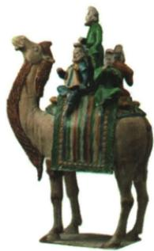

## 讲解

### 是什么

唐三彩是本课列举的造型精美、釉色亮丽的釉陶工艺，载乐骆驼是对应原图。题注明确釉陶，不是把三种颜色画在任何瓷器上便叫唐三彩，也不是青铜器。骆驼和乐人组合属于艺术塑造，不等真实尺寸比例。

### 怎么来的

器物需要塑形成坯、施釉烧制等工艺，造型与釉色体现手工业技术和审美。原图载乐人物的姿态、组合把音乐表演转成可见造型，说明艺术与工艺可在同一件作品中体现。原书只给图片和总体社会题，不提供详细温度配方，不能自编制作实验或化学比例。

骆驼、乐舞人物结合长安多地区人员和文化往来，解释原答开放社会局面；[国博器物说明](https://www.chnmuseum.cn/zp/zpml/kgfjp/202008/t20200824_247230.shtml)也说明胡汉乐人和夸张比例。交流题材与本地工艺相结合，体现吸收和创造，不简单说来自国外就不是中国工匠贡献。原图精美能支持具体手工业与艺术成就，却不代表全社会人人富裕，或所有贸易毫无制度限制。姓名、墓地和乐器残件等未在本书原题给出，不加入题目条件。

### 什么时候能用

用于文物三方面作用、陶瓷材质和艺术比例边界。三彩为工艺名称，不能只凭照片数三色鉴定所有器物；原图的完整信息优先于自动笼统“有骑手”描述。

## 例题

**原题（S3-S07）：**三彩釉陶载乐骆驼反映了盛唐时期社会发展的哪些状况？

**原答案完整保留：**艺术的繁荣、手工业的发展、开放的社会局面。

**完整解析补写：**载乐人物与骆驼造型提示艺术表现，塑造施釉的成品体现手工业，结合长安多地区人员与乐舞交流解释开放。[国博器物说明](https://www.chnmuseum.cn/zp/zpml/kgfjp/202008/t20200824_247230.shtml)也指出其汉胡人物与乐舞交流及比例夸张。不能从俑上人数算当时全部人口，或将艺术比例当真人与骆驼实际比例。题注是釉陶，不是瓷器；原图支持具体文化接触，不证明任何对外交流均无限制。

## 易错

- 三彩叫瓷：题注为釉陶。
- 人驼比例当真人比例：艺术夸张。
- 开放推一切领域无管理：具体交流与绝对开放不同。

### 来源定位

- S3-S05：full.md（历史扫描分册51-100），L1797–L1803，农业手工业商业完整表含工具旁注；a8d85606-ccac-4ba9-89c2-44c981a45642_origin.pdf，实际PDF第28页。
- S3-S07：full.md（历史扫描分册51-100），L1819–L1833，三彩釉陶载乐骆驼原图原问原答；a8d85606-ccac-4ba9-89c2-44c981a45642_origin.pdf，实际PDF第29页。
