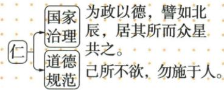

## 讲解

### 是什么

孔子名丘、字仲尼，春秋后期鲁国人，是儒家学派创始人。其核心思想是“仁”，强调爱心和同情心，以“己所不欲，勿施于人”等规范处理人与人关系；政治上反对苛政，主张为政以德。孔子思想由弟子及再传弟子整理成《论语》，不能说《论语》是孔子亲自逐章写成。

### 怎么来的

春秋旧秩序动荡，孔子主张恢复西周礼乐文明，用制度与道德重建社会政治秩序。“仁”先回答人与人应怎样相处；应用到治理，便要求统治者体察民意、爱惜民力，以德政使民众心悦诚服。道德规范和政治主张由同一思想相接，所以原图将国家治理与道德规范都连到仁。

“己所不欲，勿施于人”要求在行为中考虑他人，不将自己不愿承受的事情强加给别人。为政以德强调治理者自身品德、教化和民众支持，而不只是取消一切刑罚。这些主张是理解孔子思想的依据，不等于当时所有统治者已经实践。原书说儒家后来成为封建社会统治思想，“后来”指出历史发展，不能倒推为孔子创派时立即取得国家独尊地位。

### 什么时候能用

看到仁、德政、反苛政、己所不欲，可联系孔子；若材料明确“民为贵”或“仁政”，需再区分孟子。传统文化题应辨别可继承的思想价值及历史局限，不能将古代等级观念原封不动视作现代规范。

## 例题

**原资料史料（H7-S05）：**为政以德，譬如北辰，居其所而众星共之。——《论语·为政》

**原解读：**这句话是说，用道德教化来治国理政，就会像北斗星一样，自己居于一定的方位，而群星都会环绕在它周围。实行德政有益于维系百姓生活的安定和社会的繁荣发展。

**原资料设问：**以下示意图表现的是中国古代某一思想家的主张，这位思想家是？

**原答案：**孔子。

**完整解析与纠正：**图以“仁”联系“为政以德”和“己所不欲，勿施于人”，分别体现孔子的政治主张与道德规范，答案为孔子。原解读把“北辰”译作“北斗星”，应区分为北极星；这里用群星拱卫北辰比喻以德治理获得拥护，不是讲北斗七星主导政治。原引文与原解读保留，纠正单独列明。[核查：“为政以德，譬如北辰”官方释义](https://m.ccdi.gov.cn/content/3d/33/4646.html)

## 易错

- 把《论语》作者直接写成孔子亲自著书：本课强调由弟子和再传弟子整理。
- 将“后来”省成春秋已独尊儒家：错在改变思想影响的时间。
- 把北辰译成北斗：两者须区分，原解读的错误已单独纠正。

### 来源定位

- H7-S02：full.md（历史扫描分册1-50），L4675–L4691，孔子、仁、德政、教育与后世影响；22fce0ae-e244-4784-abd1-7e1ac2556947_origin.pdf，实际PDF第43页。
- H7-S05：full.md（历史扫描分册1-50），L4714–L4736，为政以德引文、原解读、原示意图设问和原答；22fce0ae-e244-4784-abd1-7e1ac2556947_origin.pdf，实际PDF第43–44页。
