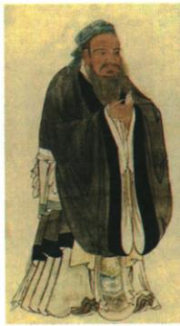

## 讲解

### 是什么

孔子兴办私学，主张有教无类，招收不同出身学生，促进教育在民间发展；教学重视道德与文化知识，提出因材施教、举一反三。教育对象和教学方法是不同层面：有教无类讨论谁能受教育，因材施教讨论如何按学生特点教学。

### 怎么来的

在教育更多由贵族垄断的背景下，兴办私学使不同出身者有学习机会，打破贵族垄断教育的局面。但它不是现代全国义务教育制度，也不能据此说每一位古人都已获得教育。

因材施教考虑学生已有基础、特点和需要，因此同一知识可以使用不同讲法，目标是让学生理解；举一反三要求从已理解的例子迁移到同类问题，不能只复制答案。两种方法可以相接：先根据特点教会基础，再引导迁移，并非只让学生猜而不提供教学。原书将孔子思想放在仁和道德教育之中，故教育成就不只是教授书本知识，也包含做人规范；仍应区分古代价值与现代评价。

### 什么时候能用

题目给不同出身都可入学，判断有教无类；给根据学生差异采用不同教学方法，判断因材施教；给从一类经验推知相近情形，判断举一反三。线索不足时不将三者视为完全同义。评价贡献可以说扩大教育传播、总结教育经验，但不能说孔子创立现代学校体制。

## 例题

**原资料设问（H7-S04）：**图中人物是哪一学派的创始人？作为新时代的中学生，我们应该如何对待中国的传统文化？

**原答案：**孔子是儒家学派的创始人。对待儒家文化，我们要批判地继承和吸收，取其精华，去其糟粕。

**完整解析补写：**按画像题注确认孔子，再联系儒家创派事实。第二问需说明有辨别地继承，教育中的开放对象、根据特点教学可作为理解其价值的课内联系，而不是把全部古代观念无条件采用。图像是后世画像，不是孔子在世时的照片；题目判断依据还包括原题注。

## 易错

- 将有教无类写成对每个人用完全一样的方法：对象开放与方法有差异可以同时成立。
- 把举一反三理解为只背一例就能无条件解决全部问题：迁移需要相同的关键关系。
- 对传统文化只写全部接受或全部否定：原答案要求辨别和选择。

### 来源定位

- H7-S02：full.md（历史扫描分册1-50），L4675–L4691，孔子、仁、德政、教育与后世影响；22fce0ae-e244-4784-abd1-7e1ac2556947_origin.pdf，实际PDF第43页。
- H7-S04：full.md（历史扫描分册1-50），L4698–L4712，孔子像及对传统文化设问与原答；22fce0ae-e244-4784-abd1-7e1ac2556947_origin.pdf，实际PDF第43页。
