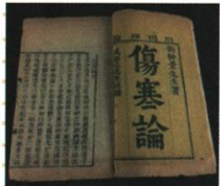

## 讲解

### 是什么

张仲景是东汉末年名医，著《伤寒杂病论》，原书称中医临床理论体系开创者，后世尊为医圣；他总结疾病症候和诊断治疗经验，发展治未病思想。这里学习的是医学史贡献，著作名、作者、时代和思想须分别记清，不把医圣称号当书名。

### 怎么来的

疾病实际表现并非只靠名字便能说明全部病情，原书以辨证分析、对症治疗说明将观察症候与处理思路联系。把多年经验分类、总结为典籍，使后来医者能够学习并继续发展，是经验积累转向系统理论的重要方式。治未病体现关注疾病发生发展、提前防范的思想，不等于只医治完全健康者或承诺任何疾病都绝不会发生。

本条原问强调发展理论和方法、总结症候、影响后世；“有重要意义”是历史与学术影响概括，不可将一本古书视为所有现代医学问题的完整结论。流传版本与古代原著经历整理，本课图上《伤寒论》与题注《伤寒杂病论》的关系已据典籍说明辨明；不能因书影不同标题就随意改作者，更不能采用提取中重复美籍作者文字。

### 什么时候能用

用于医学史人物成就、医书影响和经验总结特点。本资料未给实际病例或具体方药，不自编病案凑题；华佗的麻沸散、五禽戏不能转给张仲景。书影用于提示著作，内容依据原表与原答。

## 例题

**原资料题注及设问（H15-S02）：**《伤寒杂病论》书影。通过图片，说说该书的影响。

**原答案完整保留：**该书发展了中医学的理论和治疗方法，总结了多种疾病的症候，提出在诊断上要辨证分析病情，对症治疗。它对当今医学的发展也有重要意义。

**完整解析补写：**原问以书影提示著作，答案重点是总结经验、形成诊断治疗思想并影响后世；不能仅凭封面推得书中所有内容，要结合本课张仲景与著作的说明。原图可读《伤寒论》，原题注写《伤寒杂病论》，保留二者区别；[国家中医药数字博物馆](https://www.nmtcm.cn/ss/p/5.html)说明流传中《伤寒论》《金匮要略》与该著作的关系，因此不把图片标题当两位不同作者或美籍作者的依据。

### 明清课五位医学家表的跨朝对照

**原对照表（M21-S01，非独立题）：**扁鹊战国，望闻问切四诊沿用；张仲景东汉末，《伤寒杂病论》、治未病；华佗东汉末，麻沸散、五禽戏；孙思邈隋唐，《千金方》、后世药王；李时珍明，《本草纲目》。原医学表用于人物、时期、贡献配对，不等所有人都编同一本书，也不按名号推药物已现代临床验证。

**完整分析补写：**四诊是诊断方法，医书是经验整理，麻沸散与五禽戏又分别涉及医疗和保健，知识类型不同。先用专属贡献锁人物，再校时期；张、华同在东汉末，时期一项不能分开两人。本草纲目偏药物学汇总，不能因书名都属医药就换成伤寒杂病论。这里学习医学史，不提供使用古方治病的建议。

## 易错

- 医圣写华佗：本书称张仲景为医圣。
- 治未病当任何疾病保证不发生：思想与绝对承诺不同。
- 看封面猜全部内容或美国作者：应结合题注、原表和典籍核查。

### 来源定位

- H15-S02：full.md（历史扫描分册51-100），L551–L573，医书原影、影响原设问与原详答；a8d85606-ccac-4ba9-89c2-44c981a45642_origin.pdf，实际PDF第10页。
- H15-S05：full.md（历史扫描分册51-100），L587–L589，秦汉科技文化完整原表：造纸、医学、数学、农学、史学、宗教；a8d85606-ccac-4ba9-89c2-44c981a45642_origin.pdf，实际PDF第10页。
- M21-S01：full.md（历史扫描分册101-150），L1107–L1109，五位古代医学家时期贡献完整表；6484926a-d709-4079-96ba-4a8c4b0a1b00_origin.pdf，实际PDF第18页。
