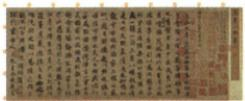

## 讲解

### 是什么

书法以汉字书写为基础，通过笔画、结构和章法形成可欣赏的艺术。东汉以后它逐渐成为供人欣赏的艺术；东晋王羲之被后人誉为书圣，《兰亭集序》被称天下第一行书。行、楷、草等书体不是书法作者时代或作品真假本身的证明。

### 怎么来的

汉代造纸的发展改善书写载体，使记录与练习更便利，为书法继续发展提供物质条件；人们对美的追求又使书写超出仅记录信息，重视线条结构和个人风格。载体与审美分别作用，纸出现不会自动使每个书写者成为名家，艺术追求也需要反复学习实践。

原表曹魏锺繇、胡昭吸收汉末众家之长形成风格，西晋设置书博士学习其书体，王羲之继承多种书体优点再提高艺术水平，体现传承与创新的链条。北魏崇尚中原文化、重视书法，碑刻呈苍劲厚重等特点，又体现文化接触与不同载体面貌。风格评价是本书概括，不是每件碑刻、每位作者都毫无差别。图中《兰亭集序》标注摹本，保留所传作品风貌并不等展示原迹，材料识别不能因作品著名而跳过版本类型。

### 什么时候能用

用于王羲之身份作品、书法条件、继承创新及摹本证据。“羲”不写“曦”；原作品名按本书《兰亭集序》，摹本不当作本人写作现场的照片。

## 例题

**原设问（H20-S06）：**根据此摹本并结合所学，谈谈书法艺术形成的条件。

**原答案完整保留：**汉代造纸术的改进，使书写的载体发生了革命性的变化，也为书法艺术的进一步发展提供了物质条件。人们对书法美的不懈追求，推动了书法艺术的持久发展。

**完整解析补写：**纸改善书写记录的载体，是物质条件；人们对线条、结构和风格美的追求，是艺术发展的推动力。两者共同解释，不仅背王羲之姓名。题注为摹本，它呈现所传作品面貌，不能据此宣称图上就是王羲之亲笔原迹。书法在纸之前已有书写传统，纸是进一步发展的条件，不等此前没有文字。

## 易错

- 造纸产生就说此前无书写：已有文字传统。
- 形成条件只答纸：原答还有对美的追求。
- 摹本称王羲之亲笔原迹：版本范围误读。

### 来源定位

- H20-S04：full.md（历史扫描分册51-100），L1265–L1267，书法绘画雕塑文学完整表；a8d85606-ccac-4ba9-89c2-44c981a45642_origin.pdf，实际PDF第21页。
- H20-S06：full.md（历史扫描分册51-100），L1303–L1310，兰亭集序摹本、书法条件原问原答；a8d85606-ccac-4ba9-89c2-44c981a45642_origin.pdf，实际PDF第21页。
